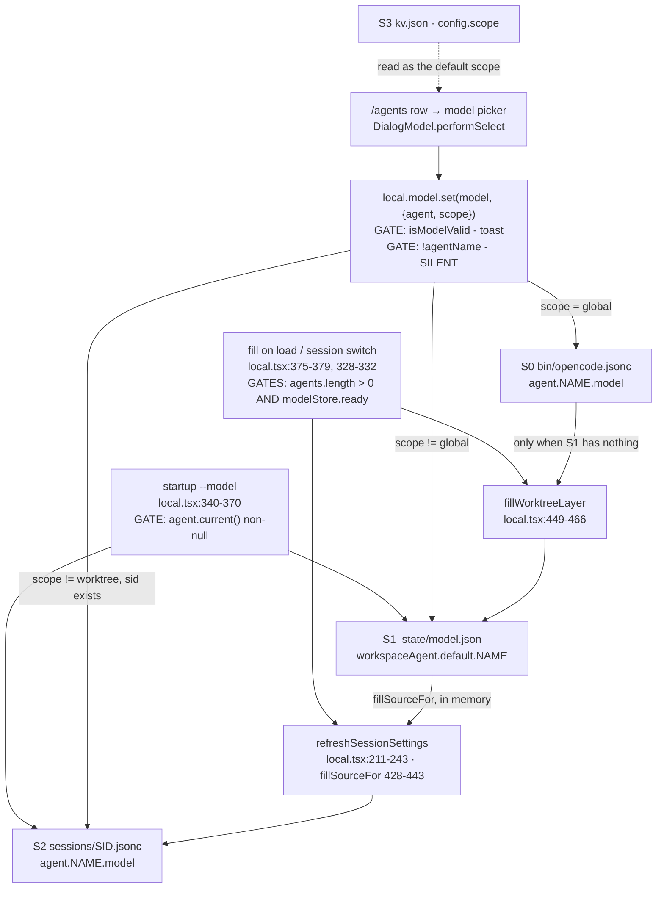
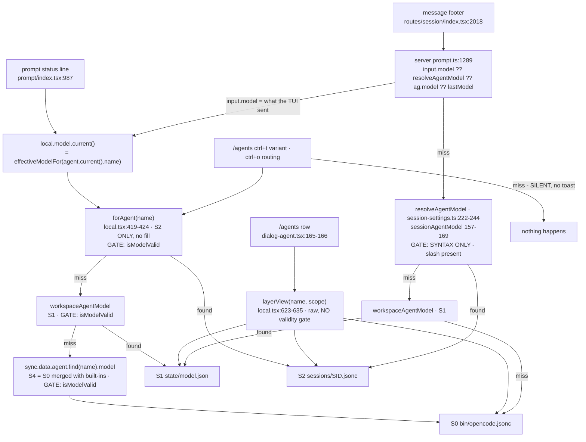

# Agent model resolution — the full graph, TUI to configs

## 2026-09-24 — выбор модели в открытой TUI-сессии

✓ По коду: список моделей, открытый из строки агента в `/agents`, сохраняет выбранную модель в worktree для новых сессий. При выбранном уровне `worktree` модель активного агента записывается также в открытую сессию, потому что строка состояния и `Prompt.submit` читают именно `local.model.current()` из настроек сессии. Настройка другого агента из `/agents` не переназначает активный запрос. Выбор снимает старый вариант модели через `setSessionAgentModel`. Отдельной команды `/models` в TUI нет.

✓ Узкие тесты: `test/tui/agent-selection.test.ts` и `test/session/session-settings-persist.test.ts` проверяют решение о записи, разрешение модели и сохранение настроек. ? Живой TUI и следующий запрос уже собранного бинарника требуют отдельного запуска; историческая схема ниже датирована 2026-09-21 и не является снимком текущего кода.

Owner request, 2026-09-21: «Строй полный граф выбора агентов от tui до конфигов и где они хранятся.»

This is a **reference**, not a plan. Every node carries `path:line`. Claims are marked
`[Inferred]` (read from source) or `[Exact]` (observed in a persisted artifact). Nothing here is
derived from a summary or from recollection.

The one invariant the whole graph exists to serve (owner, 2026-09-19/20, restated 2026-09-21):

> `global ← build model` · `worktree ← global if absent` · `session ← worktree at creation`.
> A layer is **filled**, never resolved on read. A read is a plain lookup of **one** layer.

---

## 0. The selection graph as it stands — 2026-09-21, after the C1/C5 fixes

Two diagrams, split by direction. Boxes are surfaces and files; labels on edges are the **gates** —
the only places the flow can change or die. Store ids match §1.

### 0.1 WRITE — where a selection lands



**The gate that caused the reported bug** sits on `FILL`. Without `modelStore.ready`,
`fillSourceFor` read an empty S1, fell through to the agent declaration (S0), and wrote S0's value
into S2 permanently (C5). Both gates are now present.

### 0.2 READ — what each surface reports, and what actually runs



### 0.3 What the two directions being different buys you — and costs you

| | TUI chain | server chain |
|---|---|---|
| gate on the stored pair | **`isModelValid`** — the pair must be present in `sync.data.provider` (S5a, `GET /config/providers`) | **syntax only** — a `/` must be present |
| `/agents` row | `layerView` — **no gate at all** | — |

That asymmetry is **C7**, and it is the one live defect that explains both screenshots from a single
session artifact: the server took `opencode/muse-spark-1.3-contributor-free` from S2 and the footer
said Muse Spark, while the status line's `forAgent` rejected the same pair and fell to S1.

### 0.4 Open, drawn rather than implied

- **C6** — the `VTUI → FA → miss` edge has no dead-end marker in the real code: nothing is logged,
  nothing is toasted, the keypress evaporates. This is the edge to fix.
- **C7** — `isModelValid` is stricter in the TUI than on the server. Whether the gate or the stored
  pair is wrong is not yet decided; the decider is the live `GET /config/providers` payload.
- **§4b** — the full per-key action matrix, including which actions are gated on `forAgent`.

---

## 1. Where every value is stored

| # | Layer | File | Key | Observed value |
|---|---|---|---|---|
| **S0** | global agent config | `bin/opencode.jsonc` — executable-adjacent, i.e. `Global.Path.config` | `agent.<name>.model`, `agent.<name>.variant` | all 9 agents = `"huggingface/zai-org/GLM-5.3-Flash-BF16"`, variant `"max"` `[Exact]` |
| **S1** | worktree | `.opencode/data/state/model.json` | `workspaceAgent[<scope>].<name>` = `{providerID, modelID}`; variants in `agentVariant["<name>/<prov>/<model>"]` and `variant["<prov>/<model>"]` | `deepseek/deepseek-flash` `[Exact]` |
| **S2** | session | `.opencode/data/sessions/<sessionID>.jsonc` | `agent.<name>.model`, `agent.<name>.variant`; `agentVariant["<name>/<prov>/<model>"]`; `variant[...]`; also `recent`, `favorite`, `modelRouting`, `modelSampling` | `deepseek/deepseek-flash` `[Exact]` |
| **S3** | scope memory (TUI) | `.opencode/data/state/kv.json` | `config.scope` | `"session"` `[Exact]` |
| **S4** | agent registry | built-in `src/agent/agent.ts:142` merged with **S0**; served to the TUI as `sync.data.agent` | `name` (**canonical**), `model`, `variant`, `mode`, `hidden`, `subagents` | — `[Inferred]` |
| **S5a** | connected provider set | `GET /config/providers` — `sync.tsx:869`, stored at `:909` | `sync.data.provider` | — `[Inferred]` |
| **S5b** | full provider catalogue | `GET /provider` — `sync.tsx:873`, stored at `:911` | `sync.data.provider_next` | — `[Inferred]` |
| **S5c** | app config | `GET /config` — `sync.tsx:879`, stored at `:913` | `sync.data.config` (`default_agent`, …) | — `[Inferred]` |

**S1 scope key.** `workspaceModelScope()` (`src/session/session-settings.ts:93`) = `workspaceID ?? "default"`.
Measured: `session` table holds **23** rows, **0** with `workspace_id`; `workspace` table holds **0**
rows `[Exact]`. So `workspaceModelScope()` is always `"default"` on this install — the bucket in
`model.json` is `workspaceAgent.default`.

**S4 transport.** `sync.data.agent` ← `sdk.client.app.agents()` → `GET /agent`
(`packages/sdk/js/src/v2/gen/sdk.gen.ts:437-460`, `AppAgentsData` url `/agent`) `[Inferred]`. The
registry is built in `src/agent/agent.ts`; `list()` sorts the preferred/default agent first
(`:578-591`) and `defaultAgent()` prefers `default_agent`, else `build_mode` (`:593-608`).

### Identity canonicalization — the node between S4 and every other layer

`src/session/mode-identity.ts:7-19`:

```
build → build_mode      plan → plan_mode        reasoning → reasoning_mode
coder → coder_agent     explore/explorer → explorer_agent
researcher → researcher_agent   general → general_agent   media → media_agent
orchestrator → orchestrator_agent   title → title_agent
```

`canonicalIdentity()` callers `[Exact, codegraph]`:

- server, 5 sites — `src/agent/agent.ts:509,512,542,575,581,596`; `src/session/prompt.ts:140,441`; `src/tool/task.ts:157,177`
- **TUI — none.**

Consequence: S1/S2 rows are written and read under the **canonical** name (`build_mode`), while the
server canonicalizes on every entry point. A TUI path that ever holds a legacy name (`build`,
`plan`, `coder`, …) keys its maps under a name no layer contains, and *all three* links of the read
chain return `undefined`. The hedge at `local.tsx:440`
(`x.name === "build" || x.name === "build_mode"`) is the standing evidence that both spellings
circulate. `[Inferred]`

---

## 2. Write graph

```
startup --model argument
  src/cli/cmd/tui/context/local.tsx:340-370     createEffect
    chosen = args.model                            :341
    GATE: if (!agent.current()) return             :343-344   ← drops the choice if agents are not loaded yet
    parsed = parseModel(chosen); must be valid     :345-346
    S1 ← { [scopeKey].<a.name> = parsed }          :350-356   setModelStore("workspaceAgent", ...)
    save()                                         :357
    S2 ← setSessionAgentModel(sessionSettings(), a.name, "<prov>/<model>", undefined)  :366-368
             └ variant:undefined → DELETES agent.variant and pins
               agentVariant["<a.name>/<prov>/<model>"] = "default"   (session-settings.ts:128-137)

fills — the only place a parent chain is walked
  local.tsx:375-379      createEffect, GATES: sync.data.agent.length === 0 → return
                                                  !modelStore.ready → return   (added 2026-09-21, see C5)
    fillWorktreeLayer()                        :449-466    S1 ← S4/S0
    refreshSessionSettings()                   :211-243    S2 ← S1
  local.tsx:328-332      createEffect (session switch), same `ready` gate
  local.tsx:320-325      readJson .finally → setModelStore("ready", true) + refreshSessionSettings()
        fillSessionAgents(settings, agentNames(), fillSourceFor)   (fill-layers.ts:82-100)
        fillSourceFor(name)                    :428-443    S1 → S4/S0 → opencode/big-pickle
        unresolved → Log.Default.warn("bug: session settings layer left unfilled")  :225

picker
  local.tsx:956-1054   set(model, {agent, scope})
    scope === "global"  → S0 via writeGlobalAgentField(agentName,{model})   :960-995, return
    else batch():
      S1 ← setWorkspaceAgentModel(..., agentName, model)   :1010-1011 (guard `scope !== "session"` REMOVED 2026-09-21)
      S2 ← setSessionSettings({... agent[name].model})     :1015-1028 (guard `scope !== "worktree" && sid`)
      recent/Favorite → modelStore + save                    :1030-1037
      scope === "session"  → saveSessionSettings(sid, sessionPayload()) + save()   :1040-1048
      scope === "worktree" → save()                          :1049-1052
      otherwise            → saveAll()                        :1053
```

**`sessionPayload()`** (`local.tsx:245-259`) is where S2's variant maps come from: it writes
`modelStore.variant` and `modelStore.agentVariant` — i.e. **S1's maps** — into the session file.
That is why the `agentVariant` block in a session `.jsonc` is byte-identical to `model.json`'s
`[Exact]`.

**`getActiveSessionID()`** (`local.tsx:48-51`, `:201-203`):

```
route.type === "session" → route.sessionID
otherwise                → sync.data.session.at(-1)?.id      ← the NEWEST session, not the open one
```

So on any non-session route a pick is written into the newest session's file.

---

## 3. Read graph

### TUI surfaces

```
status line under the prompt
  src/cli/cmd/tui/component/prompt/index.tsx:987   local.model.current()

/agents row model cell
  dialog-agent.tsx:158-163  agentModelCell({ session, worktree, declared, guard })
/agents row variant
  dialog-agent.tsx:164-165  local.model.layerView(agent.name, scope)

message footer (agent · model · duration)
  routes/session/index.tsx:2018  props.message.providerID / props.message.modelID
```

```
local.model.current()          local.tsx:412-415
  = effectiveModelFor(agent.current().name)        :396-410
      1. forAgent(name)                            :419-424  → S2  agent.<name>.model   (parseModel + isModelValid)
      2. workspaceAgentModel(name, getActiveWorkspaceID())  → S1  workspaceAgent.default.<name>
      3. sync.data.agent.find(x => x.name === name)?.model   → S4 ← S0
      4. undefined

local.model.layerView(name, scope)   local.tsx:623-635
      scope "session"  → S2   sessionSettings().agent[name]
      scope "worktree" → S1   workspaceAgentModel(...)
      otherwise        → S4   sync.data.agent.find(name).model
```

### Server

```
src/session/prompt.ts:1289
  model = input.model ?? resolveAgentModel(ag.name,{sessionID,workspaceID}) ?? ag.model ?? lastModel(sessionID)

  resolveAgentModel          session-settings.ts:222-244
      1. sessionAgentModel(name, settings)      :157-169   → S2
      2. workspaceAgentModel(name, workspaceID, modelState) :142-154 → S1
      3. undefined → caller falls through to S4/S0
```

`input.model` is the model the TUI sends, and the TUI sends `local.model.current()`
(`component/prompt/index.tsx:675`, emitted at `:790` and `:808-810`; `session.command` at `:835`).
**So `input.model` and the status line are the same value at submission time** `[Inferred]`.

The message footer reads what the server recorded from that same resolution
(`prompt.ts:1309-1312`), so footer-vs-status can differ **only** if the session layer changes
between the two reads.

### Variant sub-graph

```
sessionAgentVariant(name, model, settings)     session-settings.ts:177-188
  1. agentVariant["<name>/<prov>/<model>"]      ← per-agent, PER-MODEL  (explicit pick)
  2. agent.<name>.variant                       ← per-agent, MODEL-BLIND
  3. variant["<prov>/<model>"]                  ← per-model
```

Link 2 is the leak: a variant chosen for model M1 answers for M2 in the same agent.
Present in artifacts: `ses_f3d5f006…jsonc` holds `build_mode.variant = "max"` while that agent's
model resolves to `deepseek/deepseek-flash` `[Exact]`.

---

## 4. Surface → node, at a glance

| Surface | Reads | Writes |
|---|---|---|
| startup `--model` | — | S1 + S2 (gated on agents being loaded) |
| model picker opened from `/agents` | S3 (scope), S2/S1/S4 (display) | S0 / S1 / S2 by scope |
| `/agents` row | S2, S1, S4 — **fixed chain, ignores `scope`** | S0 / S1 / S2 by scope |
| status line | S2 → S1 → S4 | — |
| message footer | the message record (server's `prompt.ts:1289`) | — |
| server `prompt` | S2 → S1 → S4/S0 | S2 (`setSessionAgentModel` on an explicit pick) |
| `task()` / `plan()` / `reasoning()` / `pipeline()` | `resolveAgentModel` (S2 → S1) | — |

---

## 4b. The `/agents` action → layer matrix

Every per-row action in `dialog-agent.tsx`, its reader, its writer, and — the column that matters —
the gate that can kill it. All line numbers are `dialog-agent.tsx` unless stated.

| Action | Keybind (in code) | Reads | Writes | Gate that can kill it |
|---|---|---|---|---|
| Change model | `Enter` → `DialogModel` (`:227-237`) | `local.model.current()` for the `current` marker | `local.model.set(model, {agent: targetAgent, scope})` | `isModelValid` → toast; **`!agentName` → silent** (`local.tsx:1006`) |
| Variant step, in-row | `ctrl+t`, when `variantStep.inline` (`:283-308`) | `selectedForModel(step.model, step.agent)` | `variant.setForModel(model, next, scope, agent)` | `scope === "global"` → toast; `scope === "session"` without sid → toast |
| Variant dialog | `ctrl+t`, otherwise (`:309-318`) | `selectedForModel(ref, agent.name)` (`:224`) | `DialogVariant` → `variant.set(value, agent, scope)` | **`forAgent` → silent return** (C6) |
| Sampling | `ctrl+g` (`:320-332`) | — | `DialogModelParameters` | — |
| Routing | `ctrl+o` (`:343-366`) | **`local.model.forAgent(option.value)`** (`:347`) | `DialogRouting` | **`forAgent` → silent return**; then non-openrouter → toast |
| Edit allow-list | `ctrl+alt+l` (`:382-390`) | `subagentsFor(name)` | `setSubagents(name, list)` | no sid → toast |
| Copy from parent | `ctrl+alt+i` (`:391-413`) | `local.model.layer.all(name)` → `planCopyFromParent` | `variant.set(...)` via the plan | `planCopyFromParent` refuses → **toast with the reason** (visible) |
| Clean variant state | `ctrl+alt+p` (`:414-467`) | `variant.state()` + `classifyVariantState` | `variant.prune(targets)` → `save()`, **S1 only** | none silent |
| Scope ←/→ / picker | `left` / `right` / `DialogSelect` (`:333-342`, `:367-381`) | `scopes()` = `availableScopes(sessionAvailable)` | `kv.set(SCOPE_KV_KEY, next)` → **S3** | — |

**The asymmetry this matrix makes visible — and it is the one that produces "selection is broken":**

`forAgent` (S2-only, no fill, no parent) sits in front of **Variant** and **Routing**, and both exit
**silently**. The **model** pick does *not* go through it — `DialogModel.performSelect` passes
`options.agent` straight into `local.model.set`. So on the same row, in the same frame:

- **Enter** (change model) writes and visibly works;
- **ctrl+t** (variant) and **ctrl+o** (routing) do nothing at all, with no toast and no log.

A user reads that as "model selection is broken", while the model itself is the one part still
working. `[Inferred]`

**Footer keybind rendering.** The `/agents` footer observed 2026-09-21 printed
`Edit allow-list ctrl+a`, `Copy from parent ctrl+a`, `Clean variant state ctrl+a` — three actions on
one key — while the code binds `ctrl+alt+l`, `ctrl+alt+i`, `ctrl+alt+p`. The `ctrl+alt+X` form is
being rendered as `ctrl+a`, so the footer names bindings that do not exist and hides the ones that
do. Not yet traced to the formatter. `[Hypothetical]`

---

## 5. Contradictions proven from artifacts

**C1 — at `scope: global (save)` the dialog displays S2, not S0.**
`dialog-agent.tsx:158-163` builds the cell from a **hardcoded** session → worktree → declared chain,
and `agentModelCell` returns the first non-empty (`agent-model-cell.ts:31-34`). `scope` never enters
the cell — it feeds only `view` (`:164`) and `guard` (`:162`). Evidence: on `scope: global` the
`build_mode` row reads **Muse Spark 1.3 Free** while `bin/opencode.jsonc:32-35` declares
`huggingface/zai-org/GLM-5.3-Flash-BF16` — the global value is displayed nowhere. The hint
(`agentHintText`, `agent-model-cell.ts:121`) then prints `model from the session layer`, so the
dialog's **title** and its **hint** describe different layers in the same frame `[Exact]`.

**FIXED 2026-09-21.** `scopedModelCell(scope, own, guard)` (`agent-model-cell.ts`) replaces the cell
at that call site: the row renders `local.model.layerView(agent.name, scope)` — the layer the title
names — and falls to `inheritLabel(scope)` when that layer holds nothing. The hint's `origin` is now
the **scope**, so title and hint agree. `AgentModelOrigin` was widened to include `"global"`.

*Residual, stated rather than papered over:* `layerView(name, "global")` returns
`sync.data.agent.find(name).model` — the agent's **declared** model, i.e. `opencode.jsonc` **merged
with the built-in registry**. For an agent the jsonc does not mention (`title_agent`, `triage`,
`duplicate-pr` on this install) the row therefore still shows a value that exists in no config file.
Whether the global row must show *only* what the jsonc literally holds is an owner decision and is
not changed here.

**C2 — status line and message footer read different objects.** `prompt/index.tsx:987` (a live memo)
vs `routes/session/index.tsx:2018` (the immutable message record). They can diverge with no code
defect: they are answers to different questions — *what will run* vs *what ran* `[Inferred]`.

**C3 — the TUI does not canonicalize agent names; the server does.** §1. Any TUI key held in legacy
form misses every layer `[Inferred]`.

**C4 — `agent.<name>.variant` is model-blind.** §3. A variant chosen for one model applies to
another in the same agent `[Exact]`.

**C5 — the session is filled from the GLOBAL config, not the worktree — a load race. `[Exact]`**

`local.tsx:375-379` gated the fill on the agent list alone:

```js
createEffect(() => {
  if (sync.data.agent.length === 0) return     // "agents are here" ≠ "model.json is loaded"
  fillWorktreeLayer()
  void refreshSessionSettings()
})
```

`refreshSessionSettings` → `fillSessionAgents(settings, agents, fillSourceFor)`, and `fillSourceFor`
(`:428-435`) reads S1 **out of memory** (`modelStore.workspaceAgent`). That store is populated
asynchronously in the `readJson` `.finally()` (`:320-325`) together with `ready`. The effect
therefore ran **before `model.json` was parsed**, `fillSourceFor` saw an empty worktree, and fell
through to the agent's own declaration — i.e. **S0** — whose value was then written to the session
file. Because a fill only touches agents the session does not already hold
(`unfilledSessionAgents`, `fill-layers.ts:36-38`), the wrong copy became permanent.

Artifact: `ses_f7fca79dcffe6RZ3PtUHAQiiiv.jsonc:2-50` — every agent holds
`huggingface/zai-org/GLM-5.3-Flash-BF16` / `GLM-5.3-BF16`, byte-for-byte `bin/opencode.jsonc:31-68`,
while `model.json` held `deepseek/deepseek-flash` for the same agents. The session had copied the
layer **above** the worktree.

This is the owner's own report, verbatim: «настройки новой сессии должны копироваться из настроек
worktree, а сейчас они копируются непонятно откуда» and «сессия берёт начальные значения из
global». The same hole was reachable through the session-switch effect (`:328-332`).

Fix: both effects now gate on `modelStore.ready`; the store read re-runs them when the read
resolves, so `fillSourceFor` always sees a materialised S1.

**C6 — every variant operation is gated on a function that reads ONE layer, and fails silently. `[Exact]`**

`local.tsx:1251-1253`:

```js
set(value, agentName?, scope?) {
  const m = agentName ? forAgent(agentName) : currentModel()
  if (!m) return          // silent — no toast, no log
```

and `forAgent` (`:419-424`) — the function whose own comment calls it "THE read" — reads **S2 only**:

```js
function forAgent(name) {
  const stored = sessionSettings()?.agent?.[name]?.model
  if (!stored) return undefined
  const parsed = parseModel(stored)
  return isModelValid(parsed) ? parsed : undefined
}
```

No fill, no parent walk. `list` (`:1243-1245`), `selected` (`:1161-1162`), `current` (`:1237-1242`),
`set`, and `cycle` (`:1312-1326`) all start by calling it. An agent with no valid S2 entry makes all
five dead **silently** — `cycle` then calls `set(variants[0])` on every keypress, which exits the same
way. Recorded in the source by the same author, measured: «three ctrl+t on build_mode toasted
«Variant: low» while model.json kept `variant: {}` / `agentVariant: {}`, and `selected()` read
nothing back, so every press stepped from \"no selection\" to the same first variant».

This is the `/agents` variant path (ctrl+t), and it is the one place where "nothing happens" is
both true and completely unobservable.

**C7 — the TUI validates a model against a DIFFERENT registry than the server, and the two disagree in public. `[Exact, code]`**

Two provider sets reach the TUI from two different endpoints:

```
sync.data.provider      ← GET /config/providers   sync.tsx:869, :909     "providers the user has"
sync.data.provider_next ← GET /provider           sync.tsx:873, :911     full catalogue
```

The gate that guards **every** TUI write (`local.tsx:61-64`):

```js
function isModelValid(model) {
  const provider = sync.data.provider.find((x) => x.id === model.providerID)
  return !!provider?.models[model.modelID]
}
```

— it requires the pair to be present in **S5a**, the connected set.

The gate the **server** applies (`session-settings.ts:157-169`) does no such thing:

```js
export function sessionAgentModel(agentName, settings) {
  const value = settings?.agent?.[agentName]?.model
  if (!value) return undefined
  const slash = value.indexOf("/")
  if (slash <= 0 || slash === value.length - 1) return undefined   // ← syntax only
  return { providerID: value.slice(0, slash), modelID: value.slice(slash + 1) }
}
```

So a stored `provider/model` that is **absent from S5a** is accepted by the server and **rejected by
the TUI**. The consequences line up with both screenshots of 2026-09-21, and they line up on the
same session (`ses_f7fca79dcffe6RZ3PtUHAQiiiv.jsonc`, `build_mode.model = opencode/muse-spark-1.3-contributor-free`):

| Surface | Path | `isModelValid`? | Result |
|---|---|---|---|
| message footer | server `prompt.ts:1289` → `resolveAgentModel` → `sessionAgentModel` | **no** | takes S2 → **Muse Spark** ✓ screenshot 1 |
| `/agents` row | `layerView(name,"session")` (`local.tsx:623-627`) — raw `o?.model` | **no** | **Muse Spark** ✓ screenshot 2 |
| status line | `local.model.current()` → `effectiveModelFor` → `forAgent` | **yes** | rejects → falls to S1 → **DeepSeek** ✓ screenshot 1 |

And the same gate is what makes a **pick** fail: `local.model.set` refuses with
`Model <prov>/<model> is not valid` (`local.tsx:997-1004`) — a toast the user sees, so this is the
one failure of the family that is *not* silent.

Which side rejected Muse Spark here is not yet established — the deciding input is the live
`GET /config/providers` payload, which is not persisted to disk. `[Hypothetical]`

**C8 — `layer.value` reads different variant sources per layer.** `local.tsx:1128-1150`: the
`session` branch returns `agent[name].variant` (the **model-blind** middle link of C4), while the
`worktree` branch returns `modelStore.agentVariant["<name>/<prov>/<model>"]` (a **model-keyed** map).
`layer.all` (`:1151-1157`) feeds `copyFromParent`, so a copy copies two structurally different
things depending on the layer it comes from. `[Exact]`

---

## 6. Measurement recipe

Read a layer without guessing — these are the exact artifacts:

```
global   bin/opencode.jsonc                                    → agent.<name>.model
worktree .opencode/data/state/model.json                       → workspaceAgent.default.<name>
session  .opencode/data/sessions/<sessionID>.jsonc             → agent.<name>.model / .variant
scope    .opencode/data/state/kv.json                          → config.scope
agents   GET /agent                  (server registry; names are canonical)
validity GET /config/providers       → sync.data.provider       ← what `isModelValid` checks (S5a)
         GET /provider               → sync.data.provider_next  ← full catalogue (S5b), NOT checked
```

For a given session, the runtime model is decided by `prompt.ts:1289`; compare it against
`agent.<name>.model` in that session's `.jsonc`. A disagreement means the session layer the TUI
reads and the layer the server reads are not the same object.

**To settle C7** — the one measurement this graph cannot make from disk — dump the two provider
sets and check whether the stored `agent.<name>.model` is present in `sync.data.provider`. A stored
pair absent from S5a reproduces the footer/status split exactly, and makes every TUI write for that
pair fail with `is not valid`.

---

## 7. Open questions (marked, not assumed)

1. Does `agent.current()` (`local.tsx:343`) re-run the startup effect once `sync.data.agent`
   arrives, or can the startup `--model` be dropped and never re-applied? `[Unknown]`
2. Which identity spelling does `agent.current().name` carry in the live TUI — canonical
   (`build_mode`) or short (`build`)? `[Unknown]`
3. Reported regression 2026-09-21: in the build carrying the current working tree the model could
   not be selected at all; the owner rolled back. C6 explains a silent no-op on the **variant**
   path; whether the same silent-return shape explains a failed **model** pick is not established —
   `local.model.set` reaches its worktree/session writes through `options.agent` (supplied by the
   dialog), not through `forAgent`, so the same gate does not sit in front of it. `[Unknown]`
4. `variant.selected` (`:1160-1172`) reads `modelStore.agentVariant` — **S1** — before it consults
   `sessionAgentVariant` (S2). A variant written to the session layer alone is therefore invisible
   to it until the next `model.json` save. Not yet measured. `[Unknown]`
5. **C7 is the strongest remaining candidate for "the model cannot be selected at all", and it is
   the only claim in this document whose decider is a live payload rather than a file:** whether the
   pair stored in the session is present in `sync.data.provider` (S5a). Until that is dumped,
   `[Hypothetical]` — not fixed, not dismissed.
