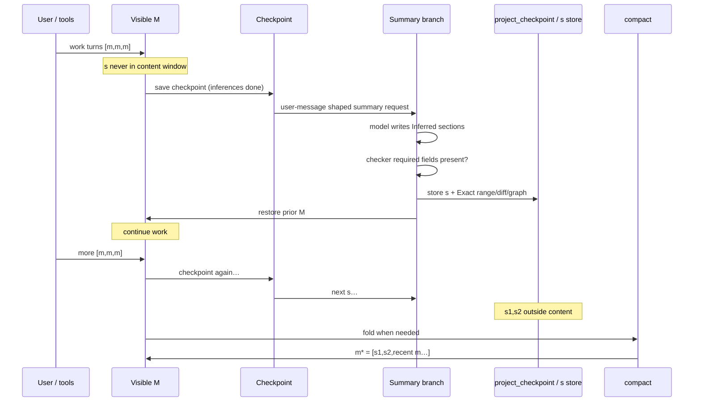

# Session memory & compaction

Two layers of truth:

1. **Intended contract** (below) — the flow that was designed / “deleted” in bad docs.  
2. **Code Exact** — what `prompt.ts` / `compaction.ts` do **today**.

If they disagree, **do not paper over it**. Fix code toward the contract, or mark gap.

**Graphs:** [`session-memory-graph.md`](session-memory-graph.md)  
**Fossil Exact on s:** [`summary-exact-handles.md`](summary-exact-handles.md)

---

## 0. Architecture at a glance (2026-08-25)

**Two independent operations — do not conflate:**

| | Layer-1 `s` (summary) | Layer-2 `m*` (compact) |
|---|---|---|
| What | short memory row with Exact handles, written by the model | mechanical pack of existing `s` rows + message tail |
| LLM cost | one incremental request (prefix cached) | **0** tokens |
| Cadence | every ~64K open-window content tokens | when the **window fills**: `usable(model)` = limit − 32K (response) − 10K (spare) |
| Check point | at stop, after the turn completes | **before sending a new message** (`hasSpareOutput` force gate) + same rule at stop |

**Cache model (why 0 hit / 132K miss happened and how it is fixed):**

- Provider cache key = `session:provider` for BOTH the trunk and the sidecar
  summary request. Checkpoints persist per `session:provider` on disk, so the
  cache survives model switching within the same provider.
- The `s` request rides the trunk prefix: `[checkpoint system, checkpoint
  messages, synthetic user row]` → prefix hits ~100%, the request pays only
  its own prose. A `:sidecar` key suffix forked the namespace and made every
  `s` request full-price (removed 2026-08-25).
- After `s`, the message chain returns to **exactly pre-summary M** (the
  request/response live only in the checkpoint) — the trunk cache prefix is
  intact; you can roll back freely.
- After a fold, ONE full-price request is inherent: `m*` replaces history, so
  the provider prefix changes at message 1. Unavoidable; everything after
  rides the cache again.

**m\* composition:** last ≤32K tokens of `s` bodies + recent tail (≥32K
tokens of real messages, walk-back hard-stops at prior m\*), closed by one
recovery pointer: `Use messagesearch, sessionread and dbread to restore
missing facts.` (single line at the very end — earlier top-placed recovery
recipes caused tool spirals). Zero summaries (manual `/compact` on a fresh
session) → tail-only m\*: header + last ~32K of messages. `m*` is the memory; the visible list after a fold is
`[m*, m, m, …]`. Rollback reconstructs the content window as `m*` + the
messages that followed it — the DB keeps every soft-hidden row
(`compacted=true`, never deleted), reachable via `session-read`.
---

## 1. Intended contract (restore target)

### Content window vs summaries

Summaries **`s` are not in the provider content window** during normal work.
Only real messages `m` are.

```text
content window (visible M, what the model sees on normal turns):

  [m, m, m]     [m, m, m]     [m, m, m]
       \             \             \
        s1            s2            s3     ← stored OUTSIDE content
        (not in M)    (not in M)    (not in M)

After compact:

  content window:
    m* = [ s1, s2, recent m, m, m ]    ← s capped at 32K tokens total
         └── AI body + system Exact handles (range / session-read locus)
             + tool filediffs + CodeGraph for that range
             + decisions from CURRENT summaries only (not from prior m*)
```

### Cadence counter

```text
open content size  ≈  content symbols (chars)
threshold          ≈  256_000 chars
tokens estimate    =  chars / 4     →  ~64_000 tokens
```

Implementation constant today: `SUMMARY_INTERVAL_TOKENS = 65_536` (≈ 262_144 chars
at /4). Same order as **256k chars**. Cadence uses **content only** (no +10k).
Safety/fit uses **content/4 + 10_000**.

### What one summary `s` is

Stored in **DB outside the content flow** (`project_checkpoint`). Never left as a
normal chat turn. Content window returns to **exactly pre-summary M**. These `s`
rows are consumed **only at compact** into `m*`.

| Piece | Owner | Role |
|-------|--------|------|
| AI body | **Inferred** | `## Semantic Vector`, `## Goal`, `## Key decisions`, `## Current state` |
| System data | **Exact** | range `from_id`/`to_id`, locus for `session-read`, checkpoint id |
| Tool diffs | **Exact** | write/edit/multiedit `filediff` from session DB — see `summary-exact-handles.md` |
| CodeGraph | **Exact** | structural impact over those file paths (system, not model) |
| Fossil | **Rollback only** | WC track/restore — **not** summary Exact |

**Not:** fossil span for memory. **Yes:** tool Exact + CodeGraph.

**Recent floor:** after compact, work tail is at least ~`RECENT_MIN_TOKENS` (32 768) content tokens from the end, ignoring the latest summary — thin post-summary stubs are extended backward so the next open window is real work, not empty → immediate re-summary. The walk-back **hard-stops at the prior message***: it is EXCLUDED (session-read only) and the tail never crosses it — repeated compacts stay idempotent.

**Summary cap:** total summary body text in m* is capped at `MAX_SUMMARY_BODY_TOKENS` (32 768 tokens). Older summaries are dropped from m* but remain accessible via `session-read`.

**Prior m\* decisions:** decisions from prior m\* are NOT pulled forward into the new m\*. Each m\* carries only decisions from its own current summaries.

**Prior m\* never enters the new m\* (2026-08-26, Alexander — design rationale):**
the new star collects summaries and Recent ONLY from messages created after
the prior star (`priorMsgStarIdx` bound); the old star survives exclusively as
the `Prior message*: \`id\`` chain-link pointer + from_id/to_id handles
(session-read). m\* is deliberately a **synthetic single-message construct**:

1. **Rollbacks** — one synthetic row = one atomic undo/redo / crossing unit;
   piecewise folds made revert boundaries ambiguous.
2. **Speed & stability** — bounded O(1) fold: the star never re-accumulates
   every summary since session start (piecewise assembly was O(n²): slow,
   bug-prone).
3. **KV-cache stability** — a fixed-composition, bounded star keeps the
   provider prefix byte-stable across folds; rebuilding from pieces broke the
   cache prefix on every compact.

**Post-summary checker:** required sections non-empty (`isValidSummaryBody`).

### When is summary called?

```text
1. Normal turn finishes (all tool / reasoning inference done)
2. Save checkpoint for exact visible M     ← "all inferences done"
3. Request summary via user-message shape (ephemeral stream / sidecar branch)
4. Store s in `project_checkpoint` (source of truth for compact)
5. Print s for the user as `=== LAYER-1 SUMMARY ===` panel
   (synthetic + ignored message — visible in TUI, not agent/provider M)
6. Agent content window = same M as before summary
7. Continue work on M
```

(3) must **not** remain as a normal user row that poisons the next real turn.
Display panel (5) is explicitly ignored by `toModelMessages` and open-window cadence.

### Compact

```text
Trigger — window fill (checked BEFORE sending a new message, re-checked at stop):

  full visible content/4  ≥  usable(model)  =  limit − 32K (response) − 10K (spare)

  256K window → fold at ~214K      1M window → fold at ~958K

  compact()  — ZERO LLM tokens, pure system fold

  m* = [ s, s, … (≤32K tokens), recent m, m, m (≥32K tokens) ]
       decisions from current s only (not from prior m*)

  zero summaries (manual /compact on a fresh session):
  m* = header + last ~32K tokens of messages   ← the tail IS the memory
```

Why window-fill and not a fixed 64K: m\* is itself ~64K (32K summaries +
32K recent). Folding 64K of real work into a ~64K m\* saves nothing and
burns Exact detail — the fold must fire only when the window is actually
filling. A degenerate window (`usable ≤ 0`) folds only via the pre-send
force gate — never a silent never-fold.

- Soft-hide prior visible rows (never hard-delete).  
- Archive remains for `session-read` / `messagesearch`.  
- Next growth: `(m*, m, m, …)` then new out-of-band `s` again.

---

## 2. Intended sequence diagram



---

## 3. Code Exact vs contract (gap table)

| Contract item | Code today | Status |
|---------------|------------|--------|
| `s` not in content window | `maybeCaptureSidecar` → `project_checkpoint` + UI panel with **old** Exact stamp product (`=== LAYER-1 SUMMARY ===`, ignored/synthetic; skipped by `toModelMessages` / cadence) | **Match** (old s product, new placement) |
| Exact stamp / multi-s fold | `formatExactSystemStamp` shared with legacy inject; `compact` folds **all** open checkpoints + legacy `assistant.summary` via `buildMessageStar` | **Match** |
| After checkpoint when inferences done | `stop` → `publish` + **await `persist`** → `maybeCaptureSidecar` | **Match** (disk before summary); capture now runs on normal clean completions (`completedCleanly`), not only on blocked/error turns |
| Exact tool diffs + CodeGraph on s | `enrichRange`: `collectToolFileDiffs` + `mcpTouchThenSqlitePack` (no Fossil) | **Match**; no write/edit/multiedit in range ⇒ empty Exact |
| Summary as user-message shape | Ephemeral stream appends `summaryRequestProse()` as user content | **Match** (stream-only, not DB user row) |
| Store s + restore M | save checkpoint table; M never mutated | **Match** |
| Checker after summary | `isValidSummaryBody` 4 headings; reject body if fail | **Partial** (no multi-retry on sidecar path) |
| Fossil only for WC rollback | `SnapshotFossil.track` / `restore` — not on summary Exact path | **Match** |
| Cadence ~256k chars / ~64k tokens | `SUMMARY_INTERVAL_TOKENS = 65_536` content/4 | **Match** (order of magnitude) |
| `m* = [s,s,recent m]` | `compact()` folds open sidecars + Recent; **zero summaries → tail-only m\*** (header + last ~32K of messages; `log: no summaries`) | **Match (2026-08-25)** — T2 refusal removed: manual /compact works on fresh sessions; uncovered tail is the memory |
| Summaries capped at 32K tokens | `MAX_SUMMARY_BODY_TOKENS = 32_768`; oldest summaries dropped from m* | **Match (shipped 2026-08-22)** |
| Prior m* decisions not pulled forward | `buildMessageStar` takes only `currentDecisions`, no `priorDecisions` param | **Match (shipped 2026-08-22)** |
| Prior m* excluded from Recent tail | `selectRecentTail` hard-stops at prior m* (does NOT include it) | **Match (shipped 2026-08-22)** |
| Recent tail ≥ 32 768 tokens | `selectRecentTail` / `RECENT_MIN_TOKENS` — skip m* + last summary; overlap back if thin, hard-stop at prior m* | **Match** |
| Compact on window fill | **`maybeCompactCadence`**: target=`usable(model)` (limit − 32K response − 10K overhead); pre-send `hasSpareOutput` force-folds before the turn; stop-cadence is an earlier evaluation of the same rule; degenerate window (usable ≤ 0) folds only via the pre-send force path. T4 (≥2 sidecars) gate removed 2026-08-25 | **Fixed 2026-08-25** |
| **m\* is NOT an increment** | `computeOpenWindowTokens` without a checkpoint boundary skips the leading message\* chain — the star is an assembly of prior s + history, never new work; a fold cannot pre-arm the Layer-1 cadence | **Fixed 2026-08-26** (was: counter baseline = len(m\*)/4 → s fired on the next stop after every fold) |
| Pre-send no-progress guard | `hasSpareOutput` fail → force fold; if still failing and nothing folded → `NamedError` with used/usable numbers — the loop never spins silently | **Added 2026-08-26**; unreachable on ≥256K windows (m\* ≤ 32K s-bodies + ≤32K recent + tools ≪ gate), reachable on small-window models / oversized single input |
| injectSummaryRequest as primary | Implemented, **not called** from `prompt.ts` | **Dead primary** |
| Summary request as durable user row then restore | inject would leave synthetic user unless restored — not used | N/A |

### Stop-path cadence (shipped)

```text
stop → Checkpoint M → maybeCaptureSidecar (s outside M)
     → if sidecar captured this stop: do NOT compact (defer Layer-2)
     → else maybeCompactCadence:
          target = usable(model)  (limit − 32K − 10K)
          full visible content/4 ≥ target → compact() → m*; soft-hide m
          (degenerate target ≤ 0 → skip here; the pre-send force gate owns it)
     → break

pre-send (before each LLM turn):
     used = content/4 + 10K overhead
     limit − used < 32K response reserve
       → maybeCompactCadence(force) → fold NOW (ignores sidecar count,
         folds tail-only when zero summaries) → re-check → send
       → still over AND nothing folded (lone oversized m* / tiny window):
         NamedError with used/usable numbers — never a silent spin
```

**Layer-1 vs Layer-2 thresholds (do not conflate):**

| Gate | Target | Meaning |
|------|--------|---------|
| Sidecar s | ~`SUMMARY_INTERVAL_TOKENS` (65 536) open since last s | periodic Exact memory rows |
| Compact m* | **`usable(model)`** (limit − 42K) — window fill | fold when the model window is actually filling; checked pre-send, re-checked at stop |

**`usable` headroom** is the compact trigger (2026-08-25): a fixed 64K
target was pointless — m* (~64K) replaced 64K of real work with zero
context savings. The fold now fires when the window is actually filling
(`hasSpareOutput` pre-send, force; `maybeCompactCadence` at stop).
Degenerate window (usable ≤ 0) folds only via the pre-send force path —
never a silent never-fold (the 2026-08-24 dead-end stays fixed).

---

## 4. Token formulas (keep)

| Use | Formula |
|-----|---------|
| Open-window / cadence | `chars / 4` (content only) |
| ~256k chars threshold | ↔ ~64k tokens (`65_536` constant) |
| Safety / request fit | `chars/4 + 10_000` |
| Summary body cap in m* | `MAX_SUMMARY_BODY_TOKENS` (32 768 tokens) |
| compact() | **0** LLM tokens |
| Post-fold m\* bound | ≤ `MAX_SUMMARY_BODY_TOKENS` (32K) summary bodies + `RECENT_MIN_TOKENS` (32K) recent tail (+ per-block diff snippets, tools/schema overhead) — why the no-progress guard is unreachable on ≥256K windows |

No BPE/tiktoken authority (undercounts providers).

---

## 5. Forbidden

| Never | Why |
|-------|-----|
| Leave summary request as permanent user message in M | Poisons next turn / KV |
| Put `s` bodies into normal content window before compact | Length bias / double-count |
| Gate compact cadence on `usable()` **as the sole gate** | a degenerate window computes usable ≤ 0 and never folds (2026-08-24 incident). `usable()` as the window-fill TARGET with the pre-send force path is the 2026-08-25 contract |
| Accept summary without required fields | Broken handle |
| Model-authored IDs/diffs | Exact is system |

---

## 6. Implementation checklist (toward contract)
- [x] **Compact on window fill** (`usable(model)` target; pre-send `hasSpareOutput` force gate + stop-cadence re-check; tail-only m\* when zero summaries)  
- [x] Checkpoint then sidecar capture on stop  
- [x] `s` outside M (`project_checkpoint`)  
- [x] AI sections + Exact enrich  
- [x] Body checker (4 headings)  
- [x] **Compact on cadence at stop** (`maybeCompactCadence` after sidecar)  
- [ ] Stronger post-summary field checker / retry on sidecar  
- [ ] Remove or quarantine dead `injectSummaryRequest` primary path  
- [x] Docs cite contract + gap table  

---

## Related

| File | Role |
|------|------|
| `session-memory-graph.md` | Mermaid of **current** control flow (Exact) |
| `finish-step-tx-graph.md` | finishStep TX (orthogonal) |
| `overflow.ts` | thresholds + +10k |
| `incremental-checkpoint.ts` | `s` store |
| `prompt.ts` | stop / break / sidecar / compact gates |
