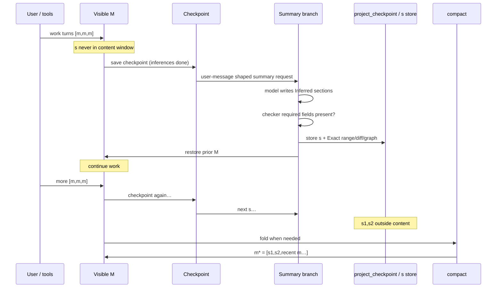

# Session memory & compaction

Two layers of truth:

1. **Intended contract** (below) — the flow that was designed / “deleted” in bad docs.  
2. **Code Exact** — what `prompt.ts` / `compaction.ts` do **today**.

If they disagree, **do not paper over it**. Fix code toward the contract, or mark gap.

**Graphs:** [`session-memory-graph.md`](session-memory-graph.md)

---

## 1. Intended contract (restore target)

### Content window vs summaries

Summaries **`s` are not in the provider content window** during normal work.
Only real messages `m` are.

```text
content window (visible M, what the model sees on normal turns):

  [m, m, m]     [m, m, m]     [m, m, m]
       \             \             \
        s1            s2            s3     ← stored OUTSIDE content
        (not in M)    (not in M)    (not in M)

After compact:

  content window:
    m* = [ s1, s2, recent m, m, m ]
         └── AI body + system Exact handles (range / session-read locus)
             + fossil diff + CodeGraph for that range
```

### Cadence counter

```text
open content size  ≈  content symbols (chars)
threshold          ≈  256_000 chars
tokens estimate    =  chars / 4     →  ~64_000 tokens
```

Implementation constant today: `SUMMARY_INTERVAL_TOKENS = 65_536` (≈ 262_144 chars
at /4). Same order as **256k chars**. Cadence uses **content only** (no +10k).
Safety/fit uses **content/4 + 10_000**.

### What one summary `s` is

| Piece | Owner | Role |
|-------|--------|------|
| AI body | **Inferred** | `## Semantic Vector`, `## Goal`, `## Key decisions`, `## Current state` |
| System data | **Exact** | range `from_id`/`to_id`, locus for `session-read`, `session_id` / checkpoint id |
| Fossil diff | **Exact** | files touched in that range |
| CodeGraph | **Exact** | structural impact for that fossil diff |

**Post-summary checker (required):** after the model returns, validate that every
**asked** field/section is present and non-empty. If the agent omitted a required
section → reject / retry (do not store a half-handle).

Today’s checker: `isValidSummaryBody` (four `##` headings non-empty). Extend if
more fields are mandated.

### When is summary called?

```text
1. Normal turn finishes (all tool / reasoning inference done)
2. Save checkpoint for exact visible M     ← "all inferences done"
3. Request summary via user-message shape (standard chat turn to the model)
4. Store s in DB outside content window
5. Restore messages to state prior to the summary call  ← M unchanged
6. Continue work on M
```

Ephemeral meaning of (3)+(5): the summary request must **not** remain as a
normal user row that poisons the next real turn. Either:

- stream-only user content on a private branch (sidecar), or  
- inject → complete → strip/restore to pre-inject M.

### Compact

```text
When enough open content has been summarized (and/or open window demands fold):

  compact()  — ZERO LLM tokens, pure system fold

  m* = [ s, s, … , recent m, m, m ]
```

- Soft-hide prior visible rows (never hard-delete).  
- Archive remains for `session-read` / `messagesearch`.  
- Next growth: `(m*, m, m, …)` then new out-of-band `s` again.

---

## 2. Intended sequence diagram



---

## 3. Code Exact vs contract (gap table)

| Contract item | Code today | Status |
|---------------|------------|--------|
| `s` not in content window | `maybeCaptureSidecar` → `project_checkpoint`; no body Message/Part | **Match** |
| After checkpoint when inferences done | `stop` → `Checkpoint.publish` → `maybeCaptureSidecar` | **Match** |
| Summary as user-message shape | Ephemeral stream appends `summaryRequestProse()` as user content | **Match** (stream-only, not DB user row) |
| Store s + restore M | save checkpoint table; M never mutated | **Match** |
| Checker after summary | `isValidSummaryBody` 4 headings; reject body if fail | **Partial** (no multi-retry on sidecar path) |
| Exact range + fossil + CodeGraph on s | `enrichRange` + save on sidecar | **Match** |
| Cadence ~256k chars / ~64k tokens | `SUMMARY_INTERVAL_TOKENS = 65_536` content/4 | **Match** (order of magnitude) |
| `m* = [s,s,recent m]` | `compact()` folds open sidecars + Recent | **Match when compact runs** |
| Compact after enough s / open window | In-band gate **after** loop `break` on completed turns; **stop path has no compact** | **GAP** |
| injectSummaryRequest as primary | Implemented, **not called** from `prompt.ts` | **Dead primary** |
| Summary request as durable user row then restore | inject would leave synthetic user unless restored — not used | N/A |

### The critical bug (control flow)

```text
// prompt.ts order today (Exact)
if (turn complete && !summaryAttempt) break;   // ← exits here on normal stop
// …
if (needsContentCompaction(open ≥ 65K)) compact();  // ← often never reached
```

So the **intended** “content grows with out-of-band s, then compact into m*” is only
reliable today via **emergency** compact (overflow/`usable`), not via clean
65K/256k-char cadence at turn end.

**Fix direction (code):** on `stop` after sidecar (or when open ≥ threshold and
enough open `s`), call `compact()` **or** move cadence gate **before** break /
onto the stop path — without putting `s` into M.

---

## 4. Token formulas (keep)

| Use | Formula |
|-----|---------|
| Open-window / cadence | `chars / 4` (content only) |
| ~256k chars threshold | ↔ ~64k tokens (`65_536` constant) |
| Safety / request fit | `chars/4 + 10_000` |
| compact() | **0** LLM tokens |

No BPE/tiktoken authority (undercounts providers).

---

## 5. Forbidden

| Never | Why |
|-------|-----|
| Leave summary request as permanent user message in M | Poisons next turn / KV |
| Put `s` bodies into normal content window before compact | Length bias / double-count |
| Gate compact cadence on `usable()` | 1M models never fold |
| Accept summary without required fields | Broken handle |
| Model-authored IDs/diffs | Exact is system |

---

## 6. Implementation checklist (toward contract)

- [x] Checkpoint then sidecar capture on stop  
- [x] `s` outside M (`project_checkpoint`)  
- [x] AI sections + Exact enrich  
- [x] Body checker (4 headings)  
- [ ] Stronger post-summary field checker / retry on sidecar  
- [ ] **Compact on cadence at turn boundary** (fix break/stop ordering)  
- [ ] Remove or quarantine dead `injectSummaryRequest` primary path  
- [ ] Docs/agents only cite this contract + gap table  

---

## Related

| File | Role |
|------|------|
| `session-memory-graph.md` | Mermaid of **current** control flow (Exact) |
| `finish-step-tx-graph.md` | finishStep TX (orthogonal) |
| `overflow.ts` | thresholds + +10k |
| `incremental-checkpoint.ts` | `s` store |
| `prompt.ts` | stop / break / sidecar / compact gates |
