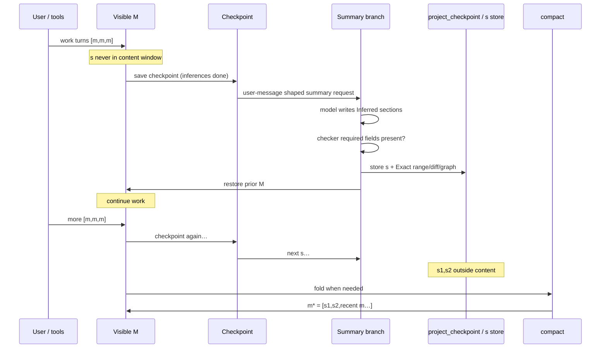

# Session memory & compaction

Two layers of truth:

1. **Intended contract** (below) — the flow that was designed / “deleted” in bad docs.  
2. **Code Exact** — what `prompt.ts` / `compaction.ts` do **today**.

If they disagree, **do not paper over it**. Fix code toward the contract, or mark gap.

**Graphs:** [`session-memory-graph.md`](session-memory-graph.md)  
**Fossil Exact on s:** [`summary-exact-handles.md`](summary-exact-handles.md)

---

## Why this is not a summarizer (2026-09-16)

The conventional design folds context with one model call: take everything
except a recent tail, serialize it, ask for a summary, continue from that. It is
what upstream does, and the shape is worth reading off its own source
(`external/opencode-1.18.29/packages/opencode/src/session/compaction.ts`):

```ts
head = input.messages.slice(0, keep.start)        // unbounded
MAX_PRESERVE_RECENT_TOKENS = 15_000               // tail, hard cap
budget = min(15_000, max(2_000, usable * 0.25))
```

The preserved tail is clamped at 15K **regardless of window size**, and the head
is whatever remains. On a 1M-context model at the moment compaction fires that
is roughly 985K tokens through a single attention pass against 15K surviving
verbatim — 1.5% of the context crosses the boundary intact. There is a
degenerate branch too: `if (!keep || keep.start === 0) return { head:
input.messages }` — nothing fits the tail budget, so the entire session becomes
head and the tail is empty.

### The failure is not lossiness

Every compaction scheme loses information; that is the point of compaction. The
defect in the single-pass design is that it loses information **without leaving
a marker where the loss occurred.**

After the fold the model holds prose about its artifacts instead of the
artifacts. It cannot distinguish "this file was never touched" from "this file
was touched and the summary did not mention it", because absence has no
representation — a fact omitted looks exactly like a fact that never existed.
So the model does the only thing available to it: it treats the summary as
complete and continues. It re-derives work already done, re-edits files already
correct, and cites conclusions it never verified — confidently, because nothing
in its context marks the gap.

### What this design preserves instead

Not content — **addressability**.

A summary carrying a resolvable pointer back to its source is not lossy
compression, it is paging: the working set shrinks, the address space does not.
A summary without that pointer is lossy compression, and the difference is
categorical rather than a matter of degree.

Every mechanism here follows from that one choice:

| mechanism | what it preserves | where |
|---|---|---|
| Layer-1 `s` carries filediffs, plan_state and Exact links | each summary points at the artifacts it describes | [summary-exact-handles.md](summary-exact-handles.md) |
| Layer-2 fold spends **0 LLM tokens** | a re-label cannot lose what it never re-encodes | `overflow.ts:188` |
| soft-delete (`compacted=true`), never `DELETE` | the source rows outlive the summary | `82f88cf126` |
| `m*` chain links every prior star | the address space is walkable backwards, not just one step | `compaction.ts` |
| one recovery pointer closes `m*` | the model is told the address space exists | §0, m\* composition |

`AGENTS.md` states the invariant this buys in one line:

> Treat summaries as **Inferred handles, not Exact** — recover via session-read /
> fossil / codegraph.

The operative word is *recover*. It is only available because the fold kept the
addresses. Upstream's head is gone from the prompt and no pointer to it survives,
so the same sentence would be unimplementable there — the rows remain in its DB,
but the model has no handle to reach them by.

### Why the encoding is incremental

Amortization is the lesser reason; the real one is that compression ratio is
bounded per step.

Layer-1 encodes a window of roughly 64K into a short row, on a schedule, while
the source is still in context and its artifacts still resolve. Upstream encodes
the entire history once, late, at whatever ratio the accumulated size dictates —
an unbounded input against a roughly fixed output, so the information rate
collapses precisely when the session has the most to lose.

The fold then concatenates rows that are already encoded. Because concatenation
is lossless, the total loss equals the sum of the per-window losses, each of
which was bounded and each of which left a pointer. There is no step at which
the history is compressed as a whole.

### The cost, which is double

A single-pass fold pays twice and the second half is usually missed:

1. one request whose input is the entire head — ~985K tokens in the case above;
2. the prefix is destroyed. The summary replaces the head, so the cached prefix
   diverges at message 1 and the **next** request is a full prefill too.

This design pays (2) as well — see §0, "After a fold, ONE full-price request is
inherent" — but not (1): the fold itself costs nothing, and the Layer-1 requests
that did the encoding rode a ~100% cached prefix when they ran.

## When to compact by hand (2026-09-16)

Automatic compaction is a **context-safety** gate: it fires when the window is
about to overflow (`needsContentCompaction` for the cadence, `hasSpareOutput`
for the pre-send fit gate, both in `session/overflow.ts`). That is the only thing
it can see. It cannot see that a task finished.

The kernel adds the other trigger — `@COMPACTION_CADENCE` in the
`SEMANTIC_ATTENTION` protocol:

> Compact at a closed boundary, not when the window fills.

The reason is attention, not memory. A `@DIGITAL_INTENTION` that reached a
terminal leaves a trace behind it that is no longer evidence, and every semantic
vector formed afterwards is formed partly from that trace — the same defect as a
basis carrying non-Exact axes. Waiting for the overflow gate means the dilution
is already priced into every turn between the boundary and the ceiling.

Mid-task compaction is the opposite error: it costs the handles still being
held. So the order is **persist, then compact** — plans, docs, `_progress_log.md`
first.

### The three triggers

| Trigger | Who sees it | Why fold |
|---------|-------------|----------|
| A `@DIGITAL_INTENTION` reached a terminal | the agent | The trace behind a closed task is no longer evidence |
| `EVOLUTION_LOOP` about to return to G1 | the agent | A new cycle built on the closed cycle's window inherits its *attention*, not its evidence |
| STALL — a repeating failure, `loop_budget` spent, or an outside call reporting tunnel vision | the agent (the third one only via `aicall`) | A diluted basis reads as a wrong plan. Fold before re-deciding, not after |
| Visible window ≥ `usable(model)` | the runtime | Context safety. The only one the automatic gate can see |

The first three are the reason `compact` exists as a tool: no window-fill gate
can observe any of them.

### Permanent memory rides the fold

`m*` reproduces `.opencode/data/memory/reasoning.md` verbatim inside a
`<memory>` block, placed before the summaries. A summary is Inferred prose
*about* what happened; memory is what an identity deliberately wrote down to
survive the boundary, so it is not re-summarized. An unwritten memory emits no
block at all — an empty `<memory>` would spend window on nothing and read as
"memory exists and is empty".

This is what makes "persist, then compact" mean something: whatever is in memory
when the fold runs is still in context after it. `readMemory()` is deliberately
service-free (`Bun.file`) — `compact()` is on the turn-end path, and a service
requirement there propagates into every layer that provides `SessionCompaction`.

Every identity may now read and write it. It used to be reachable only from
`reasoning_mode`, while the kernel told G1 — whose identities all denied the
tool — to read it at grounding.

### How the agent calls it

`compact` **arms** a fold; it does not perform one. A tool runs inside the very
window it would be folding, so folding inline would fold the window the current
turn is still streaming against. The request is consumed at turn end by
`foldDecision()` in `session/compaction-request.ts` — which is literally the
boundary the rule names:

| `requested` | `captureDue` | `sidecarCaptured` | decision |
|---|---|---|---|
| yes | yes | either | `forced` — a summary already represents the head |
| yes | no | — | `capture-then-forced` — summarize first, or the fold goes tail-only |
| no | yes | yes | `defer` — never fold on the same stop as a new `s` |
| no | otherwise | — | `cadence` — the ordinary window-fill gate |

ACL: the five subagents are denied `compact`. A subagent folds a window it was
*handed*, not one it owns — @AUTHORITY_SEPARATION. `build_mode`, `plan_mode` and
`orchestrator_agent` own G9 and may call it.

**What the manual call actually costs, per host:**

| Host | trigger | Implication |
|------|-----------|-------------|
| opencode | `compact` tool (agent) or `/compact` → `captureSummary` (`session/prompt.ts` T3) | One Layer-1 sidecar model call on a cached prefix, then a zero-token fold. It buys the *handle* and the attention boundary, not room |
| Claude Code | `/compact`, user-typed only — no tool exists | LLM summarizer over the transcript. Lossy prose; handles survive only if written to a file first |

That asymmetry is why the two kernels carry different G9 bindings for the same
rule: under opencode the mechanism preserves Exact handles by construction and
the agent can fire it, under Claude Code neither holds.

---

---

## 0. Architecture at a glance (2026-08-25)

**Two independent operations — do not conflate:**

| | Layer-1 `s` (summary) | Layer-2 `m*` (compact) |
|---|---|---|
| What | short memory row with Exact handles, written by the model | mechanical pack of existing `s` rows + message tail |
| LLM cost | one incremental request (prefix cached) | **0** tokens |
| Cadence | every ~64K open-window content tokens | when the **window fills**: `usable(model)` = limit − 32K (response) − 10K (spare) |
| Check point | at stop, after the turn completes | **before sending a new message** (`hasSpareOutput` force gate) + same rule at stop |

**Cache model (why 0 hit / 132K miss happened and how it is fixed):**

- Provider cache key = `session:provider` for BOTH the trunk and the sidecar
  summary request. Checkpoints persist per `session:provider` on disk, so the
  cache survives model switching within the same provider.
- The `s` request rides the trunk prefix: `[checkpoint system, checkpoint
  messages, synthetic user row]` → prefix hits ~100%, the request pays only
  its own prose. A `:sidecar` key suffix forked the namespace and made every
  `s` request full-price (removed 2026-08-25).
- After `s`, the message chain returns to **exactly pre-summary M** (the
  request/response live only in the checkpoint) — the trunk cache prefix is
  intact; you can roll back freely.
- The sidecar keeps the full trunk tool catalog and Constitution blocks tool
  execution, but generation is explicitly capped at **32,768 tokens — a floor,
  not a dial** (measured 2026-09-14). A thinking model spends `max_tokens` on
  reasoning FIRST, and only the ANSWER is stored in the checkpoint, so the cap
  funds both: a 16K reasoning window + the 16K body cap
  (`MAX_SUMMARY_BODY_TOKENS`). At the previous 8,192 the cycle returned
  `out=0 reasoning=8192`, `finish_reason: "length"`, `bodyLen: 0` — 68s and
  ~$0.04 per attempt, zero yield, and the missing summaries left the next
  compact a 508_320-token tail. Lowering `reasoning_effort` instead is
  measured to be a full prefix miss (effort is part of DeepSeek's prompt-cache
  key) — a cold prefill of the whole conversation every capture. Every
  `finish-step` logs cache state, token split, cost, and duration and is added
  to session totals. Balance snapshots persist that cumulative session-cost
  baseline, so the next validation delta includes detached sidecar usage too.
- `SIDECAR_VARIANT_OVERRIDE` (dormant, not wired): the last-resort lever that
  disables thinking for the sidecar chain only. It breaks the cached content
  window immediately (variant ∈ prompt-cache key) and lowers the summary's
  quality — a contingency, never a cost lever.
- After a fold, ONE full-price request is inherent: `m*` replaces history, so
  the provider prefix changes at message 1. Unavoidable; everything after
  rides the cache again.

**m\* composition (2026-08-29 contract):** ≤16K tokens of summaries measured
on the FULL rendered block (bodies + diff snippets + plan_state + Exact links;
ALL checkpoints — open AND materialized; summaries carry forward across
compacts; oldest drop first) + last ~32K tokens of REAL messages (verbatim copy from the FULL
archive — compacted rows included, prior m\* rows skipped, floor semantics
"30k ±"), closed by one recovery pointer: `Use messagesearch, sessionread
and dbread to restore missing facts.` (single line at the very end — earlier
top-placed recovery recipes caused tool spirals). Zero summaries (manual
`/compact` on a fresh session) → tail-only m\*: header + last ~32K of
messages. `m*` is the memory; the visible list after a compact is
`[m*, m, m, …]`. Rollback reconstructs the content window as `m*` + the
messages that followed it — the DB keeps every soft-hidden row
(`compacted=true`, never deleted), reachable via `session-read`.
---

## Continuity is the invariant this file exists to serve (2026-09-19)

Owner, 2026-09-19: «у нас очень важное размышление которое раскрывает суть проекта - максимально
возможная агентная непрерывность - AGI в идеале.» A fold is judged by ONE question: does the next
window still know what happened, and WHY it happened — or has the agent been handed a consequence
with no decision behind it?

Three rulings fix the contract, each bought by a defect the agent could not diagnose about itself:

1. **The tail is INVIOLATE.** «32к токенов хвоста должны быть неприкосновенны иначе это ломает тему.
   Всё что можно сжать у нас в memory и в summaries с дифами, и ещё если edit write был - значит был…
   если это корректировать то мы нарушаем chain of thoughts, что сразу потребует проверки и
   кажущаяся экономия превратится в серию припоминательных ходов.» Compression belongs in `memory`
   and in summaries-with-diffs. Inside the tail: nothing compressed, nothing dropped, and BOTH halves
   of every tool exchange kept — the result AND the call that produced it.
2. **The tail is CONTIGUOUS with what the summaries COVER.** «там не просто 32к нам не менее 32к и все
   сообщения до предыдущего summary если оно где нибудь не вызвалось надо забрать весь контент до
   него. Чтобы не было s..s..s xxxxx (what happened there) xxx 32k tokens?» The 32k is a floor that
   reaches further BACK; the boundary is the newest message a summary actually covers. A hole —
   history represented by neither a summary nor the tail — is the failure mode, and `m*` names it.
3. **Nothing hidden without representation, and the representation is CHECKABLE.** «в статистике
   номеров сообщений которые мы прикрепляем к m* должна быть непротиворечивая картина … в конце *
   должен быть четкий реф … чтобы был четкий evidence.» So `m*` closes with a range accounting, and a
   decision carries its reason (`compact`'s `reason` is required and echoed into its own output).
   The accounting shares the SELECTOR's predicate for "a message the tail renders" and NAMES the
   machinery it omits (a prior m\* row, a Layer-1 panel, a summary request/row/anchor). Otherwise a
   clean fold prints `GAP`, and a check that cries wolf on a healthy fold is a check nobody reads —
   measured 2026-09-19, on the first fold under this rule: `GAP … 1 message(s) represented by neither`
   for `#2999` (`msg_0b9bdc0b70011O6AWB9yu16rVD`), which is a Layer-1 panel.

**The measured defect that produced these rulings** (2026-09-19, read out of a real folded window):
`m*` rendered `[tool:edit] (completed)` + "Edit applied successfully." — no file, no patch;
`[tool:memory]` with no content; `[tool:compact]` with no reason; every tool output but the newest 3
collapsed to 40 head + 10 tail lines; `reasoning` dropped whole. The live wire carried `tool_calls`
with arguments, so the folded window held the **consequences of decisions without the decisions** —
and the agent's first act in the next turn was to go and check, three times, what its own window had
held. That round trip is the cost this invariant exists to remove: an unverifiable claim about
continuity is not free, it is paid for in recall turns.

**Why this is the project's thesis and not a compaction detail.** The outer loop installs priors as
process (planning grammar, memory handles, search, oracles — see `AGENTS.md`). Every one of those
priors is only as good as the agent's CONTINUITY across a boundary: a plan whose evidence has been
folded away, a decision whose reason was not recorded, an edit whose call left no trace — each forces
a fresh grounding pass, and the passes are what an agent spends its life on. **Maximum continuity is
not "remembering more"; it is being able to act without re-deriving** — the difference between a long
session and a session that keeps restarting.

Falsifier for any future change here: **if you have to go and CHECK what your own window held, the
boundary broke continuity.** The saving is a token; the cost is a turn.

## 1. Intended contract (restore target)

### Content window vs summaries

Summaries **`s` are not in the provider content window** during normal work.
Only real messages `m` are.

```text
content window (visible M, what the model sees on normal turns):

  [m, m, m]     [m, m, m]     [m, m, m]
       \             \             \
        s1            s2            s3     ← stored OUTSIDE content
        (not in M)    (not in M)    (not in M)

After compact:

  content window:
    m* = [ s1, s2, recent m, m, m ]    ← s capped at 32K tokens total
         └── AI body + system Exact handles (range / session-read locus)
             + tool filediffs + CodeGraph for that range
             + decisions from CURRENT summaries only (not from prior m*)
```

### Forking a session takes the same window (2026-09-17)

`Session.fork({ sessionID, messageID })` copies the conversation up to a chosen
message into a new session and leaves the original **untouched** — its future and
its redo stack survive, so "rewind, fork, come back" needs no branch identity and
no change to deletion semantics.

Nothing assembles a window inside `fork`, and nothing needs to: the m\* builder
already walks compacted rows (`selectRecentTail` is explicit about it), so with
the structure intact below the fork point it yields **the previous m\* plus the
raw tail from there** — exactly the window a forked session needs. Compaction
flags ride along in `...msg.info`, so the fork reproduces the structure rather
than flattening it.

That only holds if the fork copies TRUE history. It used to call
`messages({ sessionID })`, whose defaults are `visibleOnly: true` and
`limit: 500` over a DESC-sorted page — the newest 500 VISIBLE rows — and both
defaults broke it:

- **Depth.** Forking at a message older than those 500 broke the copy loop on its
  first iteration and produced an **empty** fork, with no error.
- **Window.** A summary is written after the messages it folds, so its id is
  HIGHER. Forking inside a folded region lost both halves — the covering m\* sat
  above the fork point and was cut by the loop's break, the rows it folded were
  `compacted` and cut by `visibleOnly` — leaving the region right before the fork
  point represented by nothing.

Files are a separate matter: both sessions share one worktree, so the fork does
not check out the state of that moment. A file-level fork needs its own worktree.

Pinned by `test/session/session-fork-window.test.ts`.

### Cadence counter

```text
open content size  ≈  content symbols (chars)
threshold          ≈  256_000 chars
tokens estimate    =  chars / 4     →  ~64_000 tokens
```

Implementation constant today: `SUMMARY_INTERVAL_TOKENS = 65_536` (≈ 262_144 chars
at /4). Same order as **256k chars**. Cadence uses **content only** (no +10k).
Safety/fit uses **content/4 + 10_000**.

### What one summary `s` is

Stored in **DB outside the content flow** (`project_checkpoint`). Never left as a
normal chat turn. Content window returns to **exactly pre-summary M**. These `s`
rows are consumed **only at compact** into `m*`.

| Piece | Owner | Role |
|-------|--------|------|
| AI body | **Inferred** | `## Semantic Vector`, `## Goal`, `## Key decisions`, `## Current state` |
| System data | **Exact** | range `from_id`/`to_id`, locus for `session-read`, checkpoint id |
| Tool diffs | **Exact** | snapshot anchor range diff (fossil, revision → working copy) merged with write/edit/multiedit `filediff` — see `summary-exact-handles.md` |
| CodeGraph | **Exact** | structural impact over those file paths (system, not model) |
| Plan state | **Exact** | GATED WORKFLOW mirror of active `plans/*.md`: lifecycle, gate, intention, per-task `sv`/status/attempts/last_failure, invariants — kernel-native anchors (see below) |
| Fossil | **Anchors + rollback** | the range diff starts from the stored anchor; track/restore remain undo/redo — see `summary-exact-handles.md` |

**Not:** a fossil span re-derived per summary. **Yes:** the stored anchors (one range diff) + tool Exact merge + CodeGraph + plan state.

**Plan state mirror (2026-08-27):** each `s` carries a system-Exact `planState`
— a GATED WORKFLOW snapshot of the active plans: `lifecycle`, `gate`, the plan's
`intention`, per-task `sv`/status/oracle/`attempts`/`last_failure`, plan invariants
— expressed in kernel-native anchors. It rides the Exact stamp into `m*`, so after every
compact the model re-enters the workflow state as native prompt vocabulary;
task sv strings make summaries reverse-searchable (messagesearch → s row →
sessionread → facts). `## Semantic Vector` in model prose is **dominant-only**
— invented `key_phrases` had zero consumers and were removed; the real task
vectors come from the plan (system, not model). Relevance filter + caps
(2026-08-28): only kernel-lifecycle plans with open work, newest ≤3, PASS
collapsed to counts, open tasks ≤8/plan, 1500-char hard cap — stale-plan noise
never enters `s`; `dominant` is anchored to the active plan's `goal_sv` via the
sidecar request.

**State Vector Manifest — the ancestor of `## Semantic Vector` (kept as an example 2026-09-20):** before this
Layer-1 existed, every ADID turn emitted one *State Vector Manifest* — `master_plan`, per-goal vectors with
`key_phrases` **and the commit(s) that closed them**, task statuses, `test_status` counts, and a
`goal_hierarchy` in which every level names its own dominant (`ADID_Framework_15_3.md`, § The State Vector
Manifest). The summary is the surviving half of that idea: the STATE moved to the system-Exact `planState`
mirror above — where the task vectors have readers — and the model keeps the one anchor it can honestly
judge, `dominant`. The full shape is kept here, beside the `## Semantic Vector` contract it
became — the worked example of 2026-07-22 (a session id sat where the placeholder is):

**What each block was FOR**
- `header` — `turn_id` / `parent_turn_id`: manifests CHAIN turn to turn, so continuity is read, not recalled;
- `goals[]` — a semantic vector per goal AND the commit(s) that closed it: a goal is done when a hash proves it;
- `tasks[]` — the goals split into atomic, individually checkable steps;
- `test_status` — the oracles with counts; a manifest without numbers is a wish;
- `goal_hierarchy` — the fractal, every level naming its own dominant.

```yaml
session_id: ses_example_replace_with_the_session_id
turn_id: 15
parent_turn_id: 14

master_plan: |
  Epistemic Guardrails + Semantic Vector integration — fully implemented and committed.
  All layers aligned: kernel (Python), agent spec (reasoning.txt), TS compaction system.

goals:
  - id: G1
    status: done
    desc: "Fix outputTokensSinceLastSummary reset per user message"
    sv:
      semantic_dominant: "counter_persistence"
      info_mark: Exact
      key_phrases:
        - phrase: "seed counter from persisted messages"
          weight: 0.5
        - phrase: "compute output since last summary"
          weight: 0.3
        - phrase: "survive runLoop restarts"
          weight: 0.2
      commit: be7c71c96c

  - id: G2
    status: done
    desc: "Implement epistemic guardrails A, B, C"
    sv:
      semantic_dominant: "epistemic_enforcement"
      info_mark: Exact
      key_phrases:
        - phrase: "job labels Exact vs Inferred"
          weight: 0.4
        - phrase: "epistemic nudge destructive tools"
          weight: 0.3
        - phrase: "decisions preserved verbatim"
          weight: 0.3
      commits: [690d6c78cf, 8cd4c818d7, c9cb41e06d]

  - id: G3
    status: done
    desc: "Job process priority + running visibility"
    sv:
      semantic_dominant: "background_priority"
      info_mark: Exact
      key_phrases:
        - phrase: "os.setPriority below normal"
          weight: 0.5
        - phrase: "drain background note"
          weight: 0.3
        - phrase: "CPU warning 20 percent"
          weight: 0.2
      commit: 26dfd3158d

  - id: G4
    status: done
    desc: "Semantic Vector in summaries + kernel alignment"
    sv:
      semantic_dominant: "sv_summary_integration"
      info_mark: Exact
      key_phrases:
        - phrase: "semantic vector key_phrases format"
          weight: 0.4
        - phrase: "MD5 removed message IDs chain"
          weight: 0.3
        - phrase: "summary range HTML comment"
          weight: 0.2
        - phrase: "kernel artifact regenerated"
          weight: 0.1
      commits: [3ef098546b, 26dfd3158d]

tasks:
  - id: T1
    status: done
    desc: "A: [Exact]/[Inferred] in background-jobs"
  - id: T2
    status: done
    desc: "B: epistemicNudge() + evidenceFloor tracking"
  - id: T3
    status: done
    desc: "C: ## Key decisions preserved verbatim"
  - id: T4
    status: done
    desc: "Fix summary range — HTML comment, not model-echoed"
  - id: T5
    status: done
    desc: "os.setPriority(0,10) in jobs/startEffect + drainBackgroundNote"
  - id: T6
    status: done
    desc: "## Semantic Vector in summaryRequestMessage + extractSemanticVector"
  - id: T7
    status: done
    desc: "Kernel: SemanticVector key_phrases, MD5 removed, artifact regenerated"
  - id: T8
    status: done
    desc: "reasoning.txt: new SV format, example, semantic chain description"

test_status:
  ts_compaction: "56/56 pass"
  ts_jobs: "pass"
  ts_constitution: "pass"
  python_kernel: "256/256 pass"
  python_prompt: "55/55 pass"
  typecheck: "clean"

goal_hierarchy:
  - level: 0
    desc: "Continuous Memory"
    sv: { semantic_dominant: "memory_stability" }
  - level: 1
    children:
      - desc: "Epistemic Guardrails"
        sv: { semantic_dominant: "epistemic_enforcement" }
      - desc: "Semantic Vector Integration"
        sv: { semantic_dominant: "sv_summary_integration" }
      - desc: "Job Process Management"
        sv: { semantic_dominant: "background_priority" }
```

The artifact itself was removed once this capture landed (owner, 2026-09-20): a dead experiment's
file kept alive by a pending deletion was waiting for exactly this — its shape recorded where the
contract lives.

**Intention anchor (2026-09-12):** a plan may declare the kernel's
`@DIGITAL_INTENTION` as `<!-- intention: <from_state> -> <to_state> -->`
(`util/plan-status.ts:parseIntention`). It rides `planState` into every `s` and through
compact into `m*`, so `@INTENTION_INVARIANCE` has a system-Exact anchor: after a compact
the target is read back rather than re-derived from the model's recollection. Both halves
are required — a marker without the arrow parses to no intention at all. The line is
rendered above `goal_sv`, which stays what it always was: the attention anchor for
`## Semantic Vector`, not the target.

<!-- goal_sv: summary, compaction, mirror, gated workflow -->

**Recent tail:** every message SINCE THE PREVIOUS SUMMARY — the whole epoch, however large — with
`RECENT_MIN_TOKENS` (32 768) as a FLOOR that reaches further BACK into the summarised region, never a
ceiling that trims the epoch (2026-09-19). The boundary is the newest message a summary actually
COVERS (`coveredThroughIndex`, resolved from the summaries' `toId` through the same positions map the
`#N` labels use), so a summary that fired late cannot leave a hole between its covered range and the
tail. Selection walks the FULL message list (compacted rows included) and skips memory-machinery rows:
prior m\* rows, Layer-1 UI panels, summary requests/assistants. Real messages folded into a prior m\*
tail are re-eligible — the tail is rebuilt from the DB on every compact, so repeated compacts are
idempotent (content fixed point: 10 compacts in a row → same
m\*) and undo restores the exact content window per m\*.

**Nothing inside the tail is compressed** (§ "Continuity is the invariant"): both halves of every tool
exchange — the invocation in the runtime's own `Called the <tool> tool with the following input: {…}`
caption shape, and the result — plus `reasoning` and `patch` parts all render; tool output is capped
only at `REPLAY_TOOL_OUTPUT_MAX_CHARS`, i.e. at what the wire actually carried. `tailContentChars`
measures exactly what `tailMessageText` emits, so the budget cannot diverge from the injected bytes.
The removed regime (`TAIL_TOOL_KEEP_FULL = 3` + `collapseToolOutput`, reasoning dropped) is why an
agent could not say why its own window had folded.

**Undo across a boundary rebuilds the window, verified at the consumption
layer (2026-09-17).** An undo whose target sits inside a folded region inverts
visibility over the true history (`session/revert.ts`, the `crossing`
manifest): the rows the m\* folded resurrect and the m\* row itself hides. The
window the model then receives is the raw tail from the rollback point, with
the summarised form absent — the failure that matters is not a missing row but
**double context**, m\* and the rows it folds both present, the same history
read twice.

Until `T9` in `test/session/revert-crossing.test.ts` every crossing test
asserted `info.compacted` flags, i.e. storage. `T9` asserts
`MessageV2.filterCompactedEffect` — the list the prompt is actually built
from — across fold → crossing undo → redo, and checks the order is ascending
so the tail reads in the order it happened. Right flags with a wrong window is
the one-layer-off oracle the bug policy names; the flags were in fact correct,
so this converted an Inferred claim to Exact rather than finding a defect.

**Summary cap:** total summary body text in m* is capped at `MAX_SUMMARY_BODY_TOKENS` (16 384 tokens). Older summaries are dropped from m* but remain accessible via `session-read`.

**Prior m\* decisions:** decisions ride the carried-forward summaries —
the Decisions block is rebuilt from ALL collected summaries each compact,
so decisions survive every cycle ("preserved verbatim across compaction
cycles" is literal).

**Prior m\* ROW never enters the new m\* (2026-08-29 contract, Alexander —
supersedes the 2026-08-26 pointer-only design):** the new star skips prior
m\* ROWS in selection (an m\* never contains another m\*), but REAL messages
— including ones folded into a prior m\* tail — are re-eligible by budget.
The old design (collect only after the prior star, open sidecars only)
compounded memory loss: each compact shrank the active context to
post-star work only, and the session's original task fell out of memory
entirely (observed live 2026-08-29: archaeology spirals after every
compact). The star stays bounded (≤32K summaries + ≤32K tail) and remains
one synthetic row = one atomic undo unit; the `Prior message*: \`id\``
chain-link pointer keeps every prior star session-read addressable.

**Post-summary checker:** required sections non-empty (`isValidSummaryBody`).

### When is summary called?

```text
1. Normal turn finishes (all tool / reasoning inference done)
2. Save checkpoint for exact visible M     ← "all inferences done"
3. Request summary via user-message shape (ephemeral stream / sidecar branch)
4. Store s in `project_checkpoint` (source of truth for compact)
5. Print s for the user as `=== LAYER-1 SUMMARY ===` panel
   (synthetic + ignored message — visible in TUI, not agent/provider M)
6. Agent content window = same M as before summary
7. Continue work on M
```

(3) must **not** remain as a normal user row that poisons the next real turn.
Display panel (5) is explicitly ignored by `toModelMessages` and open-window cadence.

### Compact

```text
Trigger — window fill (checked BEFORE sending a new message, re-checked at stop):

  full visible content/4  ≥  usable(model)  =  limit − 32K (response) − 10K (spare)

  256K window → fold at ~214K      1M window → fold at ~958K

  compact()  — ZERO LLM tokens, pure system fold

  m* = [ s, s, … (≤32K tokens),
         recent m, m, m (EVERY message since the previous summary — the whole epoch, however
                         large; RECENT_MIN_TOKENS = 32K is a FLOOR that reaches further BACK,
                         and the tail is CONTIGUOUS with the newest message the s's COVER) ]
       decisions from current s only (not from prior m*)

  zero summaries (manual /compact on a fresh session):
  m* = header + last ~32K tokens of messages   ← the tail IS the memory
```

Why window-fill and not a fixed 64K: m\* is itself ~64K (32K summaries +
32K recent). Folding 64K of real work into a ~64K m\* saves nothing and
burns Exact detail — the fold must fire only when the window is actually
filling. A degenerate window (`usable ≤ 0`) folds only via the pre-send
force gate — never a silent never-fold.

- Soft-hide prior visible rows (never hard-delete).  
- Archive remains for `session-read` / `messagesearch`.  
- Next growth: `(m*, m, m, …)` then new out-of-band `s` again.

---

## 2. Intended sequence diagram



---

## 3. Code Exact vs contract (gap table)

| Contract item | Code today | Status |
|---------------|------------|--------|
| `s` not in content window | `captureSidecar` → `project_checkpoint` + UI panel with **old** Exact stamp product (`=== LAYER-1 SUMMARY ===`, ignored/synthetic; skipped by `toModelMessages` / cadence) | **Match** (old s product, new placement) |
| Exact stamp / multi-s fold | `formatExactSystemStamp` shared with legacy inject; `compact` folds **all** open checkpoints + legacy `assistant.summary` via `buildMessageStar` | **Match** |
| After checkpoint when inferences done | `stop` → `publish` + **await `persist`** → `captureSidecar` | **Match** (disk before summary); capture now runs on normal clean completions (`completedCleanly`), not only on blocked/error turns |
| Range diffs + CodeGraph on s | `enrichRange`: `summaryRangeStartHash` → `Snapshot.diffFull` (revision → working copy) merged with `collectToolFileDiffs`; `mcpTouchThenSqlitePack` over the merged paths | **Match** (2026-09-21); tool filediffs are the whole answer only where no anchor resolves |
| Summary as user-message shape | Ephemeral stream appends `summaryRequestProse()` as user content | **Match** (stream-only, not DB user row) |
| Store s + restore M | save checkpoint table; M never mutated | **Match** |
| Checker after summary | `diagnoseSummaryGaps`: body ≥200 chars, per-section minima (Semantic Vector 40 / Goal 60 / Key decisions 40 / Current state 60 chars), ≥1 decision bullet; `isValidSummaryBody` = `gaps.length === 0`. Sidecar attempts ×2 (`SIDECAR_MAX_ATTEMPTS`): attempt 1 = fresh request, attempt 2 = targeted `gapFillRequest` + `mergeSummarySections`; invalid after the loop → warn + NOT stored. Every cycle, successful or not, starts the 30s cooldown. | **Match** (verified 2026-09-06: focused policy/accounting tests + typecheck) |
| Summary generation/accounting | `streamOptions()` sets `outputTokenMax=32768` — a floor (16K reasoning window + 16K body; only the answer is stored); `captureSidecar` consumes `finish-step`, classifies raw cache usage, logs duration/tokens/cost, and calls the same `recordSessionUsage` writer as normal turns. System, checkpoint M, tools, and `providerCacheKey` are unchanged. | **Fixed 2026-09-14** (was 8,192 — unsatisfiable vs the 16K body + reasoning-first) |
| Fossil anchors on the summary path | `SnapshotFossil.diffFull(anchor)` reads the undo/redo anchors for the range diff; `track`/`restore` stay rollback | **Match** (2026-09-21) |
| Cadence ~256k chars / ~64k tokens | `SUMMARY_INTERVAL_TOKENS = 65_536` content/4 | **Match** (order of magnitude) |
| `m* = [s,s,recent m]` | `compact()` folds open sidecars + Recent; **zero summaries → tail-only m\*** (header + last ~32K of messages; `log: no summaries`) | **Match (2026-08-25)** — T2 refusal removed: manual /compact works on fresh sessions; uncovered tail is the memory |
| Summaries capped at 16K tokens (FULL render: body+diffs+plan_state+links) | `MAX_SUMMARY_BODY_TOKENS = 16_384` measured via `renderSummaryBlock` — body-only counting let 76K bodies render into 237K of m* | **Fixed 2026-08-29** |
| Prior m* decisions | decisions rebuilt from ALL carried-forward summaries each compact | **Fixed 2026-08-29** (was: current-window summaries only) |
| Prior m\* row excluded, real messages re-eligible | `selectRecentTail(msgs)` skips star rows (continue, not break); full-archive walk over `session.messages(visibleOnly: false)` | **Fixed 2026-08-29** (was: visible-only walk, hard-stop at star) |
| Recent tail — the WHOLE epoch since the previous summary, 32K as a FLOOR | `selectRecentTail(msgs, RECENT_MIN_TOKENS, coveredThroughIndex)` — everything after the newest COVERED message is mandatory, then the floor reaches further back | **Offsets 2026-09-19** (was: stop at ~32K wherever it landed → dropped the OLDEST messages of the epoch; and a late summary left a hole) |
| Summaries carry forward | `IncrementalCheckpoint.listAll` — open AND materialized checkpoints feed every m\* | **Fixed 2026-08-29** (was: open-only → summaries lost after compact) |
| Compact idempotent (10 compacts → same m\*) | lone-star no-op + deterministic rebuild from DB | **Match (tested 2026-08-29)** |
| Compact on window fill | **`maybeCompactCadence`**: target=`usable(model)` (limit − 32K response − 10K overhead); pre-send `hasSpareOutput` force-folds before the turn; stop-cadence is an earlier evaluation of the same rule; degenerate window (usable ≤ 0) folds only via the pre-send force path. T4 (≥2 sidecars) gate removed 2026-08-25 | **Fixed 2026-08-25** |
| **m\* is NOT an increment** | `computeOpenWindowTokens` without a checkpoint boundary skips the leading message\* chain — the star is an assembly of prior s + history, never new work; a fold cannot pre-arm the Layer-1 cadence | **Fixed 2026-08-26** (was: counter baseline = len(m\*)/4 → s fired on the next stop after every fold) |
| Pre-send no-progress guard | `hasSpareOutput` fail → force fold; if still failing and nothing folded → `NamedError` with used/usable numbers — the loop never spins silently | **Added 2026-08-26**; unreachable on ≥256K windows (m\* ≤ 32K s-bodies + ≤32K recent + tools ≪ gate), reachable on small-window models / oversized single input |
| injectSummaryRequest as primary | **Removed 2026-08-27** — exported `fn`, service method, interface field, orphaned `trimToLastInterval` + `summaryRangeSystemMarker`, and both test blocks deleted. Legacy `assistant.summary` fold branch + `hasPendingSummaryRequest` KEPT (old sessions in DB). Oracle: typecheck PASS (exit 0); compaction.test.ts green under load; prompt.test.ts serial 39 pass / 1 flake — flake A/B-proven unrelated (cancel test passes on baseline 17.1s and after removal 13.4s) | **Resolved — removed** |
| Summary request as durable user row then restore | inject would leave synthetic user unless restored — not used | N/A |

### Stop-path cadence (shipped)

```text
stop → Checkpoint M → maybeCaptureSidecar (s outside M)
     → if sidecar captured this stop: do NOT compact (defer Layer-2)
     → else maybeCompactCadence:
          target = usable(model)  (limit − 32K − 10K)
          full visible content/4 ≥ target → compact() → m*; soft-hide m
          (degenerate target ≤ 0 → skip here; the pre-send force gate owns it)
     → break

pre-send (before each LLM turn):
     used = content/4 + 10K overhead
     limit − used < 32K response reserve
       → maybeCompactCadence(force) → fold NOW (ignores sidecar count,
         folds tail-only when zero summaries) → re-check → send
       → still over AND nothing folded (lone oversized m* / tiny window):
         NamedError with used/usable numbers — never a silent spin
```

**Layer-1 vs Layer-2 thresholds (do not conflate):**

| Gate | Target | Meaning |
|------|--------|---------|
| Sidecar s | ~`SUMMARY_INTERVAL_TOKENS` (65 536) open since last s | periodic Exact memory rows |
| Compact m* | **`usable(model)`** (limit − 42K) — window fill | fold when the model window is actually filling; checked pre-send, re-checked at stop |

**`usable` headroom** is the compact trigger (2026-08-25): a fixed 64K
target was pointless — m* (~64K) replaced 64K of real work with zero
context savings. The fold now fires when the window is actually filling
(`hasSpareOutput` pre-send, force; `maybeCompactCadence` at stop).
Degenerate window (usable ≤ 0) folds only via the pre-send force path —
never a silent never-fold (the 2026-08-24 dead-end stays fixed).

---

## 4. Token formulas (keep)

| Use | Formula |
|-----|---------|
| Open-window / cadence | `chars / 4` (content only) |
| ~256k chars threshold | ↔ ~64k tokens (`65_536` constant) |
| Safety / request fit | `chars/4 + 10_000` |
| Summary cap in m* | `MAX_SUMMARY_BODY_TOKENS` (16 384 tokens, measured on the full rendered block) |
| compact() | **0** LLM tokens |
| Post-fold m\* bound | ≤ `MAX_SUMMARY_BODY_TOKENS` (32K) summary bodies + the WHOLE epoch since the previous summary (floor `RECENT_MIN_TOKENS` = 32K, no ceiling) + per-block diff snippets, tools/schema overhead. The tail is deliberately unbounded now, so the no-progress guard IS reachable whenever one epoch alone approaches the window |

No BPE/tiktoken authority (undercounts providers).

---

## 5. Forbidden

| Never | Why |
|-------|-----|
| Leave summary request as permanent user message in M | Poisons next turn / KV |
| Put `s` bodies into normal content window before compact | Length bias / double-count |
| Gate compact cadence on `usable()` **as the sole gate** | a degenerate window computes usable ≤ 0 and never folds (2026-08-24 incident). `usable()` as the window-fill TARGET with the pre-send force path is the 2026-08-25 contract |
| Accept summary without required fields | Broken handle |
| Model-authored IDs/diffs | Exact is system |

---

## 6. Implementation checklist (toward contract)
- [x] **Compact on window fill** (`usable(model)` target; pre-send `hasSpareOutput` force gate + stop-cadence re-check; tail-only m\* when zero summaries)  
- [x] Checkpoint then sidecar capture on stop  
- [x] `s` outside M (`project_checkpoint`)  
- [x] AI sections + Exact enrich  
- [x] Body checker (4 headings)  
- [x] **Compact on cadence at stop** (`maybeCompactCadence` after sidecar)  
- [x] **Bounded post-summary checker / retry** — `diagnoseSummaryGaps` (char minima + decision bullets), one initial request + one gap-fill repair, 32,768-token cap per request (floor: 16K reasoning + 16K body; was 8,192), reject-after-loop, and cooldown after every cycle
- [x] **Removed dead `injectSummaryRequest` primary path** (2026-08-27: fn + service method + interface field + orphaned helpers; legacy `assistant.summary` fold retained for old sessions)  
- [x] Docs cite contract + gap table  

---

## Two measures, one space each (2026-09-19)

The window is measured by **three functions**, each with exactly ONE space and ONE scope.
Mixing them is how a threshold silently changes meaning: a number and the threshold it is
compared against must agree on what is being counted.

| function | space | scope | compared against |
|---|---|---|---|
| `windowFillTokens(msgs, model)` | **request** — the provider's own `prompt_tokens` for the newest billed response plus growth after it, so the system prefix and tool schemas are INCLUDED | whole visible window, **never** a boundary slice | `usable(model)` |
| `computeOpenWindowTokens(msgs, boundary?, model?)` | **content** — `chars/4` + media, nothing from the provider | the slice after the Layer-1 boundary | `layer1SummaryThreshold()` — 65 536, a CONTENT constant |
| `openWindowTokensBound(msgs, boundary?, model?)` | **request**, growth priced pessimistically at 1 token/char, no tokenizer | whole window | `usable(model)` — pre-send fit gate; it runs once per loop step and cannot afford the tokenizer |

The scope rule is why Layer-1 does NOT take the provider base: `prompt_tokens` measures a whole
REQUEST, while Layer-1 asks for NEW WORK since the boundary. Feeding the former to the latter
opened that counter at ~99K on any billed session — straight through the 65 536 threshold — so
the sidecar cadence silently became "summarize on every stop". No fixture could see it: every
cadence fixture carried no provider usage and so took the fallback path.

## The pushed status note (2026-09-20)

After every user message the runtime pushes a small `<compaction-status>` block onto its first step:
one line per OPEN summary with the gaps `diagnoseSummaryGaps` finds on read (filling a section
retires its own nag), plus `ctx open/foldAt · headroom ~N more turns at the recent X/turn (estimate)
· layer-1 sinceSummary/65 536`. Two properties make it safe:

- it rides the REQUEST TAIL — a synthetic part on the newest user message, the freshest mutable
  surface — never the byte-stable prefix, so a counter cannot break the KV cache; it is idempotent
  by `TAIL_NOTE_PREFIX` and written once per user message: a snapshot at its first step, not a tracker;
- its numbers come from `windowState`, the same computation `checkstate` formats, so the pull and
  the push cannot disagree about a threshold.

The note is MODEL-facing: synthetic parts are hidden from the TUI transcript (`UserMessage` renders
real text plus the `=== COMPACTED ===` / `=== LAYER-1 SUMMARY ===` panels only).

## The output reserve IS the requested output (2026-09-19)

`usable()` and `hasSpareOutput` reserve `ProviderTransform.maxOutputTokens(model)` — the value
the request actually asks for — not a parallel constant, so `prompt + max <= context` is checked
with the provider's own arithmetic. The budget scales with the window: `max(32 768, context / 8)`,
capped by a model's own `limit.output` (owner ruling 2026-09-19, replacing the fixed 32 768).
On a 1M window that is `125 000`, so the reserve is `10 000 + 125 000 = 135 000` and
`usable() = 865 000` — the number `checkstate` prints. The 32 768 is the FLOOR, not the value:
the fixed budget was measured to make the agent «залипать» on long operations, and raising it
stopped the sticking (owner, 2026-09-20).

An UNDECLARED ceiling is read as the 32 768 FLOOR profile, not as a small-window model (owner
ruling): the retired `8 192` fallback made reserve and request disagree by 24 576 tokens on every
model that declares no `limit.output`. The operating envelope is stated and pinned in
`summary-cadence.test.ts` — a NORMAL model is ≥ 256k of context, below that is `aicall`-only.

---

## Related

| File | Role |
|------|------|
| `session-memory-graph.md` | Mermaid of **current** control flow (Exact) |
| `finish-step-tx-graph.md` | finishStep TX (orthogonal) |
| `overflow.ts` | thresholds + +10k |
| `incremental-checkpoint.ts` | `s` store |
| `prompt.ts` | stop / break / sidecar / compact gates |
