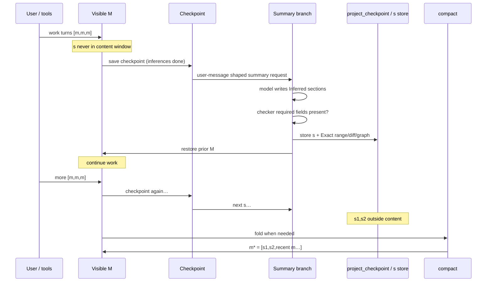

# Session memory & compaction

Two layers of truth:

1. **Intended contract** (below) — the flow that was designed / “deleted” in bad docs.  
2. **Code Exact** — what `prompt.ts` / `compaction.ts` do **today**.

If they disagree, **do not paper over it**. Fix code toward the contract, or mark gap.

**Graphs:** [`session-memory-graph.md`](session-memory-graph.md)  
**Fossil Exact on s:** [`summary-exact-handles.md`](summary-exact-handles.md)

---

## 1. Intended contract (restore target)

### Content window vs summaries

Summaries **`s` are not in the provider content window** during normal work.
Only real messages `m` are.

```text
content window (visible M, what the model sees on normal turns):

  [m, m, m]     [m, m, m]     [m, m, m]
       \             \             \
        s1            s2            s3     ← stored OUTSIDE content
        (not in M)    (not in M)    (not in M)

After compact:

  content window:
    m* = [ s1, s2, recent m, m, m ]    ← s capped at 32K tokens total
         └── AI body + system Exact handles (range / session-read locus)
             + tool filediffs + CodeGraph for that range
             + decisions from CURRENT summaries only (not from prior m*)
```

### Cadence counter

```text
open content size  ≈  content symbols (chars)
threshold          ≈  256_000 chars
tokens estimate    =  chars / 4     →  ~64_000 tokens
```

Implementation constant today: `SUMMARY_INTERVAL_TOKENS = 65_536` (≈ 262_144 chars
at /4). Same order as **256k chars**. Cadence uses **content only** (no +10k).
Safety/fit uses **content/4 + 10_000**.

### What one summary `s` is

Stored in **DB outside the content flow** (`project_checkpoint`). Never left as a
normal chat turn. Content window returns to **exactly pre-summary M**. These `s`
rows are consumed **only at compact** into `m*`.

| Piece | Owner | Role |
|-------|--------|------|
| AI body | **Inferred** | `## Semantic Vector`, `## Goal`, `## Key decisions`, `## Current state` |
| System data | **Exact** | range `from_id`/`to_id`, locus for `session-read`, checkpoint id |
| Tool diffs | **Exact** | write/edit/multiedit `filediff` from session DB — see `summary-exact-handles.md` |
| CodeGraph | **Exact** | structural impact over those file paths (system, not model) |
| Fossil | **Rollback only** | WC track/restore — **not** summary Exact |

**Not:** fossil span for memory. **Yes:** tool Exact + CodeGraph.

**Recent floor:** after compact, work tail is at least ~`RECENT_MIN_TOKENS` (32 768) content tokens from the end, ignoring the latest summary — thin post-summary stubs are extended backward so the next open window is real work, not empty → immediate re-summary. The walk-back **hard-stops at the prior message***: it is EXCLUDED (session-read only) and the tail never crosses it — repeated compacts stay idempotent.

**Summary cap:** total summary body text in m* is capped at `MAX_SUMMARY_BODY_TOKENS` (32 768 tokens). Older summaries are dropped from m* but remain accessible via `session-read`.

**Prior m* decisions:** decisions from prior m* are NOT pulled forward into the new m*. Each m* carries only decisions from its own current summaries.

**Post-summary checker:** required sections non-empty (`isValidSummaryBody`).

### When is summary called?

```text
1. Normal turn finishes (all tool / reasoning inference done)
2. Save checkpoint for exact visible M     ← "all inferences done"
3. Request summary via user-message shape (ephemeral stream / sidecar branch)
4. Store s in `project_checkpoint` (source of truth for compact)
5. Print s for the user as `=== LAYER-1 SUMMARY ===` panel
   (synthetic + ignored message — visible in TUI, not agent/provider M)
6. Agent content window = same M as before summary
7. Continue work on M
```

(3) must **not** remain as a normal user row that poisons the next real turn.
Display panel (5) is explicitly ignored by `toModelMessages` and open-window cadence.

### Compact

```text
When enough open content has been summarized (and/or open window demands fold):

  compact()  — ZERO LLM tokens, pure system fold

  m* = [ s, s, … (≤32K tokens), recent m, m, m ]
       decisions from current s only (not from prior m*)
```

- Soft-hide prior visible rows (never hard-delete).  
- Archive remains for `session-read` / `messagesearch`.  
- Next growth: `(m*, m, m, …)` then new out-of-band `s` again.

---

## 2. Intended sequence diagram



---

## 3. Code Exact vs contract (gap table)

| Contract item | Code today | Status |
|---------------|------------|--------|
| `s` not in content window | `maybeCaptureSidecar` → `project_checkpoint` + UI panel with **old** Exact stamp product (`=== LAYER-1 SUMMARY ===`, ignored/synthetic; skipped by `toModelMessages` / cadence) | **Match** (old s product, new placement) |
| Exact stamp / multi-s fold | `formatExactSystemStamp` shared with legacy inject; `compact` folds **all** open checkpoints + legacy `assistant.summary` via `buildMessageStar` | **Match** |
| After checkpoint when inferences done | `stop` → `publish` + **await `persist`** → `maybeCaptureSidecar` | **Match** (disk before summary); capture now runs on normal clean completions (`completedCleanly`), not only on blocked/error turns |
| Exact tool diffs + CodeGraph on s | `enrichRange`: `collectToolFileDiffs` + `mcpTouchThenSqlitePack` (no Fossil) | **Match**; no write/edit/multiedit in range ⇒ empty Exact |
| Summary as user-message shape | Ephemeral stream appends `summaryRequestProse()` as user content | **Match** (stream-only, not DB user row) |
| Store s + restore M | save checkpoint table; M never mutated | **Match** |
| Checker after summary | `isValidSummaryBody` 4 headings; reject body if fail | **Partial** (no multi-retry on sidecar path) |
| Fossil only for WC rollback | `SnapshotFossil.track` / `restore` — not on summary Exact path | **Match** |
| Cadence ~256k chars / ~64k tokens | `SUMMARY_INTERVAL_TOKENS = 65_536` content/4 | **Match** (order of magnitude) |
| `m* = [s,s,recent m]` | `compact()` folds open sidecars + Recent | **Match when compact runs**; new T2 guard: fold **refused** when no summaries exist (`folded:false`, warn) — no memory loss on /summarize |
| Summaries capped at 32K tokens | `MAX_SUMMARY_BODY_TOKENS = 32_768`; oldest summaries dropped from m* | **Match (shipped 2026-08-22)** |
| Prior m* decisions not pulled forward | `buildMessageStar` takes only `currentDecisions`, no `priorDecisions` param | **Match (shipped 2026-08-22)** |
| Prior m* excluded from Recent tail | `selectRecentTail` hard-stops at prior m* (does NOT include it) | **Match (shipped 2026-08-22)** |
| Recent tail ≥ ~16k tokens | `selectRecentTail` / `RECENT_MIN_TOKENS` — skip m* + last summary; overlap back if thin, hard-stop at prior m* | **Match** |
| Compact after enough s / model window full | **`maybeCompactCadence`**: target=`usable(model)` not 64k; skip same stop as new s; skip if 1 open sidecar | **Fixed 2026-07-30** |
| injectSummaryRequest as primary | Implemented, **not called** from `prompt.ts` | **Dead primary** |
| Summary request as durable user row then restore | inject would leave synthetic user unless restored — not used | N/A |

### Stop-path cadence (shipped)

```text
stop → Checkpoint M → maybeCaptureSidecar (s outside M)
     → if sidecar captured this stop: do NOT compact (defer Layer-2)
     → else maybeCompactCadence:
          open sidecars === 1 → skip (never s→immediate fold)
          open sidecars ≥ 2 (or 0 legacy)
            AND full visible content/4 ≥ usable(model)   ← e.g. ~850k on 1M, NOT 64k
            → compact() → m* = [s…, recent m…]; soft-hide m
     → break
```

**Layer-1 vs Layer-2 thresholds (do not conflate):**

| Gate | Target | Meaning |
|------|--------|---------|
| Sidecar s | ~`SUMMARY_INTERVAL_TOKENS` (65 536) open since last s | periodic Exact memory rows |
| Compact m* | **`usable(model)`** (context − LLM headroom) | only when M fills the **model** window |

**`usable` headroom** (not a compaction tax): `request overhead (10k) + min(max_output, 32k)` for the **next LLM turn**. Mechanistic compact is zero-token — no 15%/150k “leave room for summary call”. Optional override: `config.compaction.reserved`.

A 1M model must **not** compact at 64k — that wastes the window and forces the agent into m* soup.

---

## 4. Token formulas (keep)

| Use | Formula |
|-----|---------|
| Open-window / cadence | `chars / 4` (content only) |
| ~256k chars threshold | ↔ ~64k tokens (`65_536` constant) |
| Safety / request fit | `chars/4 + 10_000` |
| Summary body cap in m* | `MAX_SUMMARY_BODY_TOKENS` (32 768 tokens) |
| compact() | **0** LLM tokens |

No BPE/tiktoken authority (undercounts providers).

---

## 5. Forbidden

| Never | Why |
|-------|-----|
| Leave summary request as permanent user message in M | Poisons next turn / KV |
| Put `s` bodies into normal content window before compact | Length bias / double-count |
| Gate compact cadence on `usable()` | 1M models never fold |
| Accept summary without required fields | Broken handle |
| Model-authored IDs/diffs | Exact is system |

---

## 6. Implementation checklist (toward contract)

- [x] Checkpoint then sidecar capture on stop  
- [x] `s` outside M (`project_checkpoint`)  
- [x] AI sections + Exact enrich  
- [x] Body checker (4 headings)  
- [x] **Compact on cadence at stop** (`maybeCompactCadence` after sidecar)  
- [ ] Stronger post-summary field checker / retry on sidecar  
- [ ] Remove or quarantine dead `injectSummaryRequest` primary path  
- [x] Docs cite contract + gap table  

---

## Related

| File | Role |
|------|------|
| `session-memory-graph.md` | Mermaid of **current** control flow (Exact) |
| `finish-step-tx-graph.md` | finishStep TX (orthogonal) |
| `overflow.ts` | thresholds + +10k |
| `incremental-checkpoint.ts` | `s` store |
| `prompt.ts` | stop / break / sidecar / compact gates |
