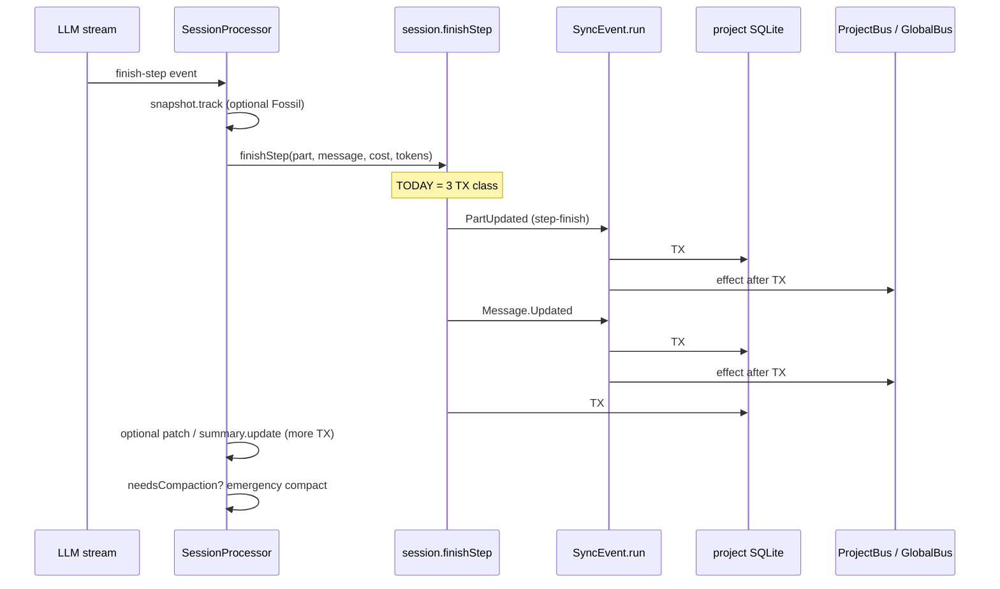
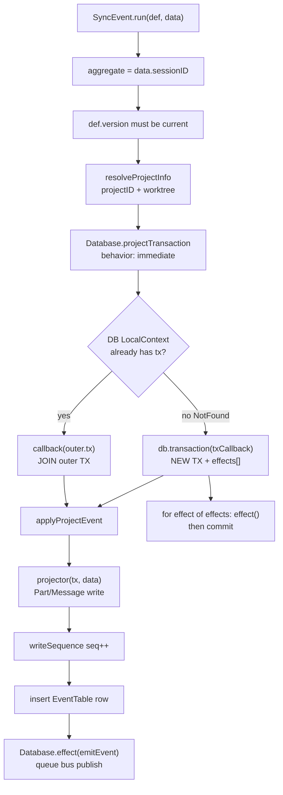
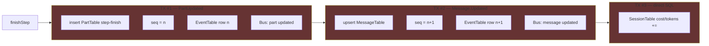
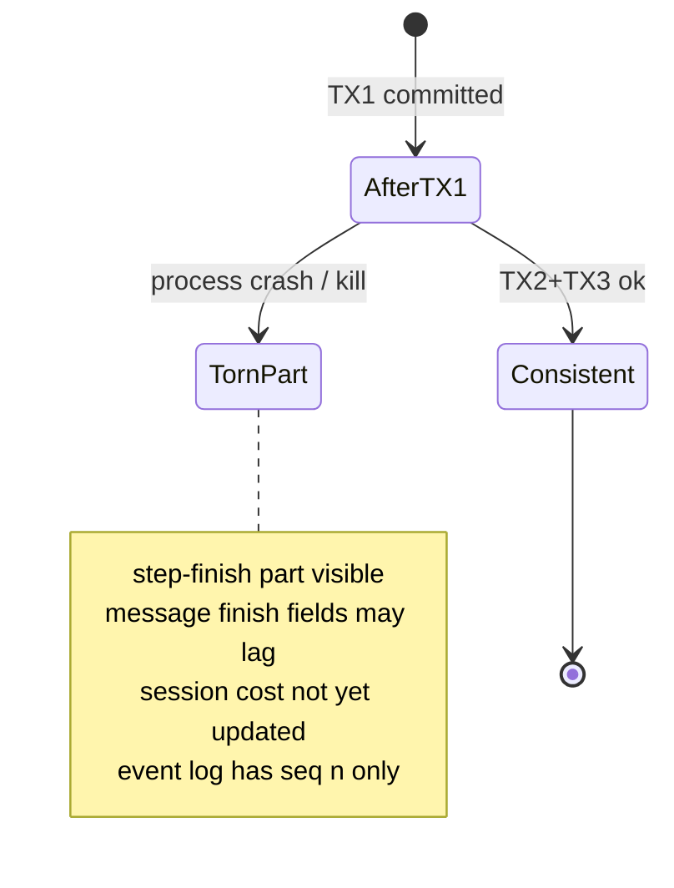
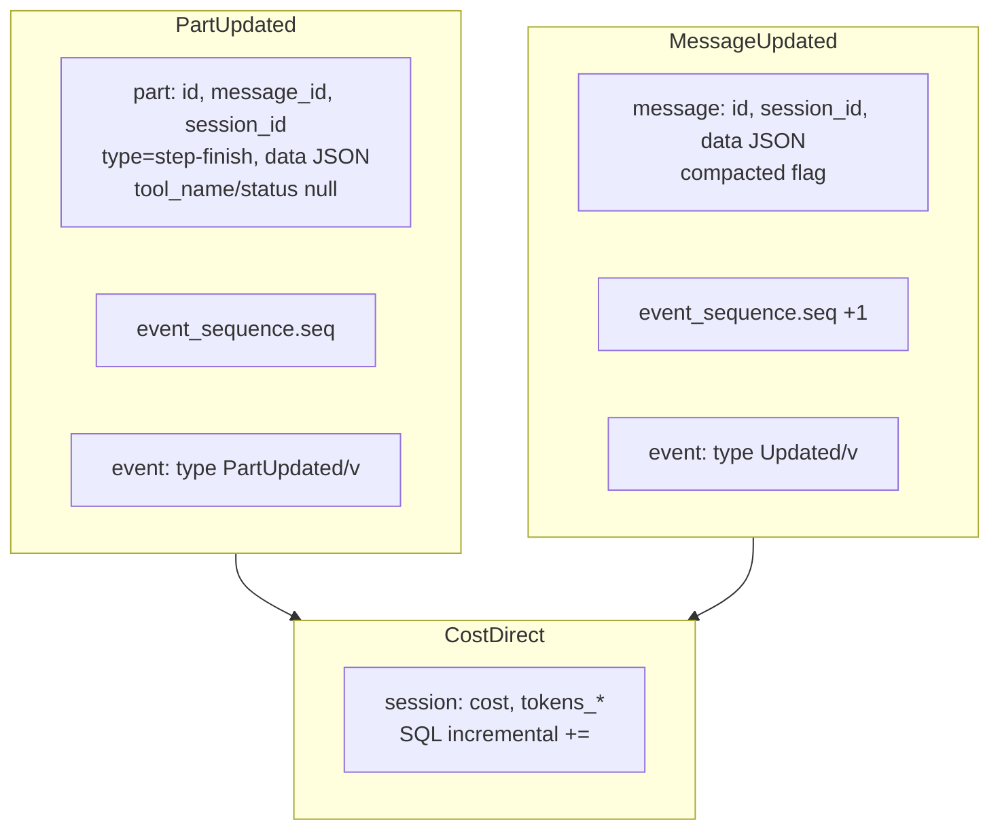
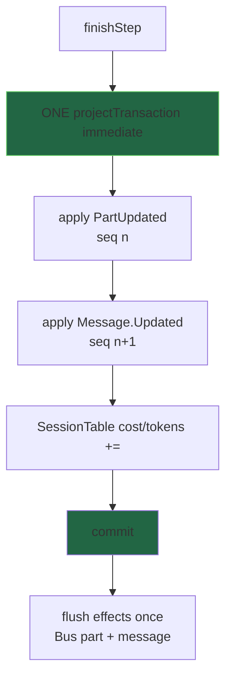
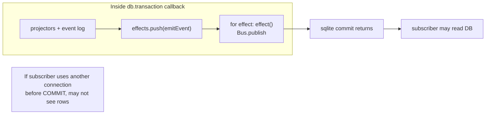
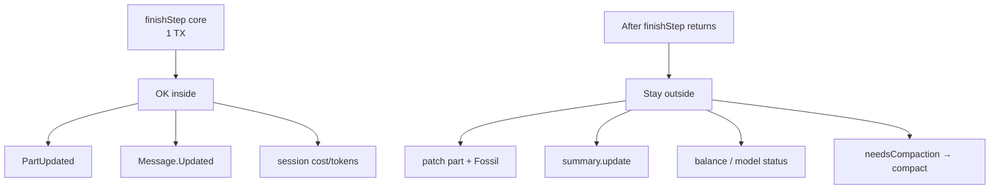
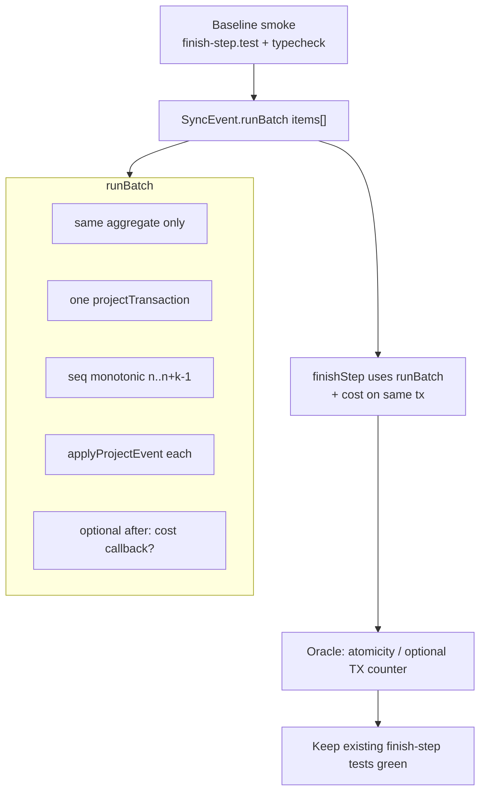
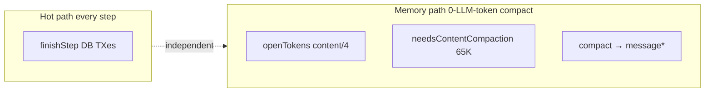

# Finish-step transactions — full graph (slippery path)

**Status:** phase-2 implemented (2026-07-30) — `SyncEvent.runBatch` + cost in one TX  
**Code:** `session.ts` `finishStep`, `sync/index.ts` `run` / `runBatch` / `applyProjectEvent`, `storage/db.ts` `projectTransaction` + `effect`  
**Plan:** `plans_completed/2026-07-30-b1-phase2-finish-step-single-tx.md`

## Why this is slippery

1. **API consolidation ≠ TX consolidation.** C2 shipped `finishStep()`; it still opens **~3** SQLite transactions.
2. **Nested `projectTransaction` joins outer TX** when `Database` context already exists — easy to get wrong if you assume every `run` is always a new TX.
3. **Bus publish is deferred via `Database.effect`**, flushed **after** the TX callback body, still **inside** `db.transaction(...)` on the happy path (order vs commit is subtle).
4. **Cost/token UPDATE is outside SyncEvent** — not event-sourced; third write path.
5. **Event `seq` is per-session aggregate** — two events must allocate seq **sequentially in one read-modify-write** or you race.
6. **Subscribers / TUI** may observe part before message (or message before cost) if multi-TX.

---

## Token ownership of this path

| Work | LLM tokens? | DB? |
|------|-------------|-----|
| `finishStep` itself | **No** | Yes — hot path every provider step |
| Optional later `patch` / `summary.update` | No | Separate TXes (out of B1-phase-2 scope) |

This is pure **CQRS write amplification** on the stream finish boundary.

---

## 1. Where `finishStep` sits in the processor



**Exact (today):** `processor.ts` calls one `finishStep`; inside it, two `SyncEvent.run` + one `Database.use` update.

---

## 2. Anatomy of one `SyncEvent.run` (Exact)



### Nested join (the trap and the lever)

```typescript
// db.ts projectTransaction
try {
  return callback(ctx.use().tx)   // already in TX → join, NO new commit
} catch (NotFound) {
  return db.transaction(txCallback)  // new TX, flush effects, commit
}
```

| Call pattern | TX count |
|--------------|----------|
| `run` alone | 1 TX + 1 flush effects |
| `run` then `run` (finishStep today) | **2** TXes |
| outer `projectTransaction { run; run; cost }` | **1** TX if both `run`s join outer |

**Claim:** phase-2 can be “wrap + join” **or** first-class `runBatch` — semantics differ for effects/seq bookkeeping.

---

## 3. Pre-phase-2 finishStep multi-TX graph (historical Exact)

> **Shipped:** `finishStep` now uses `SyncEvent.runBatch([PartUpdated, Updated], { after: cost })`
> — one `projectTransaction`. Section kept as the before-state.



### Torn windows (why it matters)



Even if rare, multi-TX is a **partial-apply** surface. Single TX = all-or-nothing for the logical step boundary.

---

## 4. Data written (Exact columns)



**Not in finishStep (still after, multi-TX):**

- `patch` part + Fossil
- `summary.update` / `updateFallback`
- balance / model-status bus (forked)

Phase-2 **must not** swallow those into the same TX (plan non-goal).

---

## 5. Target geometry — single logical TX



### Preferred API shapes

| Option | How | Pros | Cons |
|--------|-----|------|------|
| **A. Outer wrap** | `projectTransaction { SyncEvent.run; run; cost }` | Minimal code; uses join | Relies on join semantics; easy to break if `run` stops joining |
| **B. `runBatch`** | One TX, loop applyProjectEvent, then cost | Explicit, testable, documents intent | New public sync API |
| **C. CQRS pure** | New `session.usage_delta` event + projector | All writes event-sourced | Larger change; migrate cost path |

**Recommendation:** **B** (`runBatch` + cost in same TX callback) — makes “one TX” an invariant, not an accident of nesting.

---

## 6. Seq allocation — race surface

```mermaid
sequenceDiagram
  participant T1 as finishStep
  participant T2 as concurrent SyncEvent.run
  participant Seq as event_sequence

  Note over T1,Seq: SAFE: both events in one TX
  T1->>Seq: read seq = n
  T1->>Seq: write n, n+1
  T1->>T1: commit

  Note over T1,T2,Seq: UNSAFE if two TX without lock coordination
  T1->>Seq: read n
  T2->>Seq: read n
  T1->>Seq: write n+1
  T2->>Seq: write n+1
  Note right of Seq: duplicate / gap risk<br/>SQLite TX serializes writers<br/>but only within one connection TX
```

SQLite serializes writers on the same DB file; two sequential TXes from one thread are ordered. **Atomicity of the pair** is still better for:

- crash between TX1 and TX2  
- future multi-connection  
- mental model / replay of “one step”

`runBatch` must allocate:

```text
seq0 = current + 1
seq1 = current + 2
writeSequence only final (or write after each apply — both ok if same TX)
```

Today each `run` does read-increment-writeSequence per event — **inside one outer TX** both see consistent mid-state.

---

## 7. Bus / effects ordering (slippery)



**Claims:**

| Claim | Mark |
|-------|------|
| Effects run after projectors, still in `transaction` callback | **Exact** (`db.ts` loop before return) |
| Publish before durable commit is observable | **Inferred** (timing vs WAL) |
| Single TX does not remove publish-before-commit; it **reduces** dual publish windows | **Exact** |

Do **not** promise “subscribers never see partial step” without moving publish **after** commit (separate hardening).

---

## 8. Failure modes ledger

| Failure | Multi-TX today | Single TX target |
|---------|----------------|------------------|
| Crash after part, before message | Torn | All rolled back |
| Crash after both events, before cost | Cost lag | All rolled back |
| Projector throws mid-batch | One event committed | None committed |
| Busy SQLITE_BUSY | Per-TX retry | One TX retry |
| Bus publish throws | After write; write may stay | Same if publish in effect after write |

---

## 9. What must stay outside the TX



Mixing Fossil/network into the DB TX = long locks. **Forbidden.**

---

## 10. Implementation graph (phase-2 tasks)



### Minimal `runBatch` contract

```text
runBatch([
  { def: PartUpdated, data: {...} },
  { def: Message.Updated, data: {...} },
], { publish?: true })

// then cost UPDATE must share the same TX:
// either extend runBatch with tail(tx)=>void
// or finishStep opens outer TX and:
//   - uses internal apply helpers (not public run)
//   - or run joins outer (document as required invariant)
```

**Prefer:** `runBatch(..., { after?: (tx) => void })` for cost so cost cannot drift outside.

---

## 11. Cadence vs finish-step (do not confuse)



B1-phase-2 does **not** change token formulas or Layer-1/2. Only write atomicity/latency on step boundary.

---

## 12. Claim ledger (ADID)

| ID | Claim | Mark | Evidence |
|----|-------|------|----------|
| F1 | finishStep uses 2× SyncEvent.run + 1× Session UPDATE | **Exact** | `session.ts` finishStep |
| F2 | Each SyncEvent.run opens/joins one projectTransaction | **Exact** | `sync/index.ts` run |
| F3 | Nested projectTransaction joins outer TX | **Exact** | `db.ts` try `ctx.use().tx` |
| F4 | Today finishStep is 3 TX (no outer wrap) | **Exact** | no outer wrapper in finishStep |
| F5 | Comment “max 3 TX” is API batching not single TX | **Exact** | comment vs code |
| F6 | Cost update is not SyncEvent | **Exact** | direct SessionTable SQL |
| F7 | Bus publish queued via Database.effect | **Exact** | applyProjectEvent |
| F8 | Single TX reduces torn part/message/cost | **Inferred** | crash window analysis |
| F9 | Single TX alone does not guarantee post-commit publish order | **Exact** | effects before commit return |
| F10 | patch/summary after finishStep remain multi-TX | **Exact** | processor after finishStep |

---

## 13. Oracles for phase-2

| # | Oracle | Pass |
|---|--------|------|
| O1 | `bun test test/session/finish-step.test.ts` | green before/after |
| O2 | After finishStep: part + message + session tokens consistent | Exact row checks |
| O3 | Optional: instrument TX open count on finishStep path = 1 for core | Exact counter |
| O4 | Injected projector failure mid-batch → no partial rows | rollback |
| O5 | `bun typecheck` | pass |

---

## 14. One-line summary

> **finishStep is the step-boundary durability unit; today it is three durability units. Phase-2 must make Part + Message + cost one SQLite transaction without pulling Fossil/network into that lock, without breaking seq, and without confusing “nested join” with “explicit batch”.**

When implementing: prefer **`runBatch` + `after(tx)` cost**, baseline smoke first, leave patch/summary outside.
