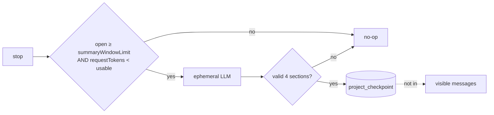
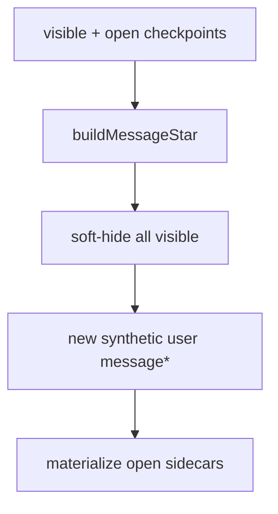

# Session memory — control-flow graph (code Exact)

**Canonical prose:** [`compaction.md`](compaction.md)  
If this graph is prettier than code, **code wins**.

---

## Prompt loop (what actually happens)

```mermaid
flowchart TB
  START([loop iteration]) --> LOAD[load visible msgs]
  LOAD --> SUM{pending legacy\nsummary request?}
  SUM -->|yes| SA[summaryAttempt tools={}]
  SUM -->|no| CHK
  SA --> CHK

  CHK{assistant complete\nAND no open tools\nAND lastUser before lastAsst\nAND NOT summaryAttempt?}
  CHK -->|yes| BRK[break — turn end]
  CHK -->|no| STEP[step++]

  STEP --> SUB{subtask?}
  SUB -->|yes| HSUB[handleSubtask] --> START
  SUB -->|no| CAD{needsContentCompaction\nopen ≥ 65_536?}

  CAD -->|yes| CMP[compact ZERO tokens] --> START
  CAD -->|no| LLM[normal LLM.stream]

  LLM --> PROC[SessionProcessor]
  PROC -->|continue tools| START
  PROC -->|result compact| CMP2[compact] --> START
  PROC -->|result stop| STOP

  STOP --> CK[Checkpoint.publish M]
  CK --> SC[maybeCaptureSidecar]
  SC --> BRK2[break]

  BRK --> END([idle])
  BRK2 --> END
```

**Read carefully:**

- Green path on completed work turns: **stop → checkpoint → sidecar? → break**.  
- **`compact` is not on that path.**  
- In-band `needsContentCompaction` only if the loop **did not break** first.

---

## Sidecar only (Layer-1 that runs)



---

## compact() data fold (when it *does* run)



---

## Token ownership

| Path | LLM? | Gate in code |
|------|------|----------------|
| Normal turn | yes | tools / stop |
| Sidecar | yes ephemeral | summaryWindowLimit + fit +10k |
| compact() | **no** | in-band 65K **if loop continues**; or emergency usable/overflow |
| injectSummaryRequest | would inject visible user | **not called from prompt loop** |

---

## Honest loop shape

```text
visible (m, m, m)
  stop → maybe sidecar in project_checkpoint; visible unchanged
  … more turns …
  stop → more sidecars (if thresholds pass)
  emergency overflow OR loop-continue + open≥65K
    → compact → visible (message*) only
  growth → (message*, m, m, …)
  … repeat …
```

Not: “every 65K at end of turn, inject summary then compact.”

---

## Claim ledger

| Claim | Mark |
|-------|------|
| Sidecar on stop after checkpoint | Exact |
| injectSummaryRequest unused by prompt loop | Exact |
| Break-before-compact on completed turns | Exact |
| compact zero LLM tokens | Exact |
| In-band needsContentCompaction can fire on tool-continue | Exact |
| Docs that said inject every 64K as primary | **False vs code** (fixed in compaction.md) |
