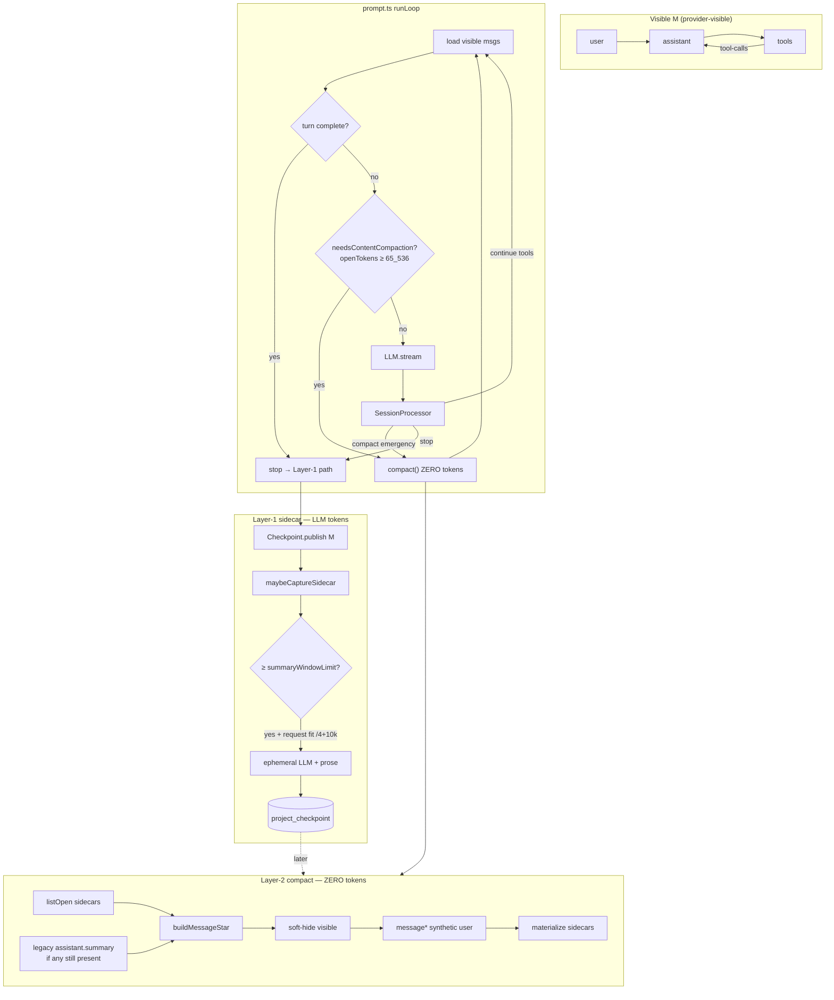
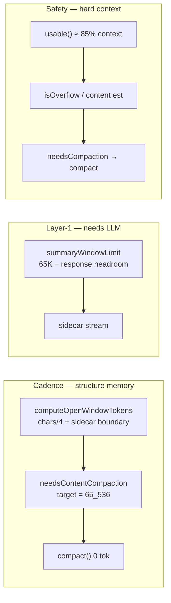
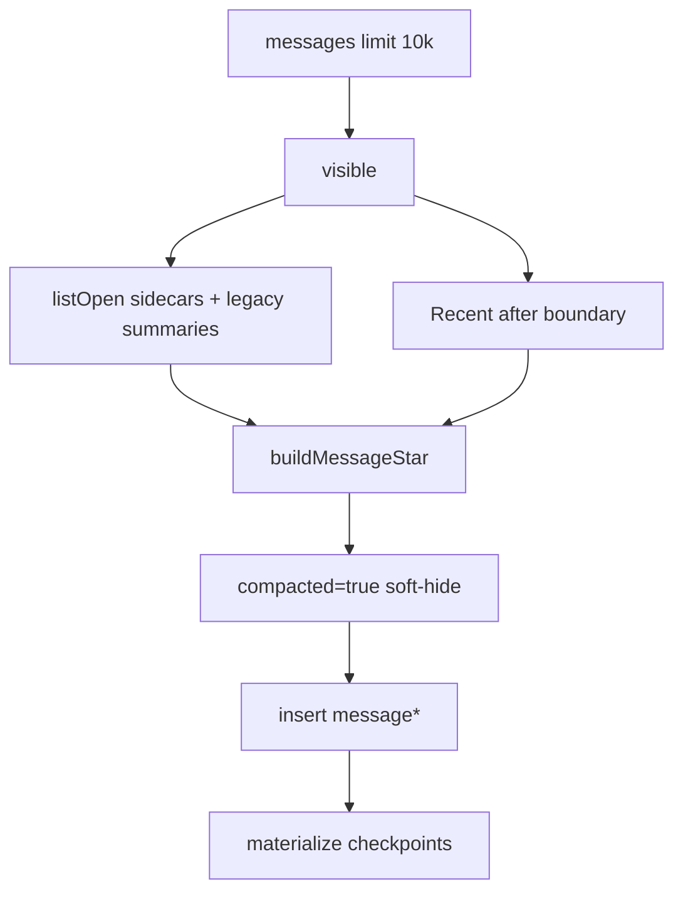

# Session continuous memory — process graph

**Status:** production geometry (ADID 15.4.3)  
**Code:** `packages/opencode/src/session/{prompt,compaction,overflow,processor,incremental-checkpoint,checkpoint}.ts`  
**Canonical prose:** [`compaction.md`](compaction.md) (if docs conflict, **compaction.md + code** win)

## Token ownership (Exact)

| Operation | LLM tokens? | Gate |
|-----------|-------------|------|
| Normal turn (user / assistant / tools) | **Yes** | tool loop / stop |
| Layer-1 sidecar capture | **Yes** (ephemeral branch) | `openTokens ≥ summaryWindowLimit` and **request fit** `content/4+10k < usable()` |
| Layer-2 `compact()` → `message*` | **No (zero)** | **cadence:** `openTokens ≥ SUMMARY_INTERVAL_TOKENS` (`needsContentCompaction`) |
| Emergency compact after finish-step | **No (zero)** | **safety:** `isOverflow(tokens)` or `requestTokens ≥ usable()` |
| Checkpoint publish / Fossil / CodeGraph | **No** | system Exact |

**Rule:** never gate zero-token `compact()` on `usable()` or `isOverflowFromContent`. Those reserve headroom for **real model turns**.

### Empirical request size (safety only)

```text
contentTokens = symbols / 4          # open window / message body
requestTokens = contentTokens + 10_000   # system + tools + framing
```

- Cadence counters use **content only** (`computeOpenWindowTokens`).
- Safety / fit uses **`estimateRequestTokens`** — no WASM/BPE/tiktoken tokenizer
  (removed: fat model.json ~5–6 MB each + large WASM heap). Constants:
  `CHARS_PER_TOKEN`, `REQUEST_OVERHEAD_TOKENS` in `overflow.ts`.

### Why not a real tokenizer (acceptance)

Across providers and window sizes, **BPE/tiktoken systematically undercount** relative
to provider ground truth (`usage` / context overflow). They encode body text and miss
system prefix, tools schema, and framing. Undercount is dangerous: safety gates fire
too late.

Empirical relation (validated multi-window / multi-provider):

```text
tokenizer  <  provider_actual  ≤  symbols/4 + 10_000
```

Our heuristic is **stably a bit above** real model usage — intentional slight
overcount for safety. Cadence stays content-only so Layer-1/2 do not advance early
just because of framing overhead.

---

## Master process graph



**Dual path:** primary capture is sidecar. `injectSummaryRequest` remains in
code for legacy; compact still folds old `assistant.summary` rows when present.


---

## Cadence vs safety



---

## Timeline (happy path)

```mermaid
sequenceDiagram
  participant U as User
  participant P as prompt loop
  participant L as LLM
  participant Pr as Processor
  participant SC as Sidecar
  participant C as compact 0 tok
  participant MS as message*

  U->>P: user message
  P->>L: normal turn
  L->>Pr: stream + tools
  Pr-->>P: stop
  P->>SC: maybeCaptureSidecar if open ≥ summaryWindowLimit
  Note over SC: ephemeral LLM; M unchanged
  loop growth
    Note over P: open window chars/4
  end
  P->>C: needsContentCompaction open ≥ 65K
  C->>MS: fold sidecars + Recent
  Note over MS: next open ≈ len(message*)/4
```

---

## compact() internal (zero tokens)



---

## Information Mark ledger

| Claim | Mark | Evidence |
|-------|------|----------|
| `compact()` does not call the provider | Exact | `compaction.ts` compact body |
| In-band gate is `needsContentCompaction` | Exact | `prompt.ts` runLoop |
| Sidecar uses `summaryWindowLimit` | Exact | `maybeCaptureSidecar` |
| Emergency path uses `usable` / `isOverflow` | Exact | `processor.ts` finish-step |
| 1M models fire cadence at ~65K open window | Exact | `needsContentCompaction` unit tests |

---

## Forbidden couplings

| Never | Why |
|-------|-----|
| Gate compact on `usable()` | Compact is not an LLM call; 1M models stall until ~980K |
| Gate compact on `summaryWindowLimit` | That reserves Layer-1 **LLM** response headroom |
| Put sidecar prose into Message/Part | Poisons visible M and KV prefix |
| Model-authored range IDs / diffs | Exact is system-owned |
