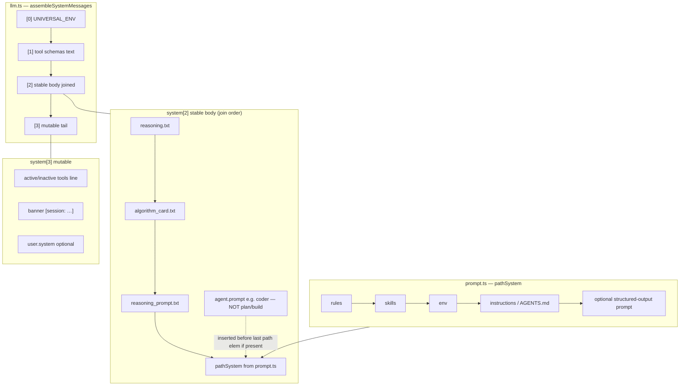
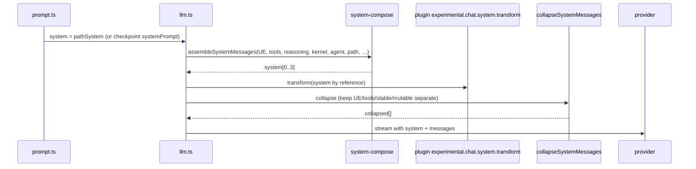
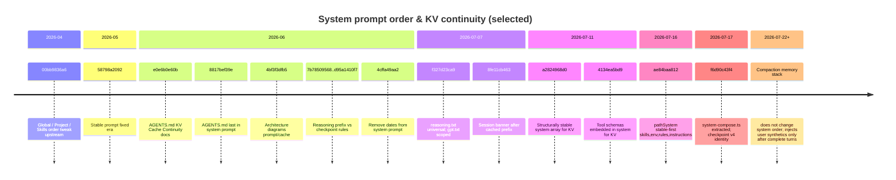
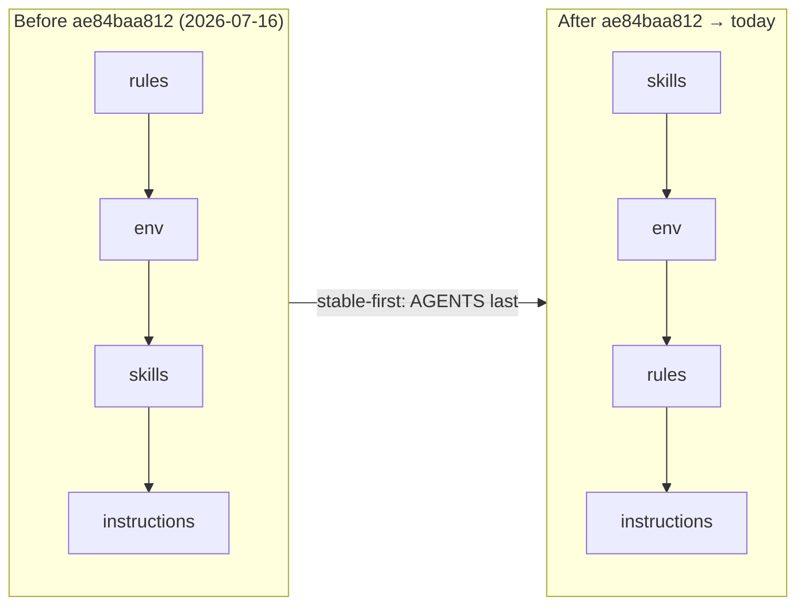

# System prompt order — investigation

**Status:** current as of 2026-07-24 (branch `Local_Development`)  
**Why it matters:** byte-stable prefix → provider KV cache hits → model keeps reasoning across turns. Any reorder or mid-prefix mutation is a full prefix miss.

---

## 1. Runtime assembly (today)

Two stages:

1. **`prompt.ts`** builds `pathSystem` (project-facing tail pieces) or reloads checkpoint system.  
2. **`llm.ts` → `assembleSystemMessages()`** (`system-compose.ts`) wraps that into the **provider-facing** array.



### Final slot layout (cache-sensitive)

| Slot | Content | Mutability |
|------|---------|------------|
| **[0]** | `UNIVERSAL_ENV` (thin role + handoff to REASONING / ALGORITHM_CARD + Exact stance) | Frozen forever |
| **[1]** | Serialized tool **schemas** (all tools, sorted) | Stable per app version |
| **[2]** | **Stable body** (single joined string): reasoning → kernel → path → agent (see below) | Stable per agent + project; rebuild on identity mismatch |
| **[3]** | Active tools line + session banner + optional `user.system` | **Most mutable** — must stay last |

### Stable body internal order (intended)

```
reasoningPrefix          ← MOST STABLE (full reasoning.txt)
algorithmCard            ← ALGORITHM_CARD (commented Python routes; shared plan+build)
kernel                   ← reasoning_prompt.txt (prompt_kernel)
pathSystem[0..n-2]       ← rules → skills → env  (assemblePathSystem)
agentPrompt              ← agent.prompt for subagents (coder/…); plan/build have NONE
pathSystem[last]         ← instructions (AGENTS.md etc.) — most mutable of path
(+ structured-output prompt may be last path element when json_schema)
```

**Mode text is NOT in system.** A single synthetic Plan, Build, or Reasoning
instruction is persisted only when the user enters or changes mode. Steady-state
mode boundaries are software-enforced; repeated tails and history-inferred mode
switches are prohibited. This keeps the system prefix unchanged while the same
model/session changes mode.

**Bug fixed (2026-07-24):** `llm.ts` used to do `systemPromptPrefix().split("\\n\\n")`.  
Both files contain blank lines, so “reasoning” became only the title (~150 bytes) and the rest of `reasoning.txt` was glued into the “kernel” string. Use `ProviderTransform.systemPromptParts()` — never join-then-split on blank lines.

**Code:** `packages/opencode/src/session/system-compose.ts`  
**Caller:** `packages/opencode/src/session/llm.ts` (~252)  
**Path builder:** `packages/opencode/src/session/prompt.ts` (~1727–1730)

### After assemble



**Plugin note:** fingerprint / checkpoint must run **after** plugin transform (KV rule in AGENTS.md).

### Checkpoint path

- Load checkpoint → if `identityFingerprint` matches, reuse stored `systemPrompt` as path input; identity components still re-applied in compose.  
- Mismatch (kernel/agent change) → full rebuild.  
- Compaction **removes** checkpoint; next success saves fresh.

---

## 2. Path order (fixed)

| Source | Path order |
|--------|------------|
| **prompt.ts (live)** | `assemblePathSystem` → `rules → skills → env → instructions` |
| **system-compose `assemblePathSystem`** | same |
| **Identity block** | `reasoning → ALGORITHM_CARD → kernel → path → agent? → AGENTS` |

plan/build: conversation-tail synthetics only (see §1).
---

## 3. Commit timeline (when order was modified)



### Table (deep cut)

| Date | Commit | What changed for **order** |
|------|--------|----------------------------|
| 2026-04-29 | `00bb9836a6` | Upstream: Global → Project → Skills instruction order |
| 2026-05-18 | `58798a2092` | “Stable, prompt fixed” era (baseline stability) |
| 2026-06-13 | `e0e6b0e60b` | Document KV continuity rules in AGENTS.md |
| 2026-06-24 | `8817bef39e` | **AGENTS.md / instructions last** in system |
| 2026-06-25 | `4bf3f3dfb5` | Diagrams: prompt, checkpoint, cache/diff |
| 2026-06-27 | `7b78509568`, `185a2ffe2c`, `d95a1410f7` | Reasoning prefix always wrap; checkpoint self-contained V2 |
| 2026-06-27 | `4cffa49aa2` | **No dates in system** (dates only on user messages) |
| 2026-07-07 | `f327d23ca9` | Universal `reasoning.txt`; drop identity headers from family prompts |
| 2026-07-07 | `8fe11cb463` | **Banner after** cached prefix (mutable last) |
| 2026-07-11 | `a2824968d0` | Structurally stable multi-slot system array |
| 2026-07-11 | `4134ea5bd9` | **Tool schemas in system** as stable slot |
| 2026-07-16 | `ae84baa812` | pathSystem: `rules,env,skills,instr` → **`skills,env,rules,instr`** |
| 2026-07-17 | `f6d90c43f4` | **`system-compose.ts` born**; pure assemble/collapse; checkpoint v4 + identity fingerprint |

Not every prompt content edit is listed — only commits that **moved slots or stability rules**.

---

## 4. Evolution of pathSystem order (prompt.ts)



Rationale (commit message): most mutable content (project AGENTS.md / instructions) last so partial prefix hits survive when only instructions change.

---

## 5. What must never enter the stable prefix

| Forbidden in [0–2] | Where it belongs |
|--------------------|------------------|
| `Date.now()`, session clocks | User message text (prompt.ts) |
| Session IDs in identity body | Banner in mutable [3] |
| Per-turn active-tool lines | Mutable [3] |
| Compaction / summary injects | **User** synthetic messages after complete assistant turn — not system |

Layer-1 summary / resume injects are **orthogonal** to system order: they append **user** messages only when `isAssistantTurnComplete` (reasoning closed + finish). They must not splice into system mid-reasoning.

---

## 6. Key files

| File | Role |
|------|------|
| `session/system-compose.ts` | `assembleSystemMessages`, `collapseSystemMessages`, `assemblePathSystem`, `validateSystemOrder` |
| `session/llm.ts` | Split reasoning/kernel, call assemble, plugin transform, collapse |
| `session/system.ts` | `UNIVERSAL_ENV`, env/skills builders, provider family prompts |
| `session/prompt.ts` | Builds pathSystem / checkpoint reuse; user-message dates |
| `session/checkpoint.ts` | Encrypted system + identity fingerprint |
| `session/cache-control.ts` | Fingerprints (post-plugin) |
| `provider/transform.ts` | `systemPromptPrefix` → reasoning + kernel |

---

## 7. Suggested verification

```bash
# Composition order unit tests (from f6d90c43f4)
cd packages/opencode && bun test test/session/system-compose.test.ts

# Once-per-process dump in logs: "system prompt dump (once)"
# Check slot count and that banner is not inside system[2]
```

---

## 8. Summary

- **System order is a long-running KV project**, not one PR: docs (Jun) → AGENTS last → banner last → stable array + tool schemas (Jul 11) → path stable-first (Jul 16) → **compose module** (Jul 17).  
- **Current law:** stable prefix first, mutable last; reasoning before kernel before path; injects only after assistant turn complete.  
- **Watch:** `assemblePathSystem` vs live `prompt.ts` path order drift if someone wires `assemblePathSystem` without reconciling `ae84baa812`.
