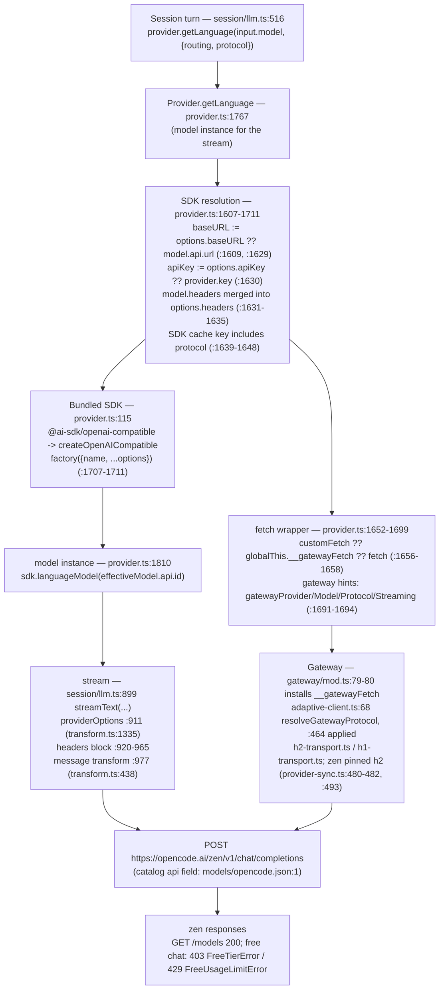

# OpenCode Zen call path — provider `"opencode"` (detailed graph)

intent: How a session call reaches `https://opencode.ai/zen/v1` in THIS fork: catalog →
provider loader → SDK + fetch wrapper → gateway transport → request headers → zen;
plus the free-tier client gate as observed live on 2026-10-10.
state: ACTIVE — every line reference below was read in-tree on 2026-10-10; the
free-tier gate question is OPEN (see §5).

## 1. Graph — runtime path

Provider identity: `provider id "opencode"` = **OpenCode Zen**
(`src/provider/models/opencode.json:1`: `"env":["OPENCODE_API_KEY"]`,
`"npm":"@ai-sdk/openai-compatible"`, `"api":"https://opencode.ai/zen/v1"`).

## 2. Step table (with code references)

| # | Step | Where |
|---|------|-------|
| 1 | Catalog entry: id `opencode`, env `OPENCODE_API_KEY`, npm `@ai-sdk/openai-compatible`, api `https://opencode.ai/zen/v1` | `packages/opencode/src/provider/models/opencode.json:1` |
| 2 | Zen used as the free default seed: `SEED_PROVIDER_ID = "opencode"`; pick = free ∧ vision ∧ toolcall, ranked by context, ties by id; `big-pickle` only as fail protection | `src/provider/free-default.ts:17`, `:20`, `:31-38` |
| 3 | Custom loader `opencode:` — key check: env → auth store → config `provider.opencode.options.apiKey`; without any key the non-free models are dropped and `apiKey: "public"` is handed to the SDK | `src/provider/provider.ts:174`, `:176-190`, `:193-194` |
| 4 | Auth store path (auth.json at `Global.Path.config`); loader reads it via `dep.auth(id)` | `src/auth/index.ts:12`; `src/provider/provider.ts:182` |
| 5 | Language model requested per call: `provider.getLanguage(input.model, {routing, protocol})` | `src/session/llm.ts:516-531`; impl `src/provider/provider.ts:1767` |
| 6 | baseURL resolution: `options.baseURL ?? model.api.url` → set on options | `src/provider/provider.ts:1607-1609`, `:1629` |
| 7 | apiKey: loader value ("public") else `provider.key` (auth) | `src/provider/provider.ts:1630` |
| 8 | Per-model `headers` from the catalog merged into SDK options | `src/provider/provider.ts:1631-1635` |
| 9 | SDK construction: bundled map entry → `createOpenAICompatible({name, ...options})` | `src/provider/provider.ts:115`, `:1701-1711` |
| 10 | Model instance: default `sdk.languageModel(modelID)` (zen loader defines no custom `getModel`) | `src/provider/provider.ts:1810` |
| 11 | fetch wrapper per SDK: `customFetch ?? globalThis.__gatewayFetch ?? fetch`; adds timeout/chunk signals; passes gateway hints | `src/provider/provider.ts:1652-1658`, `:1660-1669`, `:1691-1695` |
| 12 | Gateway install: `globalThis.__gatewayFetch = wrap(globalThis.fetch)` | `src/provider/gateway/mod.ts:79-80` |
| 13 | Protocol: `resolveGatewayProtocol` → zen pinned **h2** (zone verified live; h3 impossible server-side) | `src/provider/gateway/adaptive-client.ts:68`, `:464`; `src/provider/provider-sync.ts:480-482`, `:493` |
| 14 | Transport seam captures the exact wire request (headers verbatim) | `src/provider/gateway/wire-capture.ts:41-63`; transports `h2-transport.ts` / `h1-transport.ts` |
| 15 | Request assembly: `streamText` with `providerOptions`, headers, wrapped model | `src/session/llm.ts:899`, `:911`, `:920-965`, `:969-995` |
| 16 | Header block — universal layer: `x-request-id` (user id; novita-only differs), `x-session-id`, `x-session-affinity`, optional `x-parent-session-id` | `src/session/llm.ts:933-936` |
| 17 | Header block — opencode-only layer (only when `providerID.startsWith("opencode")`): `x-opencode-session/request/project/client` (+ TDA, config-gated) | `src/session/llm.ts:937-955` |
| 18 | `User-Agent: opencode/${InstallationVersion}` (+ ai-sdk suffix added by the SDK, see §3); per-model headers merged last | `src/session/llm.ts:963-965`; version default `packages/core/src/installation/version.ts:6` |
| 19 | Message/options transforms | `src/provider/transform.ts:438` (`message`), `:1335` (`providerOptions`) |
| 20 | 429 semantics: `FreeUsageLimitError` → "subscribe to Go" upsell message | `src/session/retry.ts:70`, `:11` |

## 3. Wire truth — what the live runtime actually sends

Source: raw-wire capture from the live gateway, request of session
`ses_eda55bb41ffe1RxpWbNd0SXtp7` at 11:54:40Z, model `mimo-v2.6-flash-free`,
protocol **h2** —
`.opencode/data/gateway/raw-wire/2026-10-10T11-54-40-558Z-4157ca52-e362-464e-b7fa-6a377df84f37-attempt1.json`
(lines 5-21):

| header | captured value |
|---|---|
| `authorization` | `***` (redacted by the capture; the real token is the account key — identical to `OPENCODE_API_KEY`, hash-checked 2026-10-10) |
| `content-type` | `application/json` |
| `user-agent` | `opencode/10.0.1262 ai-sdk/provider-utils/5.0.44 runtime/bun/1.4.2` |
| `x-opencode-client` | `cli` |
| `x-opencode-project` | `4b0ea68d…` (40-hex project id) |
| `x-opencode-request` | `msg_…` |
| `x-opencode-session` | `ses_…` |
| `x-request-id` | `msg_…` |
| `x-session-affinity` | `ses_…` |
| `x-session-id` | `ses_…` |

Notes:
- The `User-Agent` on the wire is the `llm.ts:963` prefix **plus the SDK suffix**
  (`ai-sdk/provider-utils/<v> runtime/bun/<v>`); the source in `llm.ts` sets only the prefix.
- **No `x-client` header is sent by this fork** — measured absence: `x-client` does not
  appear in `packages/opencode/src` or `external/` (the only hit is the unrelated
  `x-client-request-id` in `src/plugin/anthropic.ts:381`). Control grep that MUST match:
  `x-opencode-session` → `src/session/llm.ts:939` ✓.
- The request body carried SDK options inside it (`temperature`, `top_p`,
  `prompt_cache_key: "ses_…:model"`, `protocol: "h2"`) — captured verbatim in the same file.

## 4. Server-side gates — observed 2026-10-10

| probe | result | evidence ref |
|---|---|---|
| `GET /models`, `Bearer public`, opencode UA | 200 — 87 models | run 2026-10-10 (this session) |
| `GET /models`, `Bearer public`, default python-urllib UA | 403 — UA matters at the edge | first probe, 12:07Z |
| `GET /models`, real key | 200 — 12 models (different subset than the public list; why — Unknown) | run 2026-10-10 |
| `POST /chat/completions` free model, any key/UA/x-client/protocol combination tried (16 variants) | **403** `{"type":"error","error":{"type":"FreeTierError","message":"OpenCode's free tier can only be used from within OpenCode"}}` (mimo-v2.6-flash-free) / **429** `FreeUsageLimitError` (space-bunny-free) | `experiments/2026-10-10_zen-free-call/` (all probes) |

Timeline of the gate (all UTC, same host, same account):

| time | actor | outcome | evidence |
|---|---|---|---|
| 11:54:38 | live runtime, `mimo-v2.6-flash-free` | **completed**, no error | DB `msg_125aa47a1001Pw5j2humr9ldGa` (error NULL) |
| 11:59–12:02:56 | live runtime, `space-bunny-free` turns | completed | DB `msg_125b1df5a001IbmBy3XkxI2gXd` et al. (error NULL) |
| 12:03:06 | live runtime, last zen message | aborted | DB `msg_125b2068d001b7bL0YRKs5IcVR` |
| 12:03:09 | sibling robot replay script | **403 FreeTierError** — "headers still insufficient; stop here" | `.opencode/data/log/1791633333969_diff_space-bunny-free_ses_eda9368c4ffeZU9j2XU9Avyohs.diff:21` |
| 12:05–12:17 | this session, 16+ scripted variants (Python urllib h1; Bun h1/h2; public key and real key; x-client ∈ {`opencode`, `opencode/1.0.0`, `cli`, `opencode-cli`}; full ai-sdk UA; with/without `x-opencode-*`) | 403 (mimo) / 429 (space-bunny) — **every** combination | `experiments/2026-10-10_zen-free-call/zen_gate_probe*.mjs` |
| 12:16 | key identity check | env `OPENCODE_API_KEY` ≡ `bin/auth.json` key (sha256 prefix `6c45ba8b`, keys never printed) | `zen_key_probe.mjs` run |
| 14:42:07 / 14:44:39 | **the LIVE runtime itself** (its own server, sessions `ses_ed9bc6413ffe…` / `ses_ed9ba1279f…`), `space-bunny-free` / `mimo-v2.6-flash-free` | runtime's own requests: **429** both — zen's client check PASSES, only the free-tier limiter bites | wire `…/raw-wire/2026-10-10T14-42-07-792Z-e8019b9b-…json`, per-response `…e8019b9b…-attempt1.md:5`; `…/14-44-39-555Z-fc7bb7a9-…json` + `…fc7bb7a9…-attempt1.md:5` |
| 14:43–14:49 | controlled replicas of THAT request: exact header set, exact 306 832-byte body replayed, `node:http2` (incl. under Bun), 3 requests on one reused connection, `OPENCODE_AUTH_CONTENT` absent, env key ≡ auth.json key | **403 FreeTierError in every case** | `zen_probe_replay_body.mjs`, `zen_probe_node_http2.mjs`, `zen_probe_conn_reuse.mjs`, `keystores_probe.py` |

Interpretation (kept separate from the observations above):

- **The runtime is ALSO limited right now — but differently (✓ measured).** Driving the worktree's live
  server onto the same two free models produced the runtime's OWN requests: **429** both times (captures
  above). So zen's client check PASSES for the runtime and only the free-tier limiter bites. The earlier
  200s (11:54–12:02) are the same story with quota available: free models work from the TUI
  intermittently, and never because the gate was bypassed.
- **The 403 is a client classification the reproducible surface cannot clear (✓ measured).** Header set,
  exact request body, same key, h1/h2, `node:http2` (the gateway's own transport API —
  `h2-transport.ts:154 http2.connect(baseUrl)`), one reused connection — every scripted request is still
  answered `403 FreeTierError`. The discriminator therefore sits BELOW the HTTP application layer
  (connection fingerprint / attestation), not in anything a header-and-body replica can carry.
- **H3 — `x-client: opencode` (owner directive 2026-10-10 12:08Z) — unresolved (LOW-MEDIUM).**
  The header was added to the repro script and tested in ≥8 combinations (alone, with the
  real key, with the full UA, over h2, against two models): not sufficient by itself. The
  required value/format, or the additional factor, remains Unknown.

## 5. Free model selection (how zen free models are chosen at startup)

`pickFreeVisionModel` (`src/provider/free-default.ts:31-38`): free (`cost.input == 0 &&
cost.output == 0`) ∧ vision ∧ toolcall, ranked by context desc then id asc, `big-pickle`
excluded unless it is the only one. Chooser only — the TUI writes the pick into the global
config layer; nothing in the chooser touches disk (`free-default.ts:4-5`).

Live model lists are dynamic: bundled catalog `src/provider/models/opencode.json` carried
120 models (38 free) on 2026-10-10; the live `/models` endpoint returned 87 ids in one call
and 12 ids in another (see §4). Do not derive "available" from the bundle.

## 6. Falsified approaches (do not repeat)

Each of these was tried against the gate on 2026-10-10 and produced 403/429 — the full
matrix and outputs live in `experiments/2026-10-10_zen-free-call/`:

1. `x-client` values: `opencode`, `opencode/1.0.0`, `cli`, `opencode-cli` — no effect.
2. User-Agent: `opencode/local`, `opencode/10.0.1262`, `opencode/1.19.0`, and the exact
   wire UA (`opencode/10.0.1262 ai-sdk/provider-utils/5.0.44 runtime/bun/1.4.2`) — no effect.
3. Transport: Python urllib (h1) vs Bun `fetch` with `protocol: "h1"` and `protocol: "h2"` — no effect.
4. Auth: `Bearer public` vs the real account key (env ≡ auth.json, hash-verified) — no effect.
5. `x-opencode-*` layer present vs absent — no effect.
6. Faithful replica of the captured live request (all 10 headers, h2, real key) — still 403.

## 7. Open questions / next bounded experiments

1. **Streaming**: the runtime only ever sends SSE streaming requests; every probe was
   non-streaming. Try `"stream": true` — cheapest untried variable.
2. **Connection-level reproduction**: replay through the gateway's own `h2-transport`
   seam rather than Bun `fetch` (H2).
3. **Gate state over time**: re-probe after a pause to separate the gate from the free
   rate limiter (429); check whether the live runtime recovers on its own.
4. **External**: watch zen docs/changelog for a stated free-tier client requirement
   (the message "can only be used from within OpenCode" is server policy, not our defect).
5. If the gate persists for the genuine client too — it is an **external dependency**
   (zen-side policy), not a code defect; the fix is either a zen-compliant header the
   server now requires, or awaiting the policy's relaxation.
