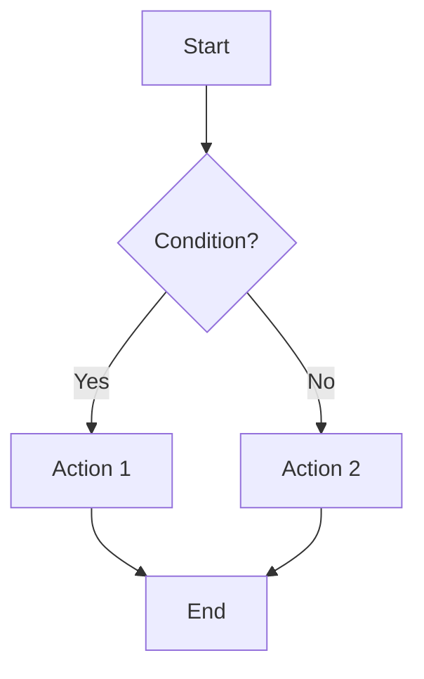
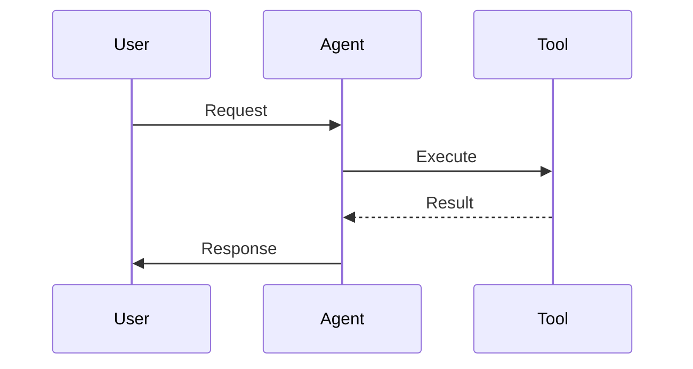

# Test Mermaid Diagram

## Flowchart

```mermaid
flowchart TD
    A[Start] --> B{Condition?}
    B -->|Yes| C[Action 1]
    B -->|No| D[Action 2]
    C --> E[End]
    D --> E
```

## Sequence Diagram

```mermaid
sequenceDiagram
    participant U as User
    participant A as Agent
    participant T as Tool

    U->>A: Request
    A->>T: Execute
    T-->>A: Result
    A->>U: Response
```

## Notes

- Created: 2026-08-16
- Edited: 2026-08-16
- Status: verified
