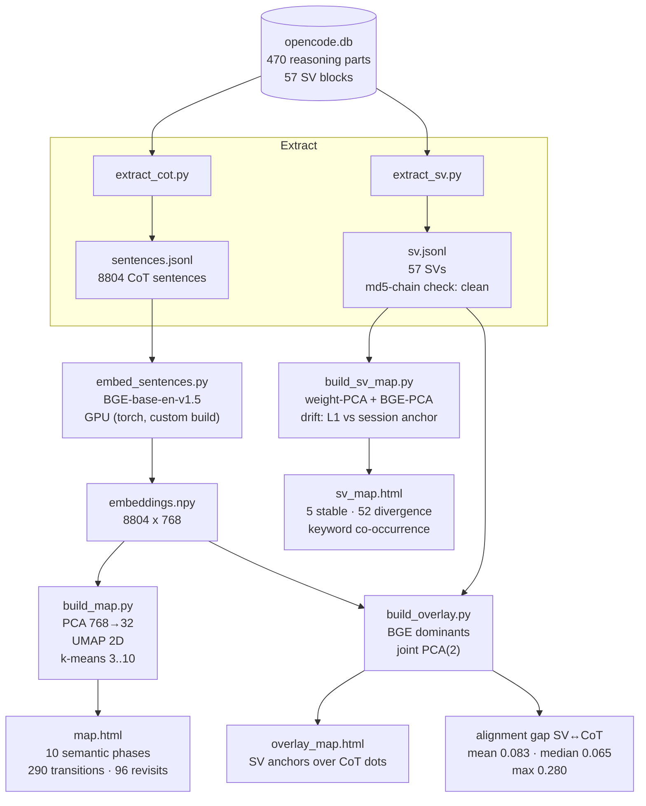
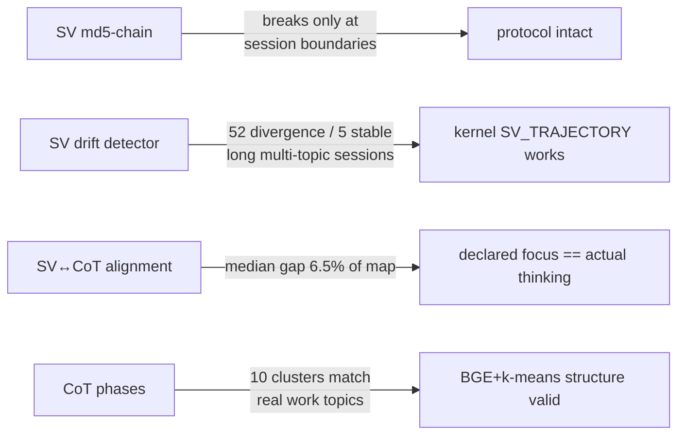

# CoT semantic map — pipeline diagrams

## 1. Pipeline

```mermaid
graph TD
    DB[("opencode.db<br/>470 reasoning parts<br/>57 SV blocks")]

    subgraph EXTRACT["Extract"]
        E1["extract_cot.py"] --> S1["sentences.jsonl<br/>8804 CoT sentences"]
        E2["extract_sv.py"] --> S2["sv.jsonl<br/>57 SVs<br/>md5-chain check: clean"]
    end

    DB --> E1
    DB --> E2

    S1 --> EMB["embed_sentences.py<br/>BGE-base-en-v1.5<br/>GPU (torch, custom build)"]
    EMB --> NPY["embeddings.npy<br/>8804 x 768"]

    NPY --> M1["build_map.py<br/>PCA 768→32<br/>UMAP 2D<br/>k-means 3..10"]
    M1 --> MAP["map.html<br/>10 semantic phases<br/>290 transitions · 96 revisits"]

    S2 --> M2["build_sv_map.py<br/>weight-PCA + BGE-PCA<br/>drift: L1 vs session anchor"]
    M2 --> SVM["sv_map.html<br/>5 stable · 52 divergence<br/>keyword co-occurrence"]

    NPY --> M3["build_overlay.py<br/>BGE dominants<br/>joint PCA(2)"]
    S2 --> M3
    M3 --> OVL["overlay_map.html<br/>SV anchors over CoT dots"]
    M3 --> GAP["alignment gap SV↔CoT<br/>mean 0.083 · median 0.065<br/>max 0.280"]
```

## 2. Verified facts

```mermaid
graph LR
    A["SV md5-chain"] -->|"breaks only at<br/>session boundaries"| OK1["protocol intact"]
    B["SV drift detector"] -->|"52 divergence / 5 stable<br/>long multi-topic sessions"| OK2["kernel SV_TRAJECTORY works"]
    C["SV↔CoT alignment"] -->|"median gap 6.5% of map"| OK3["declared focus == actual thinking"]
    D["CoT phases"] -->|"10 clusters match<br/>real work topics"| OK4["BGE+k-means structure valid"]
```
