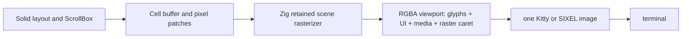

# Raster viewport renderer

## Objective

Replace the native-graphics hybrid backend with a true raster viewport backend.
When raster mode is eligible, the terminal receives one RGBA viewport containing
text, borders, selection, cursor, images, diagrams, charts, and PDF fragments.
The existing hybrid renderer remains the default and fallback; ANSI cell output
is retained for terminals and screen modes where raster mode is ineligible.

The existing atomic-native-graphics work remains a transport foundation, but it
is not visual composition: ANSI cells and SIXEL are separate terminal layers.

## State Vector Manifest

The canonical node-level execution state is
[2026-07-29-raster-viewport-renderer.svm.md](2026-07-29-raster-viewport-renderer.svm.md).
It owns SVs, work weights, dependency edges, evidence, active context, and
admission rules. This document owns architecture, implementation detail, and
smoke tests.

## Architecture

- The layout, hit grid, focus, keyboard input, and scroll state remain logical
  cell-space data; they are not reimplemented in the graphics backend.
- The rasterizer converts the final clipped `OptimizedBuffer` cell geometry and
  `PixelBuffer` into one viewport-size RGBA frame using confirmed terminal pixel
  resolution and confirmed cell width/height. Its drawable rectangle must agree
  with `columns × cell_width` and `rows × cell_height`, with an explicit crop
  policy for terminal padding/rounding. Never enable it on fallback 10×20
  metrics.
- Text rendering requires an embedded, pinned font stack: HarfBuzz shapes text;
  FreeType rasterizes hinted glyph bitmaps. Never guess an arbitrary host
  terminal font.
- The visible caret is rasterized into the viewport. The hardware terminal
  cursor remains hidden while the raster backend is active; a scheduled blink
  invalidator redraws it and is cancelled on fallback/shutdown.
- The backend sends one native image per accepted frame. No visible ANSI text
  is emitted on that backend.
- SIXEL frames are flattened to an opaque terminal-background RGB viewport.
  Retain and erase the previous viewport footprint before a shrink, resize,
  suspend/resume, or protocol/mode switch; transparency must never reveal stale
  native graphics.
- First implementation eligibility is alternate-screen only, without captured
  stdout or split-footer output. Main-screen scrollback and split-footer need a
  separate viewport/scrollback design.

## Prior art

- The existing OpenTUI Zig renderer already owns the final cell buffer,
  `PixelBuffer`, clipping state, and native Kitty/SIXEL encoders.
- HarfBuzz provides Unicode text shaping; FreeType provides hinted glyph bitmap
  rasterization. Use pinned source dependencies, not a system installation:
  https://github.com/harfbuzz/harfbuzz and
  https://freetype.org/developer.html.
- `zig-svg` remains useful for SVG assets but does not solve text shaping or
  glyph rasterization: https://github.com/vancluever/zig-svg.

## Implementation

- [x] Define a `raster_viewport` render mode with explicit capability/config
  selection and eligibility gates: confirmed pixel/cell geometry,
  alternate-screen, no captured stdout, no split footer. Kitty/SIXEL can enable
  it; symbols, remote, and unsupported contexts retain the ANSI-cell backend.
  The opt-in is `rasterViewport: true` or `OPENTUI_RASTER_VIEWPORT=1`.
- [x] Add pinned FreeType 2.14.3 and trusted bundled JetBrains Mono Regular
  bytes (SIL OFL 1.1) with a Zig `FontRasterizer` that exposes alpha glyph
  bitmaps. Native build passes on Windows.
- [x] Add a bounded glyph cache keyed by `(pixel_height, codepoint)`; it owns
  up to 4,096 FreeType bitmap copies and prevents repeated rasterization of
  visible glyphs within a viewport frame.
- [ ] Extend the font subsystem with a fallback chain and deterministic cell
  metrics.
- [ ] Add shaping and glyph rasterization for every grapheme from the existing
  grapheme pool; consume `OptimizedBuffer` coordinates exactly, preserving
  wrapping, wide-cell continuations, combining marks, ZWJ emoji, CJK fallback,
  bold, italic, underline, strike, foreground, and background.
- [ ] Add a viewport RGBA compositor that paints cell backgrounds/borders,
  glyph alpha masks, selection, scrollbars, and `PixelBuffer` media in z-order;
  flatten the result against the terminal background before SIXEL encoding.
- [x] Add the initial Zig `RasterViewport`: it rasterizes final cell backgrounds,
  direct Unicode glyphs, and `PixelBuffer` media into one opaque RGBA viewport.
  Border/style/selection, grapheme shaping, fallback fonts, and terminal-output
  routing remain under the unchecked compositor/output work.
- [x] Rasterize the focused caret and hide the hardware cursor for raster
  frames. The direct path paints block/line/underline cursor geometry into the
  RGBA image and retains ordinary hardware-cursor semantics for the ANSI
  fallback. Scheduled blink invalidation remains a performance follow-up.
- [x] Change the native output path to replace one full viewport image without
  writing visual ANSI cells. Kitty deletes its image id; SIXEL performs an
  explicit full-viewport clear/repaint on the next frame after a mode change.
  The retained footprint records its emitting protocol, so it is cleared
  correctly across SIXEL/Kitty/symbol switches. The direct path owns one
  synchronized terminal frame and hides the hardware cursor. Resize/suspend/
  exit retention and a raster caret remain under the unchecked lifecycle task
  below.
- [ ] Add latest-frame coalescing and writer backpressure. Bound viewport pixels,
  palette size, encoded bytes, and raster FPS before raster mode can be enabled;
  dirty internal regions alone do not reduce a full SIXEL payload.
- [x] Restore the Windows native-test command: `bun run test:native` now
  builds the bundled FreeType test dependency and executes 1,687 passing Zig
  tests (22 skipped). Raster-specific compositor fixtures remain under the
  unchecked lifecycle/direct-terminal work.
- [ ] Add direct Windows Terminal screenshots and input/scroll/resize tests for
  mixed Markdown and Mermaid/image fixtures first. Add chart and PDF-fragment
  producers before claiming their regression coverage.
- [ ] Measure RGBA composition, glyph-cache misses, SIXEL/Kitty encoding, and
  terminal-write latency. Establish a bounded frame-size and frame-rate policy.
- [ ] Add a logical-buffer copy-text command and test it in raster mode, so
  copy remains available when terminal text selection is intentionally absent.

## Compatibility decisions

- Native raster mode intentionally trades terminal text selection/copy semantics
  for pixel-accurate composition. Keep an explicit ANSI fallback and expose a
  copy-text command based on the logical cell buffer.
- The first production target is a bundled monospaced UI font. Matching every
  user's terminal font is impossible without an explicit font-file setting.
- Do not enable the mode by default until direct Windows Terminal smoke tests
  prove typing, caret blinking, selection, scrolling, resize, and clean exit.
- This plan owns only the new `raster_viewport` mode. The atomic-native-graphics
  plan continues to own hybrid transport/telemetry and remains its fallback;
  shared `renderer.zig` changes must preserve both modes explicitly.

## Smoke Tests

### Baseline [Exact]

- `bun run build:native:dev` (`packages/opentui/packages/core`): passes.
- `bun test src/tests/image-renderable.test.ts src/tests/renderer.image-protocol.test.ts`
  (`packages/opentui/packages/core`): 4 tests, 0 failures, 10 assertions.
- `bun typecheck` (`packages/opencode`): passes.
- `bun run test:native` (`packages/opentui/packages/core`): 1,687 pass,
  22 skipped; includes the bundled FreeType glyph-cache test.
- Direct Windows Terminal currently demonstrates the hybrid-layer defect with
  mixed text and Mermaid content; capture a reproducible cmd_runner screenshot
  before the first raster-backend edit.

### Post-implementation oracles

| # | Command (cwd) | Pass criteria |
|---|---------------|---------------|
| 1 | `bun run build:native:dev` (`packages/opentui/packages/core`) | native library compiles for Windows |
| 2 | `bun run test:native` (`packages/opentui/packages/core`) | all native tests pass, including bundled FreeType glyph-cache coverage |
| 3 | `bun typecheck` (`packages/opencode`) | TypeScript boundary remains valid |
| 4 | `_build.ps1` then cmd_runner direct WT (`repo root`) | mixed text/media scroll and resize as one image; typing and caret remain usable |
| 5 | screenshot regression fixtures | Mermaid, PNG, chart, and PDF fragment share one coordinate system |
| 6 | caret timing and copy-text tests | raster caret blinks without stale frames; logical text copy remains correct |
