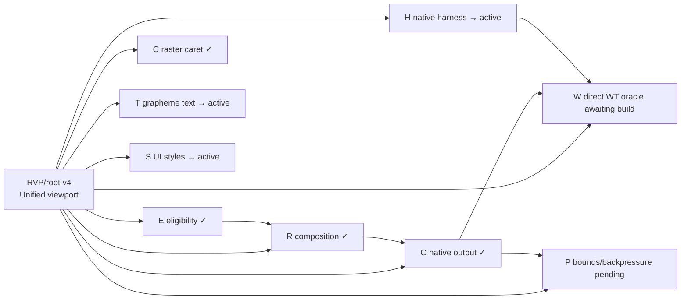

# Raster viewport State Vector Manifest

## Canonical transport

```text
SV = [weighted_key_phrases, [semantic_dominant], complex_hash_tag]
canonical_id = logical_id + "@" + complex_hash_tag
CHT = SHA256(canonical JSON of the node envelope; `id` and CHT are excluded)
```

This manifest uses the ADID 15.4.6 envelope fields: `schema`, `logical_id`,
`record_type`, `parent_id`, `previous_version_id`, `local_sequence`,
`sv_payload`, `state`, `progress`, `dependency_ids`, `child_ids`,
`message_chain_head`, and `evidence_root`. Work weight, blockers, and next
transition are node state and are kept alongside the committed envelope.

Canonical, independently recomputable envelopes are in
[2026-07-29-raster-viewport-renderer.svm.envelopes.jsonl](2026-07-29-raster-viewport-renderer.svm.envelopes.jsonl).
Each line is one envelope; serialize it with sorted keys, compact separators,
and UTF-8 before calculating the displayed SHA-256 tag.

## Root version chain

The root is versioned to avoid a child-hash cycle: `root@v0` establishes the
parent identity, child nodes bind to it, and later root records commit their
canonical IDs. The current canonical state is `root@v4`.

```text
RVP/root@cht1:sha256:b752c3055e05ba4becaf7e37499f740f997012195ef5c376ec127cac17888296  # v0
  -> child nodes RVP/E, RVP/R, RVP/O, RVP/C, RVP/T, RVP/S, RVP/H, RVP/W, RVP/P
  -> RVP/root@cht1:sha256:ff3e2c2bdbf6177008ecd9c0c24dce37de30d531f35c750d136cfb39ba8d7d76  # v1
  -> RVP/root@cht1:sha256:1477f494ce4c2483e884169747cc15a4572fe3d31103a00813845c496e0f4a5c  # v2
  -> RVP/root@cht1:sha256:e7451411b4ea10beec8663a6e8169ab46882a10d0320bf08bdf968d4288ac21d  # v3
  -> RVP/root@cht1:sha256:a4592a851b26f2a19477f82a6e57e13e4b9eb6d4b3781b257d5aed50dbbca546  # v4/current
```

## Causal graph



## Node records

| Logical node / canonical ID | Local SV | State / progress / work wt. | Parent, dependencies, local chain | Evidence, blocker, next transition |
|---|---|---|---|---|
| `RVP/E`<br>`@cht1:sha256:fb5df22deade98521b7ebf0ea94a6e40c67fd81c1a0fc9f1173309733a8454af` | `[{"confirmed geometry":.45,"alternate screen":.30,"capabilities":.25},["Safe eligibility"],CHT]` | `done / 1.00 / .10` | parent `root@v0`; deps `[]`; `RVP/E/M0001` | `evidence_root=oracle:native-build+library-build+targeted-tests`; implementation `b21a254da`; next `none`. |
| `RVP/R`<br>`@cht1:sha256:0f73f02b8d9f0bf349d67941ba49e110355acae47b66be47e5398b925cd67e21` | `[{"cell buffer":.45,"media patches":.35,"opaque RGBA":.20},["Final composition input"],CHT]` | `done / 1.00 / .15` | parent `root@v0`; deps `[E]`; `RVP/R/M0001` | `evidence_root=oracle:native-build+library-build+targeted-tests`; implementation `3def96120,b21a254da`; next `none`. |
| `RVP/O`<br>`@cht1:sha256:598d6d15c9ed97388e7a009d7a9fba2ebabe51c8dc46af242c084664d2d16c3a` | `[{"one protocol image":.50,"no ANSI diff":.35,"lifecycle":.15},["Single native output"],CHT]` | `done / 1.00 / .15` | parent `root@v0`; deps `[E,R]`; `RVP/O/M0001` | `evidence_root=oracle:native-build+library-build+targeted-tests`; implementation `b21a254da,14258c51f`; next `direct WT`. |
| `RVP/C`<br>`@cht1:sha256:11eb4b7ee7074e0e6fc0d6bd222ef8aefec6954d4a7d7874d2bf16afa42b589b` | `[{"caret geometry":.45,"input usability":.35,"no ANSI restore":.20},["Raster caret"],CHT]` | `done / 1.00 / .10` | parent `root@v0`; deps `[O]`; `RVP/C/M0001` | `evidence_root=oracle:native-build+library-build+targeted-tests`; implementation `a5adad714`; next `blink scheduler`. |
| `RVP/T`<br>`@cht1:sha256:f12255450a217ca8796c060c61d63da5ac20489bf8c64ac5e05f582fec6421f3` | `[{"grapheme pool":.45,"Unicode sequence":.35,"cell metric":.20},["Text cluster fidelity"],CHT]` | `active / 0.40 / .15` | parent `root@v0`; previous `T@v2`; deps `[R]`; `RVP/T/M0003` | Evidence `abb1b4f7d,7c597fcd1,ee4f05e36,f670cee89`; native suite `1687 pass, 22 skip`; blocker `no shaping/fallback`; next `HarfBuzz/fallback`. |
| `RVP/S`<br>`@cht1:sha256:fcbfe13b5135577e7ffccfc9e9754b9160907bedca72907ba5e0e5ce9f85acf2` | `[{"attributes":.40,"borders":.35,"selection/scrollbar":.25},["UI visual fidelity"],CHT]` | `active / 0.00 / .10` | parent `root@v0`; deps `[R]`; `RVP/S/M0001` | Evidence `6f6c535ee`; blocker `borders/selection/scrollbar`; next `match final cell visuals`. |
| `RVP/H`<br>`@cht1:sha256:4e236e07b17a335d3de017bb3c3561b7ab319470a1db8ef7c5adb07be28a639f` | `[{"native harness":.50,"deterministic pixels":.30,"CI oracle":.20},["Reproducible native proof"],CHT]` | `active / 0.25 / .10` | parent `root@v0`; previous `H@v1`; deps `[R,C]`; `RVP/H/M0002` | Evidence `f670cee89`; `bun run test:native` is runnable (1,687 pass, 22 skip); blocker `no deterministic compositor fixture`; next `runnable pixel oracle`. |
| `RVP/W`<br>`@cht1:sha256:0c83234950bd54f9ceda5bd9f2e95d5963ff44177030ef671e2e0c99bff7e052` | `[{"Windows Terminal":.45,"screenshot":.35,"resize/input":.20},["Direct observable oracle"],CHT]` | `awaiting_external / 0.00 / .10` | parent `root@v0`; deps `[O,C,H]`; `RVP/W/M0001` | Blocker `needs direct WT build`; next `mixed Mermaid/input/resize/exit evidence`. |
| `RVP/P`<br>`@cht1:sha256:eddde3a1adf35bb7ed428d9f73e639a96f37e42ebd4ef0ec6ee4e9c04ca1cc0b` | `[{"frame bounds":.45,"coalescing":.30,"transport latency":.25},["Bounded raster transport"],CHT]` | `pending / 0.00 / .05` | parent `root@v0`; deps `[O]`; `RVP/P/M0001` | Blocker `no encoded-byte/FPS policy`; next `limits + latest-frame coalescing`. |

## Current root record

```text
logical_id: RVP/root
canonical_id: RVP/root@cht1:sha256:a4592a851b26f2a19477f82a6e57e13e4b9eb6d4b3781b257d5aed50dbbca546
previous_version_id: RVP/root@cht1:sha256:e7451411b4ea10beec8663a6e8169ab46882a10d0320bf08bdf968d4288ac21d
SV: [{"unified scene":.40,"scroll coherence":.35,"native graphics":.25},["One terminal scene"],CHT]
state: active
progress: .50 = .10(E) + .15(R) + .15(O) + .10(C)
children: [E,R,O,C,T,S,H,W,P]
message_chain_head: RVP/root/M0016
evidence_root: oracle:native-suite+native-build+library-build+targeted-tests
next_transition: advance RVP/T, RVP/S, and RVP/H locally; accept RVP/W only from direct Windows Terminal evidence
```

## Admission rules

1. A node is `done` only after its named oracle passes; commit hashes identify
   the evidence-producing implementation, not the oracle by themselves.
2. `RVP/W` needs direct Windows Terminal evidence; source builds do not replace it.
3. Raster mode cannot become default before `RVP/P`, `RVP/H`, and `RVP/W` pass.
4. New work must attach to one node or add a node with its own SV, CHT envelope,
   work weight, dependencies, evidence root, blocker, and next transition.
