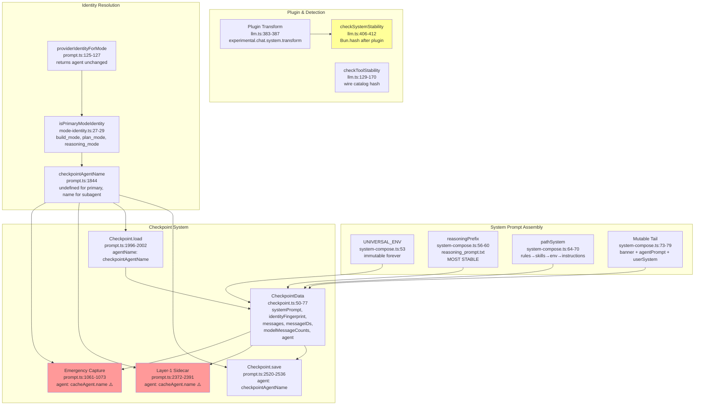

# KV Cache Continuity Graph

## Architecture Overview



---

## Data Flow: System Prompt Assembly

```
┌─────────────────────────────────────────────────────────────────────────────┐
│                        assembleSystemMessages()                             │
│                        system-compose.ts:52-82                              │
├─────────────────────────────────────────────────────────────────────────────┤
│                                                                             │
│  system[0] = UNIVERSAL_ENV                    ← immutable forever          │
│                                                                             │
│  system[1] = reasoningPrefix + kernel         ← MOST STABLE (kernel only)  │
│                  = ProviderTransform.systemPromptPrefix(model)              │
│                  = reasoning_prompt.txt (Bun-inlined asset)                 │
│                                                                             │
│  system[2..N] = pathSystem                    ← FROZEN until compact       │
│                  [0] rules       (more stable)                              │
│                  [1] skills      (agent-independent catalog)                │
│                  [2] env         (working dir, project paths)               │
│                  [3] instructions (most mutable)                            │
│                                                                             │
│  system[N+1] = mutable tail                     ← changes per session      │
│                  banner + agentPrompt("") + userSystem                      │
│                                                                             │
└─────────────────────────────────────────────────────────────────────────────┘
```

---

## Checkpoint Key Mismatch Bug

### Root Cause

Two different code paths save checkpoints with **different agent keys**:

| Path | File:Line | Agent Key | For build_mode |
|------|-----------|-----------|----------------|
| **Normal save** | prompt.ts:2532 | `checkpointAgentName` | `undefined` |
| **Layer-1 sidecar** | prompt.ts:2381 | `cacheAgent.name` | `"build_mode"` |
| **Emergency capture** | prompt.ts:1070 | `cacheAgent.name` | `"build_mode"` |
| **Load** | checkpoint.ts:321 | `agentName` (checkpointAgentName) | `undefined` |

### File Paths (checkpoint directory)

```
Normal save → {log}/.checkpoints/openai_gpt-4o_<sid>_S0.enc
Sidecar save → {log}/.checkpoints/openai_gpt-4o_build_mode_<sid>_S0.enc  ← ORPHANED
Load reads → {log}/.checkpoints/openai_gpt-4o_<sid>_S0.enc              ← never finds sidecar
```

### Impact

- Sidecar-written checkpoint is **never loaded** by the working turn
- Wasted encryption/disk write
- Stale orphan files accumulate
- Normal save still publishes correct slot → not a direct prefix break

---

## Fingerprint Chain

```
┌──────────────────────────────────────────────────────────────────┐
│                    identityFingerprint()                         │
│                    checkpoint.ts:92-94                           │
│                                                                  │
│  SHA-256(identity_string) → hex                                  │
│                                                                  │
│  identity_string = ProviderTransform.systemPromptPrefix(model)   │
│                  = reasoning_prompt.txt content only             │
│                  = kernel bytes ONLY                             │
│                                                                  │
│  ⚠️ Does NOT include:                                           │
│    - pathSystem (rules, skills, env, instructions)               │
│    - plugin transform output                                     │
│    - tool catalog                                                │
│    - MCP catalog                                                 │
└──────────────────────────────────────────────────────────────────┘
```

---

## Cache Break Causes (Ranked)

```mermaid
graph LR
    subgraph "Cache Break Sources"
        K[Kernel Change<br/>reasoning_prompt.txt bytes change<br/>→ global cold start]
        P[Path System Drift<br/>rules/skills/env/instructions change<br/>→ cold reassembly on checkpoint miss]
        PL[Plugin Transform<br/>outside fingerprint<br/>→ every turn break]
        T[Tool Catalog Drift<br/>wire insertion order changes<br/>→ detected only]
        S[Sidecar Key Mismatch<br/>orphaned slots<br/>→ wasted write]
        D[Stale Documentation<br/>AGENTS.md claims sys.skills(agent)<br/>→ misdiagnosis]
    end

    K --> BREAK[Cache Break]
    P --> BREAK
    PL --> BREAK
    T -.->|detected| STAB[checkSystemStability]
    S -.->|orphan| WASTE[Wasted Write]
    D -.->|doc debt| DIAG[Misdiagnosis]

    style K fill:#ff6666
    style P fill:#ff6666
    style PL fill:#ff9999
    style T fill:#ffcc99
    style S fill:#ffcc99
    style D fill:#ccccff
```

---

## Plugin Transform Hazard

```
┌─────────────────────────────────────────────────────────────────────────────┐
│                           llm.ts:370-412                                    │
├─────────────────────────────────────────────────────────────────────────────┤
│                                                                             │
│  1. assembleSystemMessages()           ← system assembled                  │
│  2. plugin.trigger("experimental.chat.system.transform", ...)  ← MUTATES   │
│  3. collapseSystemMessagesInPlace()                                         │
│  4. checkSystemStability()              ← detects change AFTER plugin      │
│                                                                             │
│  ⚠️ Fingerprint (checkpoint.ts:92) computed BEFORE plugin                  │
│  ⚠️ Plugin output NOT persisted in checkpoint                               │
│  ⚠️ Non-deterministic plugin → break EVERY turn                            │
│                                                                             │
│  Detection: YES (bug: system prompt content changed mid-session)            │
│  Prevention: NO                                                             │
│                                                                             │
└─────────────────────────────────────────────────────────────────────────────┘
```

---

## Agent Resolution: Cache-Safe

```
┌─────────────────────────────────────────────────────────────────────────────┐
│                           prompt.ts:1840-1844                               │
├─────────────────────────────────────────────────────────────────────────────┤
│                                                                             │
│  cacheAgent = providerIdentityForMode(agent, fallback)                      │
│             = agent  (returns unchanged, prompt.ts:125-127)                 │
│                                                                             │
│  checkpointAgentName = isPrimaryModeIdentity(cacheAgent.name)               │
│                      ? undefined                                            │
│                      : cacheAgent.name                                      │
│                                                                             │
│  Primary modes (build/plan/reasoning): checkpointAgentName = undefined      │
│  Subagents (coder/explorer/...): checkpointAgentName = "coder_agent" etc.   │
│                                                                             │
│  ✅ Agent/mode switching is cache-safe:                                     │
│     - sys.skills() is agent-parameterless (system.ts:93,140-148)            │
│     - Agent prompt excluded from system (llm.ts:374)                        │
│     - Role = synthetic notify (prompt.ts:129-136)                           │
│     - providerCacheKey ignores agent (llm.ts:229-237)                       │
│                                                                             │
│  ⚠️ AGENTS.md §KV Cache Continuity is STALE:                                │
│     Claims "Switching agents changes sys.skills(agent) output"              │
│     This is no longer true.                                                 │
│                                                                             │
└─────────────────────────────────────────────────────────────────────────────┘
```

---

## Key Files & Lines

| File | Lines | Role |
|------|-------|------|
| `packages/opencode/src/session/checkpoint.ts` | 50-77, 92-105, 267-357 | CheckpointData, fingerprint, save/load |
| `packages/opencode/src/session/system-compose.ts` | 52-122 | System prompt assembly, path system order |
| `packages/opencode/src/session/llm.ts` | 129-170, 370-412 | Plugin transform, stability detectors |
| `packages/opencode/src/session/prompt.ts` | 1061-1073 | Emergency capture (sidecar key bug) |
| `packages/opencode/src/session/prompt.ts` | 1840-1844 | Agent resolution, checkpointAgentName |
| `packages/opencode/src/session/prompt.ts` | 1987-2053 | Checkpoint load, identity check, system assembly |
| `packages/opencode/src/session/prompt.ts` | 2372-2391 | Layer-1 sidecar (sidecar key bug) |
| `packages/opencode/src/session/prompt.ts` | 2476-2536 | Normal checkpoint save |
| `packages/opencode/src/session/mode-identity.ts` | 27-29 | isPrimaryModeIdentity |
| `packages/opencode/src/provider/transform.ts` | 514-522 | systemPromptPrefix (kernel bytes) |

---

## Epistemic Status

- **Checkpoint key mismatch**: [Exact] — verified by reading prompt.ts:1070, 2381, 2532
- **Plugin outside fingerprint**: [Exact] — verified by reading llm.ts:383-412, checkpoint.ts:92
- **Agent resolution cache-safe**: [Exact] — verified by reading system.ts, llm.ts:229-237
- **No detector firings in logs**: [Exact] — explorer grep returned zero matches
- **Stale AGENTS.md**: [Exact] — AGENTS.md claims sys.skills(agent), code shows parameterless

```yaml
Keywords: kv-cache 0.25, checkpoint 0.20, system-prompt 0.15, fingerprint 0.12, plugin-transform 0.10, sidecar-key-bug 0.08, agent-resolution 0.05, compaction 0.05
Semantic dominant: Built comprehensive graph of KV cache continuity chain with data flow, checkpoint key mismatch bug, fingerprint chain, and ranked break causes.
md5: 3c7f9a2b8e1d6f4a5c9b0e3d7f1a8c4e
prev-md5: 9f4e2c1a7b6d5e8f0a3c9b2d4e6f8a1c
```
