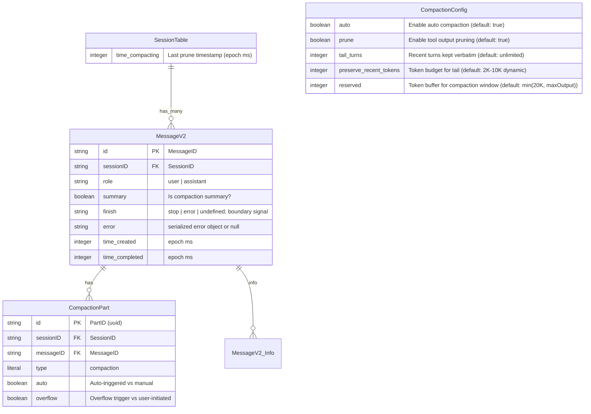
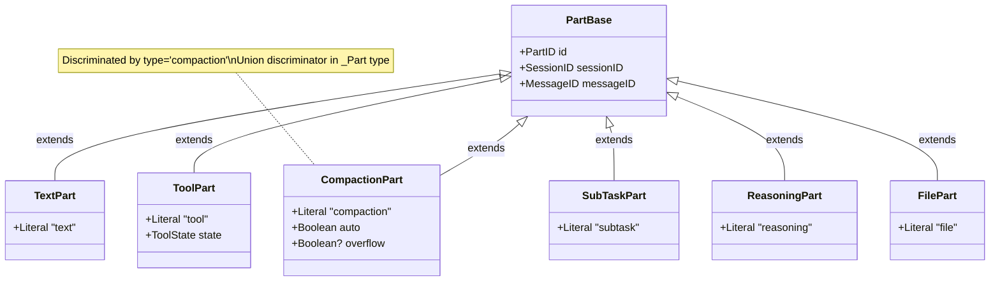
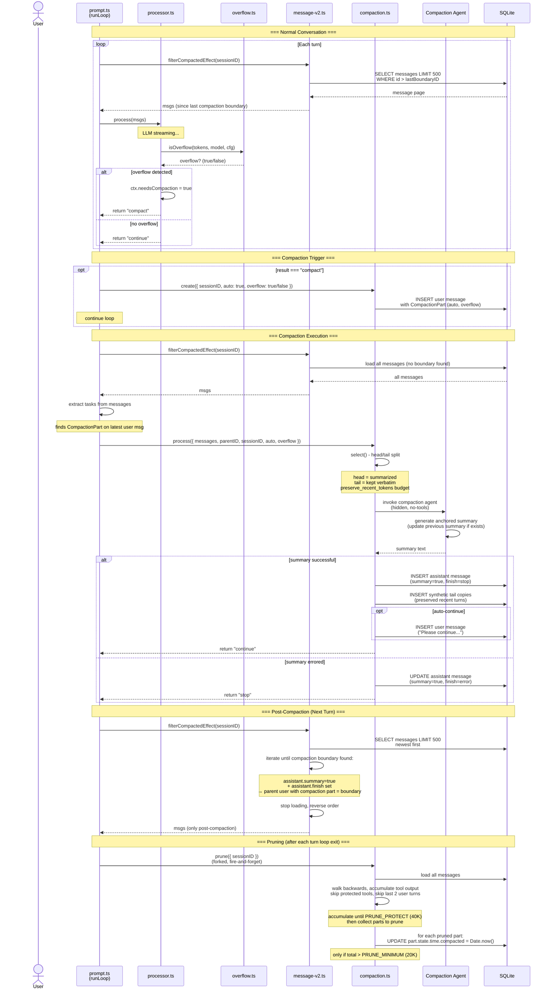
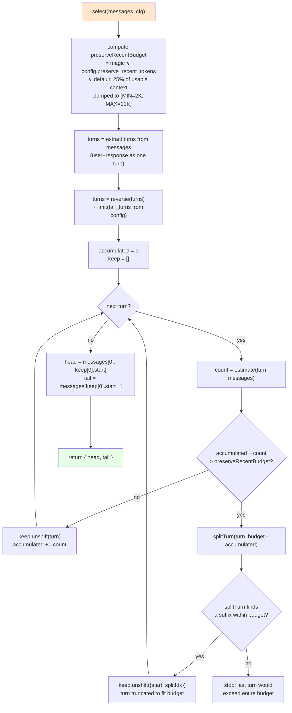
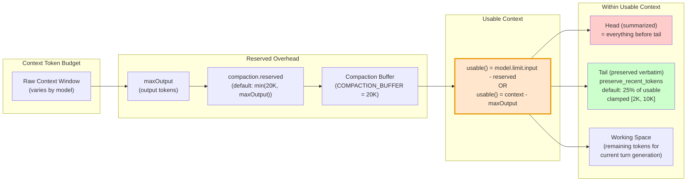

# Compaction Schema Analysis & Diagram

**Date:** 2026-06-12  
**Status:** Validated (codebase cross-reference complete, corrections applied)  
**Priority:** Medium

---

## 1. Entity/Types Schema (ER Diagram)



### Part Hierarchy (Discriminated Union)



---

## 2. Compaction State Machine

```mermaid
stateDiagram-v2
    [*] --> Normal : session active

    Normal --> OverflowDetected : token usage >= usable context
    OverflowDetected --> CompactionTaskQueued : process() returns "compact"\n→ compaction.create() inserts\nuser msg w/ CompactionPart

    Normal --> OverflowFromContent : synthetic tail copies\nhave zero token counters
    OverflowFromContent --> CompactionTaskQueued : isOverflowFromContent()\n→ compaction.create(overflow=true)

    CompactionTaskQueued --> Compacting : prompt loop picks up\ncompaction part from tasks

    Compacting --> SelectingMessages : select() splits head/tail
    SelectingMessages --> GeneratingSummary : compaction agent invoked\n(via SessionProcessor)

    Note right of Compacting: prune() is called separately\nafter each turn loop exit\n(prompt.ts:1422)\nNOT inside processCompaction

    GeneratingSummary --> SummaryDone : LLM returns summary text
    GeneratingSummary --> SummaryErrored : LLM error / ContextOverflowError

    SummaryDone --> CreatingSynthetics : persist summary assistant\n(updateMessage)
    CreatingSynthetics --> Done : synthetic tail copies created\n+ optional auto-continue prompt

    SummaryErrored --> Done : halt() marks finish="error"\nerrored summary still serves\nas compaction boundary

    Done --> Normal : filterCompactedEffect()\nloads only messages since\ncompaction boundary

    note right of OverflowDetected
        processor.ts:553-558
        isOverflow() check after
        each finish-step event
    end note

    note right of SummaryErrored
        Fix applied 2026-06-11:
        errored summaries now
        valid boundaries
    end note
```

---

## 3. Module Interaction (Component Diagram)

```mermaid
graph TD
    subgraph "External Inputs"
        CONFIG[Config<br/>compaction.auto, .prune,<br/>.tail_turns, .preserve_recent_tokens,<br/>.reserved]
        ENV[Env Flags<br/>OPENCODE_DISABLE_AUTOCOMPACT<br/>OPENCODE_DISABLE_PRUNE]
    end

    subgraph "Session Module"
        OVERFLOW[overflow.ts<br/>usable()<br/>isOverflow()<br/>isOverflowFromContent()]
        COMPACTION[compaction.ts<br/>select() - head/tail split<br/>prune() - tool output erasure<br/>processCompaction() - main flow<br/>create() - task creation]
        MESSAGE[message-v2.ts<br/>CompactionPart schema<br/>filterCompactedEffect()<br/>isCompactionBoundary()<br/>pageCompacted()]
        PROCESSOR[processor.ts<br/>needsCompaction flag<br/>halt() - error handling<br/>process() - return compact/stop/continue]
        PROMPT[prompt.ts<br/>task extraction<br/>compaction processing<br/>overflow creation]
    end

    subgraph "Storage"
        DB[(SQLite DB<br/>session.time_compacting<br/>message with CompactionPart<br/>assistant with summary=true)]
    end

    subgraph "Agent"
        CAGENT[Compaction Agent<br/>hidden, no-tools native agent<br/>prompt: built dynamically via SUMMARY_TEMPLATE<br/>generates anchored summary]
    end

    CONFIG --> OVERFLOW
    CONFIG --> COMPACTION
    ENV --> CONFIG

    PROCESSOR -->|"calls isOverflow()"| OVERFLOW
    PROCESSOR -->|"sets needsCompaction"| PROCESSOR
    PROCESSOR -->|"returns 'compact'"| PROMPT

    PROMPT -->|"filterCompactedEffect()"| MESSAGE
    PROMPT -->|"compaction.create()"| COMPACTION
    PROMPT -->|"compaction.process()"| COMPACTION
    PROMPT -->|"compaction.prune()"| COMPACTION
    PROMPT -->|"isOverflowFromContent()"| OVERFLOW

    COMPACTION -->|"select() - token estimation"| MESSAGE
    COMPACTION -->|"invokes compaction agent"| CAGENT
    COMPACTION -->|"reads/writes"| DB

    MESSAGE -->|"loads messages"| DB
    PROCESSOR -->|"reads/writes"| DB

    style OVERFLOW fill:#e6f3ff
    style COMPACTION fill:#ffe6cc
    style MESSAGE fill:#e6ffe6
    style PROCESSOR fill:#f0e6ff
    style PROMPT fill:#ffe6e6
```

---

## 4. Full Sequence Diagram



---

## 5. Head/Tail Selection Algorithm



---

## 6. Token Budget Model



---

## 7. Pruning Schema

```mermaid
flowchart TD
    A["compaction.prune(sessionID)<br/>called from prompt.ts:1422<br/>(forked after each turn loop exit<br/>NOT inside processCompaction)"] --> B{"compaction.prune<br/>enabled?"}
    B -->|no| Z["return (no-op)"]
    B -->|yes| C["msgs = load all messages<br/>skip last 2 user turns"]

    C --> D["walk msgs backwards<br/>(newest to oldest)<br/>total = 0, toPrune = []"]

    D --> E{"next message?"}
    E -->|yes| F{"has completed tool parts<br/>(excl. 'skill')<br/>with uncompacted output?"}
    F -->|yes| G["total += part output tokens"]
    G --> H{"total > PRUNE_PROTECT<br/>(40K tokens)?"}
    H -->|no| E
    H -->|yes| I["toPrune.push(part)"]
    I --> E
    F -->|no| E

    E -->|no| J{"pruned = sum(toPrune) > PRUNE_MINIMUM<br/>(20K tokens)?"}
    J -->|no| Z
    J -->|yes| K["toPrune.forEach(part =><br/>part.state.time.compacted = Date.now()<br/>+ session.updatePart(part))"]
    K --> Z

    Note right of K: session.time_compacting is NOT updated by prune()\nit exists in the DB schema but prune() only updates individual parts

    style A fill:#e6f3ff
    style K fill:#ffcccc
    style Z fill:#e6ffe6
```

---

## 8. Key Constants Reference

| Constant | Value | Location | Purpose |
|----------|-------|----------|---------|
| `COMPACTION_BUFFER` | 20,000 | `overflow.ts:6` | Default reserved token buffer |
| `PRUNE_MINIMUM` | 20,000 | `compaction.ts:37` | Min tokens to trigger pruning |
| `PRUNE_PROTECT` | 40,000 | `compaction.ts:38` | Token threshold to keep unpruned |
| `TOOL_OUTPUT_MAX_CHARS` | 2,000 | `compaction.ts:39` | Max chars to collect from tool output |
| `PRUNE_PROTECTED_TOOLS` | `["skill"]` | `compaction.ts:40` | Tools whose outputs are never pruned |
| `DEFAULT_PRESERVE_RECENT_TOKENS` | 10,000 | `compaction.ts:41` | Default tail token budget |
| `MIN_PRESERVE_RECENT_TOKENS` | 2,000 | `compaction.ts:42` | Minimum tail token budget |
| Page size | 500 | `message-v2.ts` | Messages per DB page in `filterCompactedEffect` |

---

## 9. CompactionPart DB Schema (Drizzle)

```typescript
// message-v2.ts:225-233
export const CompactionPart = Schema.Struct({
  ...partBase,                              // id, sessionID, messageID
  type: Schema.Literal("compaction"),       // discriminator literal
  auto: Schema.Boolean,                     // auto-triggered (true) vs manual /summarize (false)
  overflow: Schema.optional(Schema.Boolean), // true when triggered by context overflow
})

// Session DB column: session.sql.ts:37
time_compacting: integer(),                 // epoch ms; read/written via session.ts info.time.compacting
                                            // Note: prune() does NOT update this field — only individual parts are marked

// Config: config.ts:218-237
compaction: Schema.optional(Schema.Struct({
  auto: Schema.optional(Schema.Boolean),                   // default: true
  prune: Schema.optional(Schema.Boolean),                  // default: true
  tail_turns: Schema.optional(NonNegativeInt),             // default: unlimited (u32 max)
  preserve_recent_tokens: Schema.optional(NonNegativeInt), // default: dynamic 2K-10K
  reserved: Schema.optional(NonNegativeInt),               // default: min(20K, maxOutput)
})),
```

### JSON/Storage representation (tool part compaction state)

```typescript
// When prune() runs, it sets on tool parts:
part.state.time.compacted = Date.now()

// When filterCompactedEffect loads messages:
// Skips parts where part.state?.time?.compacted is set
// (these are tool outputs that have been summarized in a prior compaction)
```

---

## 10. Compaction Agent Definition

```typescript
// agent.ts:184-197 — Defined as a plain object in the agents map (not Agent.define())
compaction: {
  name: "compaction",
  mode: "primary",
  native: true,            // always available (no third-party)
  hidden: true,            // not shown in agent list
  permission: Permission.merge(
    defaults,
    Permission.fromConfig({ "*": "deny" }),  // no tools available
    user,
  ),
  options: {},             // no custom model override (uses default model)
  // No prompt field — the compaction prompt is built dynamically
  // via buildPrompt() in compaction.ts:128-139 using SUMMARY_TEMPLATE
}
```

---

## Verification Checklist

- [x] Confirm `CompactionPart` schema matches current `message-v2.ts:225-233` -- VERIFIED
- [x] Confirm `time_compacting` column exists in `session.sql.ts:37` -- VERIFIED
- [x] Confirm config schema matches `config.ts:218-237` -- VERIFIED
- [x] Confirm boundary detection logic in `filterCompactedEffect` at `message-v2.ts:1154-1185` -- VERIFIED
- [x] Confirm overflow detection in `overflow.ts` -- VERIFIED
- [x] Confirm compaction flow in `compaction.ts:processCompaction` -- VERIFIED
- [x] Validate against codebase via explore agent -- COMPLETED; corrections applied (see sections 2,3,4,7,9,10)
- [ ] Run typecheck: `bun typecheck` from `packages/opencode`
- [ ] Run compaction tests: `bun test packages/opencode/test/session/compaction.test.ts`

### Corrections Applied (from explore validation)

| Section | Issue | Fix |
|---------|-------|-----|
| 2 | ManualSummarize path not implemented in code | Removed from state machine |
| 2, 4, 7 | `prune()` shown as step inside `processCompaction` | Corrected: `prune()` is called separately from `prompt.ts:1422` after loop exit |
| 7 | `session.time_compacting` shown as updated by `prune()` | Corrected: `prune()` only updates individual `part.state.time.compacted`; DB column exists but `prune()` does not write to it |
| 3, 10 | Agent prompt shown as file `compaction.txt` | Corrected: prompt is built dynamically via `SUMMARY_TEMPLATE` in `compaction.ts:128-139` |
| 10 | Agent definition shown as `Agent.define()` syntax | Corrected: agent is a plain object in the `agents` map with `permission` rules |
