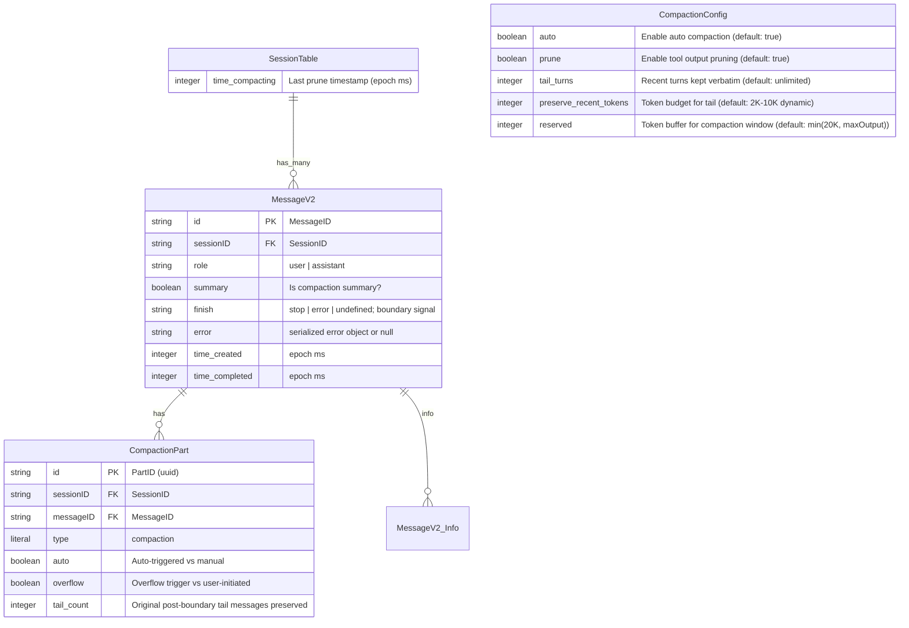
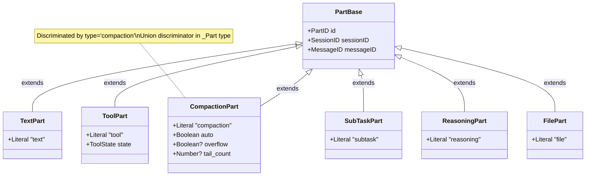
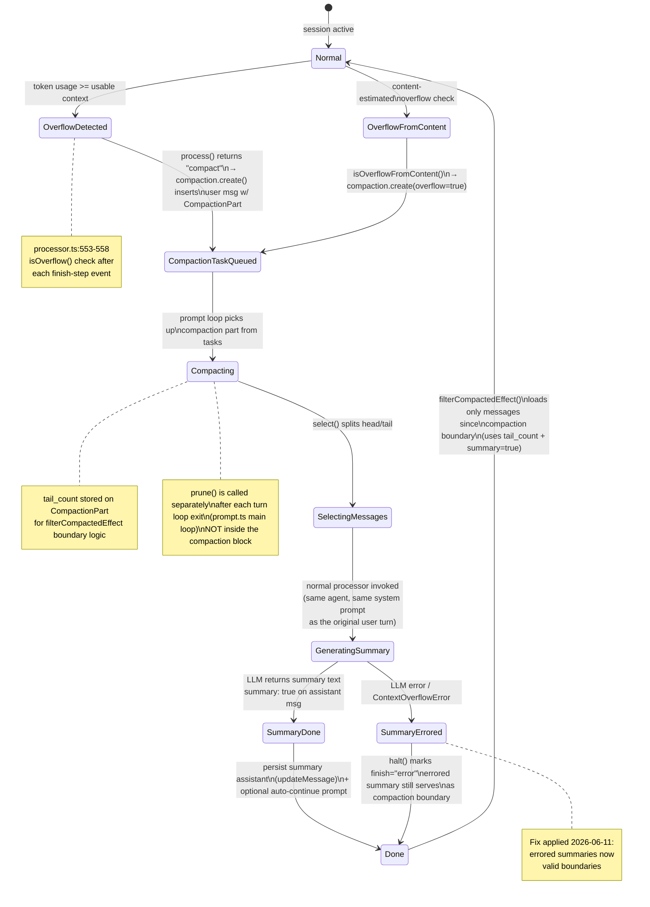
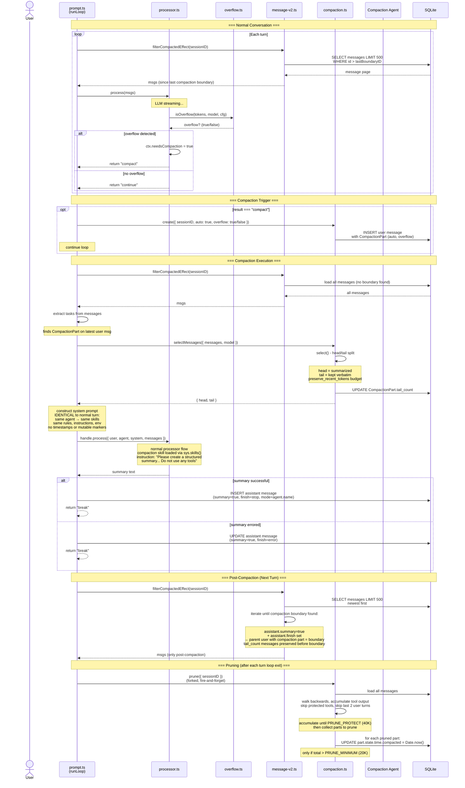
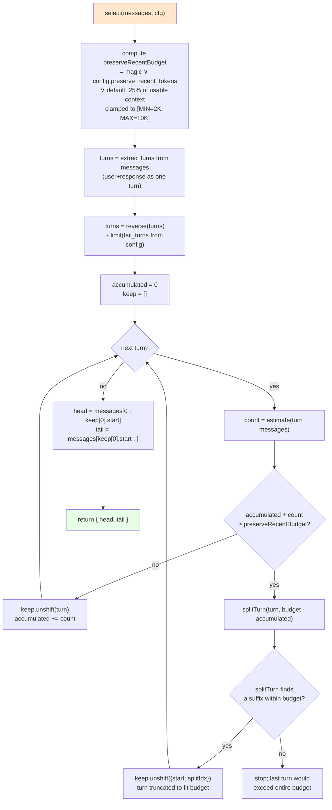
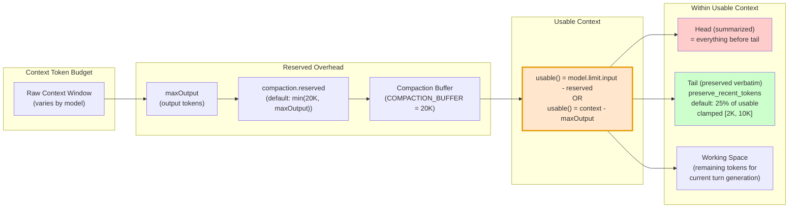

# Compaction Schema Analysis & Diagram

**Date:** 2026-06-12 (updated 2026-06-13 with normal-flow integration)  
**Status:** Validated (codebase cross-reference complete, corrections applied)  
**Priority:** Medium

---

## 1. Entity/Types Schema (ER Diagram)



### Part Hierarchy (Discriminated Union)



---

## 2. Compaction State Machine



---

## 3. Module Interaction (Component Diagram)

```mermaid
graph TD
    subgraph "External Inputs"
        CONFIG[Config<br/>compaction.auto, .prune,<br/>.tail_turns, .preserve_recent_tokens,<br/>.reserved]
        ENV[Env Flags<br/>OPENCODE_DISABLE_AUTOCOMPACT<br/>OPENCODE_DISABLE_PRUNE]
    end

    subgraph "Session Module"
        OVERFLOW[overflow.ts<br/>usable()<br/>isOverflow()<br/>isOverflowFromContent()]
        COMPACTION[compaction.ts<br/>select() - head/tail split<br/>prune() - tool output erasure<br/>create() - task creation<br/>selectMessages() - public API]
        MESSAGE[message-v2.ts<br/>CompactionPart schema<br/>filterCompactedEffect()<br/>isCompactionBoundary()<br/>pageCompacted()]
        PROCESSOR[processor.ts<br/>needsCompaction flag<br/>halt() - error handling<br/>process() - return compact/stop/continue]
        PROMPT[prompt.ts<br/>task extraction<br/>compaction: normal processor path<br/>same agent, same system prompt<br/>overflow creation]
    end

    subgraph "Storage"
        DB[(SQLite DB<br/>session.time_compacting<br/>message with CompactionPart<br/>assistant with summary=true)]
    end

    subgraph "Skill System"
        SKILL[compaction SKILL.md<br/>built-in skill<br/>available to all agents<br/>via sys.skills(agent)]
    end

    CONFIG --> OVERFLOW
    CONFIG --> COMPACTION
    ENV --> CONFIG

    PROCESSOR -->|"calls isOverflow()"| OVERFLOW
    PROCESSOR -->|"sets needsCompaction"| PROCESSOR
    PROCESSOR -->|"returns 'compact'"| PROMPT

    PROMPT -->|"filterCompactedEffect()"| MESSAGE
    PROMPT -->|"compaction.create()"| COMPACTION
    PROMPT -->|"compaction.selectMessages()"| COMPACTION
    PROMPT -->|"compaction.prune()"| COMPACTION
    PROMPT -->|"isOverflowFromContent()"| OVERFLOW
    PROMPT -->|"handle.process()<br/>(normal processor)"| PROCESSOR

    COMPACTION -->|"select() - token estimation"| MESSAGE
    COMPACTION -->|"reads/writes"| DB

    SKILL -->|"loaded via<br/>sys.skills(agent)"| PROMPT

    MESSAGE -->|"loads messages"| DB
    PROCESSOR -->|"reads/writes"| DB

    style OVERFLOW fill:#e6f3ff
    style COMPACTION fill:#ffe6cc
    style MESSAGE fill:#e6ffe6
    style PROCESSOR fill:#f0e6ff
    style PROMPT fill:#ffe6e6
    style SKILL fill:#e6e6ff
```

---

## 4. Full Sequence Diagram



---

## 5. Head/Tail Selection Algorithm



---

## 6. Token Budget Model



---

## 7. Pruning Schema

```mermaid
flowchart TD
    A["compaction.prune(sessionID)<br/>called from prompt.ts:1422<br/>(forked after each turn loop exit<br/>NOT inside processCompaction)"] --> B{"compaction.prune<br/>enabled?"}
    B -->|no| Z["return (no-op)"]
    B -->|yes| C["msgs = load all messages<br/>skip last 2 user turns"]

    C --> D["walk msgs backwards<br/>(newest to oldest)<br/>total = 0, toPrune = []"]

    D --> E{"next message?"}
    E -->|yes| F{"has completed tool parts<br/>(excl. 'skill')<br/>with uncompacted output?"}
    F -->|yes| G["total += part output tokens"]
    G --> H{"total > PRUNE_PROTECT<br/>(40K tokens)?"}
    H -->|no| E
    H -->|yes| I["toPrune.push(part)"]
    I --> E
    F -->|no| E

    E -->|no| J{"pruned = sum(toPrune) > PRUNE_MINIMUM<br/>(20K tokens)?"}
    J -->|no| Z
    J -->|yes| K["toPrune.forEach(part =><br/>part.state.time.compacted = Date.now()<br/>+ session.updatePart(part))"]
    K --> Z

    Note right of K: session.time_compacting is NOT updated by prune()\nit exists in the DB schema but prune() only updates individual parts

    style A fill:#e6f3ff
    style K fill:#ffcccc
    style Z fill:#e6ffe6
```

---

## 8. Key Constants Reference

| Constant | Value | Location | Purpose |
|----------|-------|----------|---------|
| `COMPACTION_BUFFER` | 20,000 | `overflow.ts:6` | Default reserved token buffer |
| `PRUNE_MINIMUM` | 20,000 | `compaction.ts:37` | Min tokens to trigger pruning |
| `PRUNE_PROTECT` | 40,000 | `compaction.ts:38` | Token threshold to keep unpruned |
| `TOOL_OUTPUT_MAX_CHARS` | 2,000 | `compaction.ts:39` | Max chars to collect from tool output |
| `PRUNE_PROTECTED_TOOLS` | `["skill"]` | `compaction.ts:40` | Tools whose outputs are never pruned |
| `DEFAULT_PRESERVE_RECENT_TOKENS` | 10,000 | `compaction.ts:41` | Default tail token budget |
| `MIN_PRESERVE_RECENT_TOKENS` | 2,000 | `compaction.ts:42` | Minimum tail token budget |
| Page size | 500 | `message-v2.ts` | Messages per DB page in `filterCompactedEffect` |

---

## 9. CompactionPart DB Schema (Drizzle)

```typescript
// message-v2.ts:225-233
export const CompactionPart = Schema.Struct({
  ...partBase,                              // id, sessionID, messageID
  type: Schema.Literal("compaction"),       // discriminator literal
  auto: Schema.Boolean,                     // auto-triggered (true) vs manual /summarize (false)
  overflow: Schema.optional(Schema.Boolean), // true when triggered by context overflow
  tail_count: Schema.optional(Schema.Number), // original post-boundary tail messages preserved
})

// Session DB column: session.sql.ts:37
time_compacting: integer(),                 // epoch ms; read/written via session.ts info.time.compacting
                                            // Note: prune() does NOT update this field — only individual parts are marked

// Config: config.ts:218-237
compaction: Schema.optional(Schema.Struct({
  auto: Schema.optional(Schema.Boolean),                   // default: true
  prune: Schema.optional(Schema.Boolean),                  // default: true
  tail_turns: Schema.optional(NonNegativeInt),             // default: unlimited (u32 max)
  preserve_recent_tokens: Schema.optional(NonNegativeInt), // default: dynamic 2K-10K
  reserved: Schema.optional(NonNegativeInt),               // default: min(20K, maxOutput)
})),
```

### JSON/Storage representation (tool part compaction state)

```typescript
// When prune() runs, it sets on tool parts:
part.state.time.compacted = Date.now()

// When filterCompactedEffect loads messages:
// Skips parts where part.state?.time?.compacted is set
// (these are tool outputs that have been summarized in a prior compaction)
```

---

## 10. Compaction Skill Definition

Compaction is a **built-in skill** (`src/skill/compaction/SKILL.md`), not a separate agent.
The skill is registered in `skill/index.ts` and available to all agents via `sys.skills(agent)`.

```yaml
# src/skill/compaction/SKILL.md (frontmatter)
name: compaction
description: Summarize conversation history using the anchored summary template.
```

The compaction turn uses the **same agent** as the original user turn (e.g., "build").
No tool-less "compaction" agent is needed — the text instruction says "Do not use any tools."
This keeps the system prompt byte-identical between turns, preserving KV cache continuity.

```typescript
// compaction.ts — create() inserts a user message with the summarization instruction
const msg = yield* session.updateMessage({
    role: "user",
    agent: input.agent,           // same agent as the original turn
    ...
})
yield* session.updatePart({
    type: "text",
    text: "Please create a structured summary of the conversation history. " +
          "Keep the most recent turn verbatim. " +
          "Do not use any tools — just produce the summary.",
    synthetic: true,
})
yield* session.updatePart({
    type: "compaction",
    auto: input.auto,
    overflow: input.overflow,
})

// prompt.ts — compaction block uses the same agent
const agent = yield* agents.get(lastUser.agent)  // user's original agent
// → sys.skills(agent) returns identical content to previous turn
// → system prompt is byte-stable → KV cache hits for prefix
```

---

## 11. KV Cache Continuity Model

The system prompt is **byte-stable** for the entire session:

| Component | Source | Changes between turns? |
|-----------|--------|----------------------|
| sessionIdBanner | `[session: <ID>]` | No |
| rules | `instruction.rules()` | No (file-based) |
| instructions | `instruction.system()` | No (file-based) |
| env | `sys.environment(model)` | No (no timestamps, no mutable markers) |
| skills | `sys.skills(agent)` | No (same agent used) |
| json_schema | `STRUCTURED_OUTPUT_SYSTEM_PROMPT` | Same condition → same result |

Date (`Today's date: ...`) is injected into **user messages**, not the system prompt
(`prompt.ts:1417-1430`). Providers see identical SHA256(system prompt) across all turns
including compaction → prefix cache hits → minimum recomputation.

---

## Verification Checklist

- [x] Confirm `CompactionPart` schema matches current `message-v2.ts` -- VERIFIED
- [x] Confirm `time_compacting` column exists in `session.sql.ts` -- VERIFIED
- [x] Confirm config schema matches `config.ts` -- VERIFIED
- [x] Confirm boundary detection logic in `filterCompactedEffect` at `message-v2.ts` -- VERIFIED
- [x] Confirm overflow detection in `overflow.ts` -- VERIFIED
- [x] 2026-06-13: Removed `processCompaction` — compaction now uses normal processor path -- VERIFIED
- [x] 2026-06-13: Compaction skill as proper SKILL.md + built-in registration -- VERIFIED
- [x] 2026-06-13: Same agent, same system prompt for KV cache continuity -- VERIFIED
- [x] 2026-06-13: `summary: true` + `tail_count` set before compaction processing -- VERIFIED
- [x] Validate against codebase via explore agent -- COMPLETED; corrections applied
- [x] Run typecheck: `bun typecheck` from `packages/opencode` -- passed
- [x] Run compaction tests: `bun test test/session/compaction.test.ts` from `packages/opencode` -- 31 pass, 0 fail
- [x] Run skill tests: `bun test test/skill/skill.test.ts` from `packages/opencode` -- 10 pass, 0 fail

### Corrections Applied (from explore validation)

| Section | Issue | Fix |
|---------|-------|-----|
| 2 | ManualSummarize path not implemented in code | Removed from state machine |
| 2, 4, 7 | `prune()` shown as step inside `processCompaction` | Corrected: `prune()` is called separately from `prompt.ts` after loop exit |
| 7 | `session.time_compacting` shown as updated by `prune()` | Corrected: `prune()` only updates individual `part.state.time.compacted` |
| 3, 10 | Agent prompt shown as file `compaction.txt` | Corrected: compaction is a built-in skill (`SKILL.md`) loaded via `sys.skills()` |
| 10 | Compaction as separate "compaction" agent | Corrected: uses same agent as original turn; skill loaded via normal skill system |
| 2, 4, 9 | Diagram still showed synthetic tail copies and omitted `tail_count` | Corrected: removed synthetic tail insertions and added `CompactionPart.tail_count` |
| 4 | Compaction process omitted normal system prompt | Corrected: normal processor constructs identical system prompt (same agent → same skills) |
