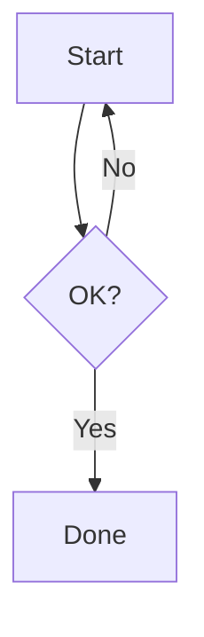

# Merman layout POC

## Context / goal

The current `mermaid-wasm-renderer` output routes a simple flowchart feedback
edge around the full diagram. Evaluate `merman` 0.7 as an isolated Rust renderer
before any production backend change.

Fixed fixture, rendered without per-run directives and with the current TUI's
`dark` theme where the backend supports it:

## Prior art

- Current local backend: `packages/opencode/src/util/mermaid.ts`.
- `merman` 0.7 documents a headless Rust renderer with Mermaid 11.15 parity and
  an SVG output API: https://docs.rs/merman/latest/merman/

## Implementation

- [x] Add `experiments/merman-layout-poc/` with `merman = { version = "0.7.0", features = ["render"] }`, the fixed fixture, and a runner using `render_svg_resvg_safe_sync`.
- [x] Render the fixture through current WASM and `merman`; generate ignored local artifacts `current-wasm.svg`, `merman-resvg-safe.svg`, same-contain-budget PNG previews on the same background, and `report.json` under `output/`.
- [x] Record SHA-256, SVG width/height/viewBox, viewBox area, applied theme/config, and a manually reviewed feedback-edge route. Merman passed: valid raster output, 37,222.52 vs 56,295.19 viewBox area (-33.9%), and a compact readable feedback channel.

## Smoke Tests

### Baseline

| # | Command (cwd) | Expected now | Actual [Exact] |
|---|---------------|--------------|----------------|
| 1 | `bun test test/util/mermaid.test.ts` (`packages/opencode`) | current renderer tests pass | 11 pass, 0 fail, 26 expects |
| 2 | user-provided Windows Terminal screenshot | current feedback edge is inspectable | route wraps the full diagram and conflicts with the intended compact return edge |

### Post-implementation oracles

| # | Command (cwd) | Pass criteria |
|---|---------------|---------------|
| 1 | `bun run render-current.ts && cargo +1.95.0 run --release && bun run compare.ts` (`experiments/merman-layout-poc`) | both paths create non-empty SVG/PNG/report artifacts from identical source |
| 2 | `output/report.json` + PNG inspection | report records hashes and geometry; feedback route is judged against the explicit reject criterion |

## Results

Generated artifacts remain local because `experiments/` is gitignored. The small
fixture and runners are force-added as reproducible experiment source.

| # | Command (cwd) | Actual [Exact] |
|---|---------------|----------------|
| 1 | `bun test test/util/mermaid.test.ts` (`packages/opencode`) | 11 pass, 0 fail, 26 expects |
| 2 | `bun run render-current.ts && cargo +1.95.0 run --release && bun run compare.ts` (`experiments/merman-layout-poc`) | completed; `merman` cold build 7m47s, both SVG/PNG artifacts valid, report written |
| 3 | PNG inspection | `merman` makes the feedback route compact and readable; current WASM creates a wide external loop |

Recommendation: advance `merman` to an additive integration POC, retaining the current WASM renderer as fallback.
