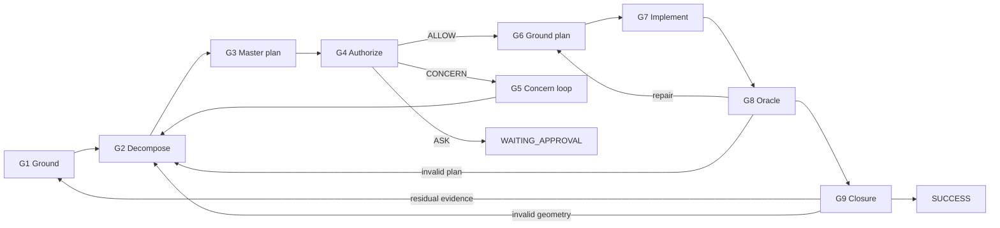

# prompt_kernel

Production map-first reasoning kernel. Source of `packages/opencode/src/session/prompt/reasoning_prompt.txt`.



## Serialization

1. `WORKFLOW`: gates, `gated_workflow` success path, `forward_move`/`CONCERN`/`back_move`/`terminal` edges.
2. `ABI_AND_VOCABULARY`: precedence, reference grammar, `INFORMATION_STATUS`, `SV_CONTRACT`, `SOURCE_ROUTING`, state, and action classes.
3. `SHARED_RULES`: definitions needed by multiple gates.
4. `GATE_REFINEMENT`: `G1..G9`, with each gate's local rule definitions beside their use.
5. Advisory semantic-attention and evolution protocols.
6. Identity contracts.

`source.py` is the only semantic owner. `validate.py` rejects incomplete topology, duplicate rule ownership, broken state flow, unresolved identities/references, authorizing optional loops, and unsafe size budgets before rendering.

`migration.py` gives every legacy runtime rule an explicit disposition: preserved, merged into a named canonical owner, or delegated to a named host/runtime boundary. No legacy rule is silently dropped or retired.

## Dedup guardrails

`dedup.py` keeps schema and behavior distinct:

- state descriptions are compact data shapes; rules describe transitions and enforcement;
- unapproved state/rule similarity at or above `0.58` fails validation;
- reviewed overlap requires a pair-specific rationale in `SEMANTIC_OVERLAP_ALLOWLIST`;
- repeated five-token boilerplate, repeated ownership lines, duplicated edge serialization, and repeated identity authority clauses are regression-tested;
- the runtime artifact has a 24,000 UTF-8 byte budget and 2,800 normalized-token test ceiling;
- `SV_FORMAT` and `SOURCE_ROUTING` are typed IR contracts; compatibility fails if they or the digest/discipline coverage disappear.

## Build and test

```powershell
python -m pytest prompt_kernel/tests/ -q
python -m prompt_kernel
```

Assembly writes **only** timestamped files under `prompt_kernel/dist/`:

- `YYYY-MM-DD_HH-MM-SS_reasoning_prompt.txt`
- `YYYY-MM-DD_HH-MM-SS_reasoning_prompt.mdc`
- `YYYY-MM-DD_HH-MM-SS_manifest.json`
- `YYYY-MM-DD_HH-MM-SS_migration_report.json`

The stamp is local time, Windows-safe (`2026-09-01_19-27-54`). Tests write to a temp directory so pytest does not pollute `dist/`.

Install into production:

```powershell
python -m prompt_kernel --install
```

Ordinary `python -m prompt_kernel` (no `--install`) only stamps `dist/` and leaves the working copy unchanged. `build.py` `step_kernel` runs `--install`.

`cutover.py` remains the hash-gated promote API (`approve=True` + current SHA-256).

## Host variants

`GATE_ADDONS` (`addons.py`) binds each gate to opencode's own tools
(`codegraph`, `cmd_runner`, `applypatch`, `getmode`, `messagesearch`, `nssm`,
…). Everything else — `WORKFLOW`, `ABI_AND_VOCABULARY`, `SHARED_RULES`,
`GATE_REFINEMENT`'s local rules, the protocols, the identity contracts — is
host-agnostic.

`addons_claude.py` swaps that binding for the Claude Code CLI's own tools
(Read/Edit/Write/Glob/Grep, a Bash tool and a PowerShell tool side by side,
Agent, AskUserQuestion, `run_in_background` + Monitor for long-lived
processes, the Browser tool for visual oracles) while keeping the same
kernel core. `render_kernel`, `render_review`, `kernel_digest`, and
`write_artifacts` all take an optional `addons` argument so any tuple of
`GateAddon`s can be rendered without touching `source.py`.

```powershell
python -m prompt_kernel --claude
```

writes stamped artifacts under `prompt_kernel/dist_claude/` (same file
shapes as `dist/`: `..._reasoning_prompt.txt`, `.mdc`, `_manifest.json`,
`_migration_report.json`).

```powershell
python -m prompt_kernel --claude --install
```

additionally refreshes `.claude/reasoning_kernel.md` — a stable,
git-tracked, renderer-only file (never hand-edit it). `.claude/CLAUDE.md`
pulls it in with Claude Code's `@reasoning_kernel.md` import syntax, so it
loads automatically into every Claude Code session in this repo. Unlike
`install_production`/`cutover` (which hash-gate writes to the opencode
runtime prompt other code depends on), `install_claude_kernel` has no gate:
`.claude/reasoning_kernel.md` never carries hand-written content to protect,
only prior renderer output. Re-run `--claude --install` after any change to
`source.py` or `addons_claude.py` to keep it in sync — nothing does this
automatically yet.

Before wiring this in, note the size trade-off: the installed file is the
full kernel render (~26 KB), so every session in this repo now spends that
many tokens up front. If that is not wanted, remove the `@reasoning_kernel.md`
line from `.claude/CLAUDE.md` (the generator and `dist_claude/` builds stay
unaffected either way).
