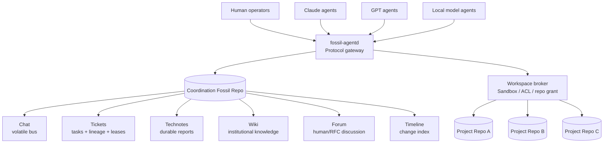
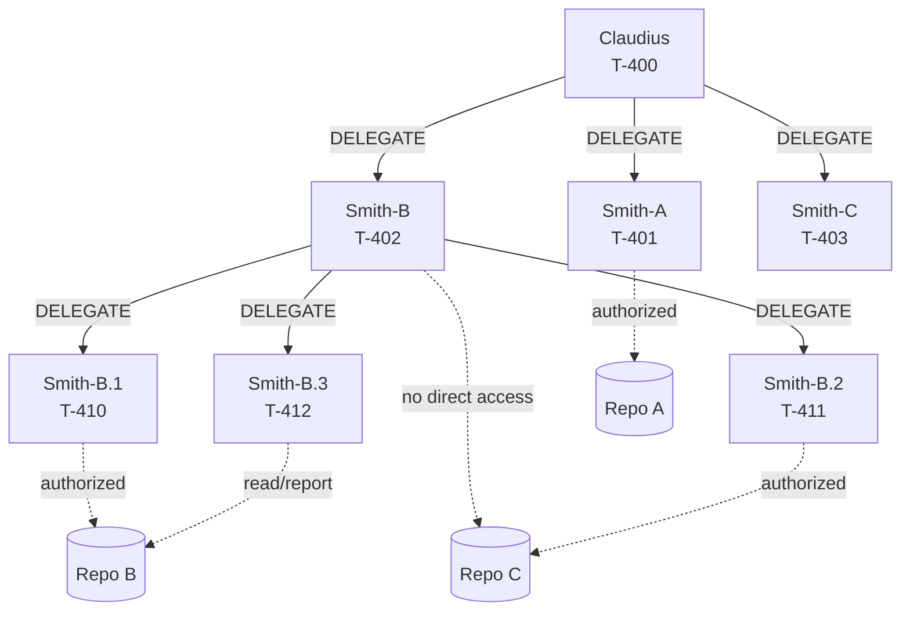
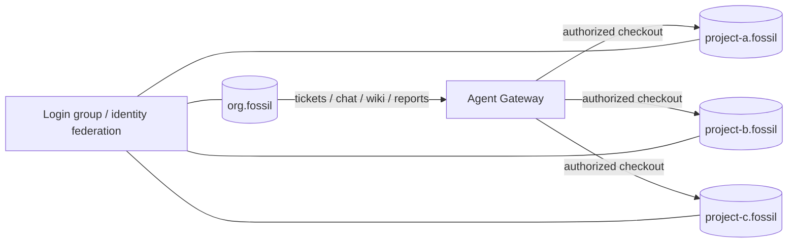
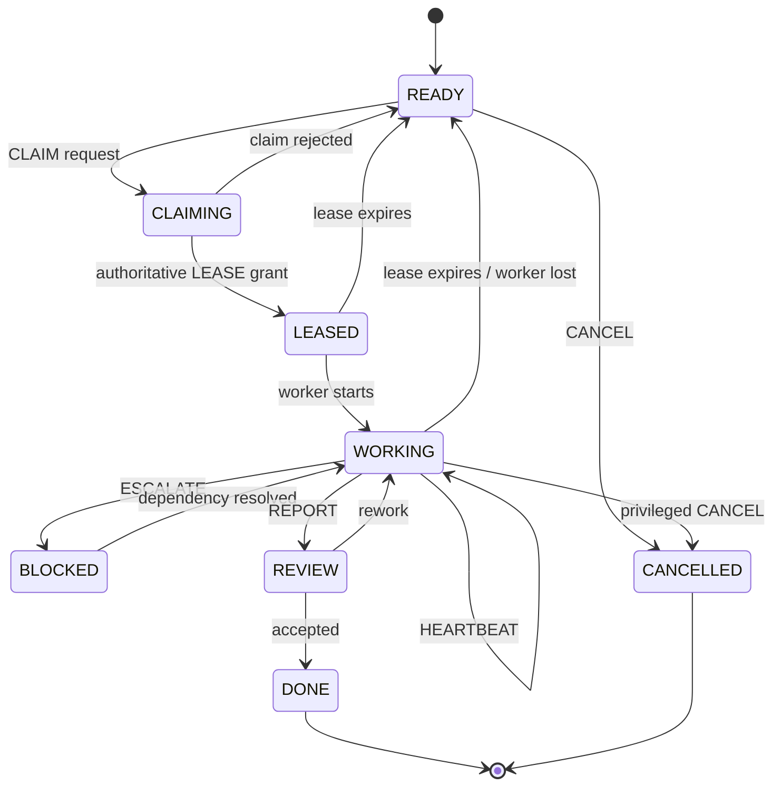
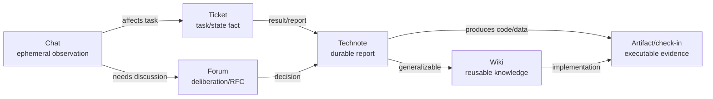
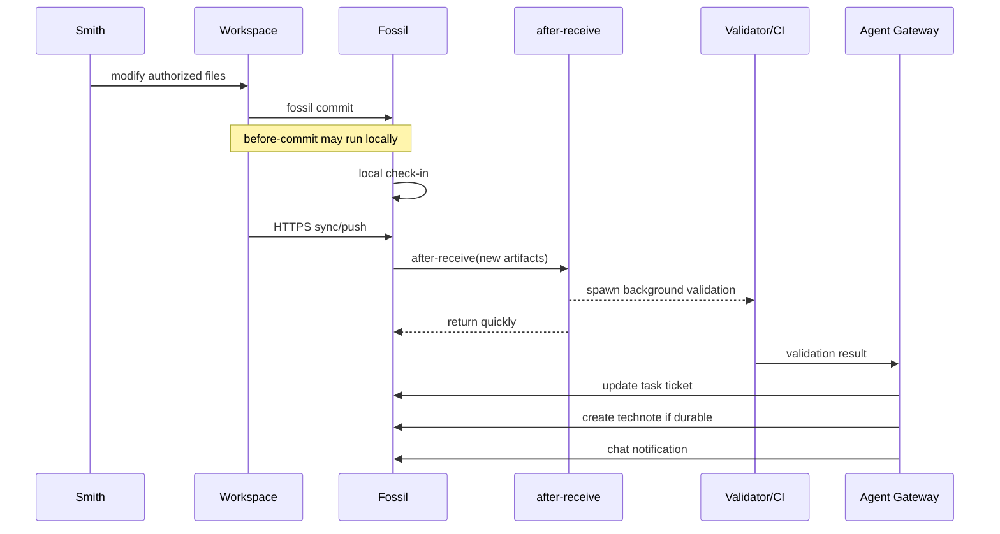

# Fossil as a Coordination Substrate and Corporate Intranet for Recursive Multi-Agent Systems

## Executive summary

**[Inferred]** Alexander, the architecture is technically sound, but the strongest version is not “Fossil as a replacement for an agent orchestrator.” It is **Fossil as the institutional substrate of an agent organization**: a durable shared record, human interface, task/delegation graph, knowledge base, artifact store, and a lightweight ephemeral coordination channel. Fossil is unusually well aligned with that role because DVCS, tickets, wiki, technotes, forum, chat, timeline, authentication, and a web UI are integrated into one repository-oriented system and one executable. The official project explicitly describes these integrated facilities as part of Fossil's project-management model. citeturn14view0

The key architectural recommendation is:

> **Use Fossil as the authoritative institutional memory and coordination plane, but put a thin `fossil-agentd` protocol gateway and a workspace broker in front of it.**

The gateway normalizes heterogeneous agents—Claude, GPT, local models, humans—into a small protocol such as `DELEGATE`, `CLAIM`, `LEASE`, `HEARTBEAT`, `REPORT`, `DONE`, `ESCALATE`, while the workspace broker enforces your most important invariant:

> **An agent does not independently enter another project's workspace. It delegates work to an agent instantiated with authority over that workspace.**

That invariant **cannot be strongly enforced by Fossil capabilities alone**. Fossil permissions are repository-scoped HTTP capabilities; once an agent has a local clone, normal Fossil caps no longer constrain what it can inspect or modify locally, and Fossil explicitly says local access is governed by operating-system filesystem permissions. Fossil also warns that its capability system does not meaningfully protect ordinary SSH/local-path repository access in the way it protects HTTP(S) access. citeturn1view2turn8search6

The resulting architecture should therefore separate **organizational authority** from **filesystem authority**:



**[Inferred]** There are four critical caveats.

First, Fossil Chat is intentionally ephemeral: messages do **not** synchronize between repository clones, retention is configurable with a default of seven days, and chat can be deleted independently of the permanent repository artifact graph. citeturn1view0 This is excellent for heartbeats, progress chatter, wakeups, and transient coordination, but it means **Chat must never be the sole record of a claim, delegation, completion, decision, or deliverable**.

Second, the Fossil Timeline is extremely useful as a unified change index, but it should not itself be treated as the complete event-sourcing journal. Ticket state, for example, is reconstructed from underlying ticket-change artifacts; the timeline is a projection over those changes. Fossil explicitly describes ticket state as the ordered reduction of ticket-change artifacts and says the SQL ticket tables can be reconstructed from those artifacts. citeturn9view1 Thus the robust formula is:

```text
STATE = reduce(durable Fossil artifacts)
```

rather than:

```text
STATE = reduce(timeline display rows)
```

Third, the documented JSON API remains explicitly non-final, and the ticket JSON API is notably incomplete: the official ticket API still says it lacks direct ticket-content and ticket-history functionality. citeturn2search0turn4search0 For the first implementation, use **stable CLI surfaces for writes and important reads**—`fossil ticket add/set/history`, `fossil wiki create/commit/export`, `fossil timeline`—and use `/chat-poll`, `/chat-send`, and carefully pinned JSON endpoints where they add value. citeturn7view0turn7view1turn7view2turn3view0

Fourth, the current trunk hook documentation says `commit-msg` hooks are **not yet implemented**, `before-commit` is locally bypassable with `--no-validate`, and `after-receive` runs only after artifacts have already been accepted. Therefore hooks are useful for validation, CI, notification, and promotion, but they are **not sufficient as the security boundary for workspace isolation or server-side admission control**. citeturn1view1

The overall verdict is therefore:

| Question | Assessment |
|---|---|
| Fossil as corporate intranet for agents | **Strong fit** |
| Chat as transient coordination bus | **Strong fit within one repo/server** |
| Tickets as recursive delegation graph | **Strong fit after schema customization** |
| Wiki/technotes as institutional memory | **Strong fit** |
| Timeline as event/change index | **Strong fit** |
| Timeline alone as event-sourcing store | **Insufficient** |
| Strict distributed leases directly in stock Fossil | **Needs gateway/arbitration layer** |
| Filesystem/project-folder isolation | **Must be enforced outside Fossil or by repo boundaries** |
| Human-in-the-loop interface | **Strong fit** |
| Heterogeneous agent interoperability | **Strong fit with a thin protocol adapter** |
| Highly granular enterprise RBAC/channels/workflows | **Weaker than specialized products** |
| Fully replicated chat/federated message bus | **Not supported by Fossil Chat** |

## Fossil semantics and architectural fit

### Chat is almost exactly the right volatile bus

**[Inferred]** Fossil's documented Chat implementation has the characteristics needed for lightweight agent coordination. `/chat-poll` returns JSON and uses sequential `msgid` values; a client supplies the highest message ID it has already seen, and the request blocks if there is nothing newer. The documented long-poll timeout defaults to approximately 420 seconds. A negative starting value can fetch the latest N messages, and `raw` can return the original Markdown rather than pre-rendered HTML, specifically for third-party clients. citeturn3view0

That gives an agent a very simple receive loop:

```text
cursor = last_msgid

loop:
    messages = GET /chat-poll/{cursor}?raw=1

    for message in messages:
        process(message)
        cursor = max(cursor, message.msgid)
```

`/chat-send` accepts POSTed Markdown text and optionally a file attachment, while `/chat-delete` deletes an existing chat row and inserts a deletion notification referencing the removed message through `mdel`. citeturn3view1turn3view2

Fossil also explicitly supports robotic Chat users. The official recommendation is to create one account per robot and grant only capability `C`, allowing that robot to send Chat messages without broader repository authority. Fossil's own documentation cites SQLite fuzzing infrastructure as a real-world example of robots posting findings to a Fossil chatroom. citeturn1view0

This translates cleanly into agent identities:

```text
claudius           C + ticket/wiki capabilities
smith-4821         C + limited ticket capabilities
reviewer-17        C + ticket read/write
ci-bot             C only
knowledge-promoter C + wiki/technote authority
```

The documented model is a repository-level `/chat` room. Fossil's current Chat documentation describes filtering messages by user but does not document a Slack-style channel/room-routing primitive. Accordingly, **logical channels should live in your message envelope, not be assumed to exist natively**. citeturn13view2

For example:

```text
channel = task:T-482
channel = org:engineering
channel = agent:smith-4821
channel = project:pipeline-inspection
```

### Chat's ephemerality is a feature, provided promotion is mandatory

Fossil deliberately keeps Chat outside the durable synchronized artifact graph. Chat does not sync between peer repositories, defaults to seven-day retention, can be globally deleted, and the entire Chat table can be dropped without damaging other repository content. citeturn1view0

This makes it suitable for:

```text
HEARTBEAT
PROGRESS
"I'm inspecting X"
"Need delegate with Python capability"
"Artifact upload started"
"Wake reviewer-12"
"Lease expires in 180 s"
```

but unsuitable as the only copy of:

```text
DELEGATION GRANT
LEASE OWNERSHIP
ACCEPTED DECISION
FINAL REPORT
TASK COMPLETION
KNOWLEDGE CLAIM
AUDIT EVIDENCE
```

The right division is therefore:

| Fossil object | Agent-system role | Durable | Syncs between clones | Recommended semantics |
|---|---|---:|---:|---|
| Chat | Low-latency coordination | No | No | heartbeats, wakeups, progress, hints |
| Ticket | Task and state machine | Yes | Yes | delegation, ownership, state, dependencies |
| Technote | Dated durable report | Yes | Yes | experiment/report/decision checkpoint |
| Wiki | Curated shared knowledge | Yes | Yes | reusable organizational knowledge |
| Forum | Durable discussion/RFC | Yes | Yes | human deliberation, design discussion |
| Check-in/repo | Executable artifact | Yes | Yes | code, configuration, tested output |
| Timeline | Unified activity index | Derived | Artifact-backed | observation, replay discovery |
| Unversioned files | Mutable/latest artifact | Limited history | Separately syncable | caches/build outputs where appropriate |

Fossil documents technotes as timestamped wiki-like artifacts that automatically appear on the timeline, synchronize across repositories, retain edit history, and are explicitly suitable for process checkpoints and test results. citeturn9view2 Forum posts are likewise repository artifacts, synchronize to clones, have preserved history, support cross-links with other Fossil artifacts, and can be searched offline. citeturn9view3

There is one important automation mismatch: Fossil's Forum documentation currently says that new forum posts are entered through the web interface, while the JSON API index does not expose a forum API category. citeturn11search3turn11search2 For that reason, **do not put Forum on the critical machine-to-machine control path in the first version**. Treat it primarily as the durable human/RFC layer until you intentionally implement and test a supported adapter.

### Tickets are naturally compatible with recursive delegation

Fossil tickets are particularly interesting for this architecture because ticket state is already event-derived. Each ticket change is an artifact containing ticket ID, timestamp, author, and changed key/value pairs. Fossil orders those changes and applies them to obtain current state. citeturn9view1

More importantly, ticket fields beyond Fossil's internal `tkt_*` columns are administrator-defined. Official documentation explicitly demonstrates adding fields such as `assigned_to` and `opened_by`, and custom ticket reports can query those fields. citeturn9view0

That means the recursive delegation graph does **not** require abusing comments or inventing an external task database.

A ticket can literally contain:

```text
root_task      = T-400
parent_task    = T-481
delegated_by   = claudius
assigned_to    = smith-4821
state          = WORKING
lease_owner    = smith-4821
workspace_repo = project-b
```

Fossil's CLI supports ticket creation, field updates, ticket history, and custom fields directly. citeturn7view0

### Timeline is the corporate ledger index, not the entire ledger

The CLI timeline can filter check-ins, technotes, forum posts, tickets, and wiki changes, and can filter by user, path, branch, and time. citeturn7view2 The JSON timeline API separately exposes ticket, wiki, technote, and check-in timeline views, including UUIDs that can be used to locate underlying artifacts. citeturn0search2

This gives you a very useful corporate view:

```text
13:00 claudius      created task T-400
13:01 smith-81      modified T-401
13:03 smith-82      committed 4d91b2...
13:04 reviewer-17   created technote TEST-4d91b2
13:06 promoter      updated wiki Valve-Failure-Modes
13:07 claudius      closed T-400
```

But semantically:

```text
Timeline = index(change events)
Artifacts = authoritative historical records
Reduced state = projection(artifacts)
```

That distinction matters when designing restart and replay.

### Version and API stability must be pinned

As of October 2026, Fossil's official home page lists **2.28, released March 11, 2026, as the latest formal release**, while the live trunk documentation is being generated by a 2.29 development build. citeturn14view0

The JSON API documentation itself warns that an implemented interface should not be assumed final, and JSON support may be built conditionally with `--enable-json`. citeturn2search0turn2search3

For an agent infrastructure system this argues strongly for:

```text
pin Fossil binary version
        +
protocol adapter
        +
integration contract tests
        +
CLI fallback paths
```

rather than allowing every model runtime to call arbitrary Fossil HTTP endpoints directly.

## Recursive delegation architecture

### Organizational graph and workspace graph should be separate

**[Hypothetical]** The most important conceptual move is to model at least four graphs independently:

```text
delegation graph
authorization graph
knowledge graph
artifact dependency graph
```

A Smith can be organizationally subordinate to Claudius without sharing Claudius's filesystem authority. A Smith can consume knowledge produced by another organizational branch without inheriting access to that branch's project checkout. A report can reference an artifact owned by another project without granting the reporting agent write permission over that project.

For example:



The rule is:

```text
Agent A sees work needed in Project B
                |
                X  do not cd/open/edit Project B
                |
                v
          DELEGATE(task, Project B)
                |
                v
        Workspace Broker
                |
                v
       Agent B + Project B ACL
```

This is not merely a security rule. It creates **organizational provenance**:

```text
Who entered the project?
Why?
Under whose authority?
For which root task?
With what scope?
What came back?
```

### Delegation must carry lineage across arbitrary depth

A root task created by Claudius:

```text
T-400
```

may spawn:

```text
T-400
├── T-401  Smith-A
├── T-402  Smith-B
│   ├── T-410 Smith-B.1
│   │   └── T-414 Smith-B.1.1
│   ├── T-411 Smith-B.2
│   └── T-412 Smith-B.3
└── T-403  Smith-C
```

Every child stores both:

```text
parent_task = immediate delegator's task
root_task   = original organizational objective
```

This lets a manager request:

```text
REPORT T-402 depth=1
```

while an executive requests:

```text
REPORT T-400 aggregate=true
```

and an auditor requests:

```text
TRACE root=T-400 descendant=T-414
```

without depending on the original model contexts still existing.

### Recommended physical topology

**[Hypothetical]** For small trusted teams, one Fossil repository can contain code plus coordination state. For a recursive agent corporation with workspace isolation, the better production topology is **a coordination repository plus multiple project repositories**.



Fossil can serve multiple repositories from a single server setup, and its login-group facility can provide shared login identity across repositories while keeping per-repository capabilities distinct. citeturn8search8turn10view1

That combination is unusually useful here:

```text
same identity:
    smith-43

org.fossil:
    read tickets
    write own task
    chat

project-a.fossil:
    no access

project-b.fossil:
    read + write

project-c.fossil:
    read only
```

Fossil explicitly notes that login-group authentication does not make capabilities identical across repositories; an account may have different authorities in each member repository. citeturn10view1

For actual **multi-tenancy**, define the repository boundary as a trust boundary:

```text
tenant A -> coordination-A.fossil
tenant B -> coordination-B.fossil
tenant C -> coordination-C.fossil
```

Do not put mutually confidential tenants into one Chat room and attempt to implement confidentiality using message tags. Fossil's Chat capability grants access to the repository's `/chat` room, not a per-message ACL mechanism. citeturn15view0turn13view2

## Agent protocol and delegation data model

### Canonical message envelope

**[Hypothetical]** Agents should not communicate with free-form prose alone. Let the human-readable Markdown remain visible, but embed or attach a machine-readable envelope.

A compact Chat message:

```json
{
  "v": "agent/1",
  "id": "msg_01K6Q3F8T1Y7",
  "type": "HEARTBEAT",
  "actor": "smith-4821",
  "task": "T-482",
  "root": "T-400",
  "parent": "T-481",
  "channel": "task:T-482",
  "ts": "2026-10-04T09:41:12Z",
  "seq": 38,
  "lease": {
    "epoch": 4,
    "token": "ls_8b570f",
    "expires_at": "2026-10-04T09:46:12Z"
  },
  "body": {
    "state": "WORKING",
    "progress": 0.63,
    "activity": "validating inspection parser"
  }
}
```

The corresponding human presentation might simply be:

```text
[HEARTBEAT T-482] smith-4821
63% — validating inspection parser
lease epoch=4 expires=09:46:12Z
```

Because `/chat-poll?raw=1` can return raw Markdown to third-party clients, a machine-readable fenced object can be recovered without parsing rendered HTML. citeturn3view0

Every protocol message should carry at least:

```text
protocol version
globally unique event ID
message type
actor
task
root task
causal parent/event
timestamp
idempotency key
```

That is what makes heterogeneous agents interchangeable: the receiving side processes the contract, not Claude-specific or GPT-specific conversational conventions.

### Minimal organizational primitives

A small protocol is preferable to exposing the entire Fossil ontology to every model.

| Primitive | Meaning | Authoritative storage |
|---|---|---|
| `DELEGATE` | Create child task under current authority | Ticket |
| `CLAIM` | Request ownership | Chat request → ticket grant |
| `LEASE` | Time-bounded work authority | Ticket |
| `HEARTBEAT` | Assert worker liveness/progress | Chat |
| `REPORT` | Publish durable result | Technote + ticket link |
| `DONE` | Complete task and release lease | Ticket |
| `ESCALATE` | Return uncertainty/blocker upward | Ticket + Chat notification |
| `PROMOTE` | Move useful content to higher durability | Ticket/technote/wiki/repo |

A `CANCEL` can either be a distinct primitive or a `state=CANCELLED` transition.

### Ticket schema for recursive delegation

Fossil's ticket tables explicitly permit administrator-defined fields, and the CLI can create and modify those fields. citeturn9view1turn7view0

A practical schema is:

| Field | Type | Purpose |
|---|---|---|
| `title` | TEXT | Human-readable task |
| `status` | TEXT | Fossil-compatible summary status |
| `agent_state` | TEXT | `NEW/READY/LEASED/WORKING/BLOCKED/REVIEW/DONE/...` |
| `root_task` | TEXT | Root delegation ticket |
| `parent_task` | TEXT | Immediate parent |
| `delegated_by` | TEXT | Agent/human that created delegation |
| `assigned_to` | TEXT | Intended worker |
| `delegation_depth` | INTEGER/TEXT | Hierarchy depth |
| `attempt` | INTEGER/TEXT | Retry generation |
| `lease_owner` | TEXT | Current authorized worker |
| `lease_token` | TEXT | Capability-like random lease identifier |
| `lease_epoch` | INTEGER/TEXT | Monotonically increasing lease generation |
| `lease_until` | TEXT | Server-time expiration |
| `heartbeat_at` | TEXT | Last durable heartbeat checkpoint |
| `workspace_repo` | TEXT | Authorized repository |
| `workspace_ref` | TEXT | Branch/check-in |
| `workspace_scope` | TEXT | Logical allowed subtree or scope descriptor |
| `policy_version` | TEXT | Isolation/policy version |
| `depends_on` | TEXT | Task dependency IDs |
| `report_ref` | TEXT | Technote ID |
| `result_ref` | TEXT | Check-in/artifact UUID |
| `knowledge_ref` | TEXT | Wiki page/reference |
| `idempotency_key` | TEXT | Duplicate protection |
| `failure_code` | TEXT | Structured terminal/block reason |

`workspace_scope` is **descriptive provenance**, not the actual security mechanism. Actual filesystem enforcement belongs to the workspace broker.

### Claim and lease state machine

**[Hypothetical]** Do not use a permanent `assigned_to` field alone as mutual exclusion. Recursive agents die, restart, partition, and duplicate work. Use leases.



A lease record should resemble:

```json
{
  "task": "T-482",
  "state": "WORKING",
  "lease_owner": "smith-4821",
  "lease_token": "ls_8b570f",
  "lease_epoch": 4,
  "lease_issued_at": "2026-10-04T09:36:12Z",
  "lease_until": "2026-10-04T09:46:12Z",
  "attempt": 2
}
```

A stale Smith reporting later with `lease_epoch=3` can then be deterministically rejected.

### Why claim arbitration should live in the gateway

**[Inferred]** Fossil's documented ticket CLI provides add/set/change/history operations, but it does not expose a documented compare-and-swap primitive such as “change this field only if lease_epoch still equals 4.” citeturn7view0

Therefore this race is possible at the application layer:

```text
Smith-A reads READY
Smith-B reads READY

Smith-A writes lease_owner=A
Smith-B writes lease_owner=B
```

Fossil will durably preserve ticket changes, but that is not the same thing as application-level mutual exclusion.

The clean solution is a tiny authoritative operation in `fossil-agentd`:

```text
claim(task, agent)
    acquire task lock
    read current durable state
    verify READY or expired lease
    increment lease_epoch
    issue random token
    update Fossil ticket
    release lock
    return grant
```

The gateway does not need to be the durable source of truth. The lock is transient; the authoritative result is persisted back to the ticket.

Thus:

```text
Gateway memory = disposable
Fossil task history = durable
```

### Promotion protocol

**[Hypothetical]** Promotion should be semantic, not simply age-based.



Promotion criteria can be explicit:

| From | To | Promotion condition |
|---|---|---|
| Chat | Ticket | changes task state, dependency, assignment, or risk |
| Chat | Forum | unresolved multi-party design discussion |
| Ticket | Technote | work generated a meaningful report, experiment, decision, or diagnosis |
| Forum | Technote | decision/RFC reaches durable conclusion |
| Technote | Wiki | information is reusable beyond its originating task |
| Technote/Wiki | Repo | knowledge becomes executable/testable configuration, code, data, or specification |

That structure creates three useful memory temperatures:

```text
HOT
Chat
minutes -> days

WARM
Tickets + active technotes
days -> project lifetime

COLD / INSTITUTIONAL
Wiki + repository artifacts
project/organization lifetime
```

The seven-day default Chat retention becomes a **garbage collector for working memory** rather than a liability, because all important semantic events are promoted before expiry. citeturn1view0

## Isolation, access control, and multi-tenant policy

### Fossil access control is necessary but not sufficient

Fossil has a detailed capability system. Relevant examples include `C` for Chat, `n/r/w` for creating/reading/writing tickets, `j/f/k` for wiki access, `i` for uploading/checking-in repository changes, `g` for cloning, and separate Forum capabilities. citeturn15view0

This is valuable for implementing least privilege:

```text
notification-bot:
    C

task-worker:
    C r w

research-agent:
    C r w j

knowledge-promoter:
    C r w j f k

code-worker:
    coordination caps
    + i/o on authorized project repo
```

However, the crucial limit is explicit in Fossil's documentation: **caps protect HTTP interfaces, not possession of a local repository database**. Once a repository is local, filesystem permissions dominate. citeturn1view2

Likewise, capability `i` does not prevent an agent from committing locally; it prevents synchronization of those changes to the parent over the controlled HTTP interface. citeturn15view0

Therefore your rule:

> “Do not touch another project's folders yourself; delegate somebody who is authorized there.”

must be represented at multiple layers.

### Recommended isolation stack

**[Hypothetical]**

```text
Layer A — Organizational policy
    task.workspace_repo
    task.workspace_scope
    delegation lineage

Layer B — Agent gateway
    refuses tool request outside delegated scope

Layer C — Workspace broker
    only mounts/clones authorized project

Layer D — OS/container boundary
    other project directories absent or read-only

Layer E — Fossil repository boundary
    separate project repositories

Layer F — Fossil capabilities
    no Clone/Write where not authorized

Layer G — audit
    ticket lineage + timeline + commits
```

The strongest enforcement rule is not:

```text
"You may not edit ../project-b"
```

because an agent may ignore or misunderstand that.

It is:

```text
../project-b does not exist inside this worker's namespace.
```

An agent needing access must issue:

```json
{
  "type": "DELEGATE",
  "target_project": "project-b",
  "task": "Inspect compatibility of parser with Project B schema",
  "required_capabilities": ["python", "project-b:read"],
  "parent_task": "T-482"
}
```

The workspace broker then creates a worker that actually has Project B mounted or cloned.

### Repository-per-project is preferable to path ACL emulation

**[Inferred]** Fossil's documented capability system is per served repository, while a Fossil server can conveniently serve multiple repositories. Fossil also supports login groups across those repositories. citeturn8search8turn10view1

That naturally yields:

```text
corporate identity boundary   = login group
security boundary             = repository
execution boundary            = sandbox
organizational boundary       = ticket lineage
```

rather than attempting to force all four concerns into directories within one monorepo.

If a monorepo is mandatory, the workspace broker must become the hard boundary by presenting only selected directories or ephemeral task worktrees/checkouts. Fossil itself should not be treated as providing native per-directory authorization.

### Avoid SSH for security-sensitive agent synchronization

Fossil's capability documentation explicitly warns that the web capability system applies to `http[s]://` interfaces and does not provide equivalent protection for ordinary SSH-based repository operations unless additional measures are taken. citeturn1view2turn10view1

For automated agents, prefer:

```text
HTTPS
+
named Fossil user
+
minimum capability set
+
short-lived or scoped credential management
```

over treating an SSH shell account as equivalent to a Fossil application identity.

### Private branches are not tenant isolation

Private Fossil branches are useful for local unpublished work: they normally do not sync, and their sharing requires explicit private synchronization plus the `x` capability. citeturn10view2

They should **not** be used as the primary isolation mechanism between agents or tenants. Fossil states that private-branch controls apply collectively and does not support independently syncing an arbitrary individual private branch within a repository containing several private branches. citeturn10view2

They are therefore useful for:

```text
worker scratch
speculative experiments
local unpublished edits
```

but not for:

```text
tenant A versus tenant B confidentiality
project A ACL versus project B ACL
```

## Event reduction, hooks, and failure recovery

### Stateless supervisor is achievable, with a precise definition of “stateless”

**[Hypothetical]**

A supervisor may hold caches:

```json
{
  "chat_cursor": 18442,
  "timeline_cursor": {
    "timestamp": "2026-10-04T09:41:12Z",
    "uuid": "8e3c..."
  }
}
```

but correctness must not depend on those caches surviving.

The durable model is:

```text
task state       <- ticket change artifacts
reports          <- technotes
knowledge        <- wiki
code/results     <- repository artifacts
discussion       <- forum
```

while:

```text
chat cursor
timeline pagination cursor
in-memory dependency index
cached org tree
```

are accelerators.

Fossil's ticket architecture supports this model particularly well because the current ticket state is explicitly reconstructible from the chronological ticket-change artifacts. citeturn9view1

Thus on supervisor restart:

```text
load unfinished tasks
        ↓
reconstruct lineage
        ↓
evaluate leases
        ↓
recover durable reports/results
        ↓
resume chat polling from cursor if possible
        ↓
reissue notifications / expired work
```

### Cursor semantics

For Chat:

```text
cursor = highest msgid processed
```

because `/chat-poll` returns increasing sequential `msgid` values. citeturn3view0

But a Chat cursor is **not a recovery guarantee** because messages can expire or be deleted. If the worker was offline longer than retention, it may never see the missing messages. citeturn1view0

Therefore:

```text
chat cursor = optimization
ticket/artifact replay = correctness
```

For durable timeline consumption, use at least:

```text
timestamp + artifact/change UUID
```

rather than timestamp alone, since multiple events can share temporal boundaries and the JSON timeline surfaces identifying UUIDs. citeturn0search2

### Recommended hook workflow

Fossil's `after-receive` hook runs through backoffice after new artifacts have arrived; it receives a list of incoming artifact hashes and descriptions. It cannot reject those artifacts because they have already been committed. Concurrent pushes can be combined into one callback, and Fossil warns that a long backoffice outage can cause the hook input to include only the most recent 24 hours of accumulated artifacts. citeturn1view1

That makes this the recommended use:



The hook docs explicitly advise keeping hooks short and putting long-running work in the background. Fossil also holds a write transaction during portions of hook execution, making long synchronous work undesirable. citeturn1view1

`before-commit` is useful for convenience checks:

```text
workspace path validation
task ID in metadata
forbidden-file patterns
generated-file rules
unit-test preflight
```

but Fossil documents `--no-validate`, which bypasses those hooks, so it must not be your security boundary. citeturn1view1

And as of the current 2.29 trunk documentation generated October 1, 2026, `commit-msg` hooks are explicitly marked **not yet implemented**. citeturn1view1

### Failure matrix

| Failure | Consequence | Recovery strategy |
|---|---|---|
| Supervisor process dies | In-memory schedule lost | Rebuild from tickets/artifacts |
| Smith process dies | Lease remains temporarily | Lease expiration → READY |
| Smith restarts | Context lost | Fetch ticket + parent/root + reports + relevant wiki |
| Chat message expires | Transient chatter lost | Important state must already be promoted |
| Chat server fails over to clone | Recent chat absent | Reconstruct from durable tickets; restart Chat |
| Duplicate message | Repeated action risk | `idempotency_key` |
| Double claim | Two workers may begin | Gateway arbitration + lease epoch |
| Late stale worker reports | Old result can overwrite new | Validate lease epoch/token |
| Agent modifies wrong checkout | Cross-project contamination | Workspace/container boundary |
| Agent pushes unauthorized repo | Privilege breach | Separate repos + Fossil HTTP caps |
| `before-commit` bypassed | Local policy check skipped | Never rely on it as hard boundary |
| `after-receive` delayed | CI/notifications late | Periodic durable reconciliation |
| `after-receive` misses old backlog window | Event-trigger gap | Scan durable repository/timeline periodically |
| JSON API behavior changes | Adapter breakage | Pin Fossil, contract tests, CLI fallback |
| Parent agent disappears | Child results orphaned conversationally | `root_task`/`parent_task` durable lineage |
| Worker goes offline with claim | Task wedged | Lease timeout and retry |
| Clock-skewed worker | Bad expiration calculations | Server-issued lease timestamps/epochs |

The most important general principle is:

```text
notifications may be lossy
state transitions may not be lossy
```

### Chat-to-timeline feedback loop

Fossil can automatically publish timeline events into Chat when `chat-timeline-user` is configured. The synthetic messages are attributed to the configured timeline user. citeturn3view3

That gives you a useful observation loop:

```text
Agent commit
    ↓
Fossil timeline
    ↓
synthetic Chat event
    ↓
watching agents wake
    ↓
review/test/delegate
```

but it should be treated as notification, not as the underlying event.

## Human interface, alternatives, and trade-offs

### Human-in-the-loop is one of Fossil's strongest advantages

Fossil already has an integrated web interface exposing project activity, tickets, wiki, forum, repository history, and timeline views; the Fossil website itself is served by Fossil. citeturn14view0

The practical consequence is significant: a human manager does not need a separate “agent dashboard” for the first implementation.

A custom ticket report can provide:

```text
ROOT     AGENT        STATE      LEASE       DEPTH  PROJECT
T-400    claudius     WORKING    —           0      org
T-401    smith-21     DONE       —           1      p-a
T-402    smith-22     WORKING    04:12       1      p-b
T-410    smith-30     DONE       —           2      p-b
T-411    smith-31     BLOCKED    01:37       2      p-c
T-412    smith-32     REVIEW     03:05       2      p-b
```

Custom ticket reports are a native Fossil capability built over the ticket SQL tables. citeturn9view0turn7view0

The human can then move laterally:

```text
ticket
   ↓
child ticket
   ↓
technote report
   ↓
commit/artifact
   ↓
timeline history
```

rather than interrogating a live model about what it remembers.

### Fossil versus Git + Slack + Jira + Confluence

The competing stack is individually stronger in several specialist dimensions. Git has a rich hook model including server-side receive hooks; Slack provides mature messaging APIs and event envelopes; Jira provides configurable work-item hierarchy and HTTPS webhooks; Confluence provides versioned page APIs. citeturn5search3turn5search0turn12search1turn12search2turn5search2

The architectural difference is integration.

| Property | Fossil substrate | Git + Slack + Jira + Confluence |
|---|---|---|
| Deployment units | One core executable/repository system citeturn14view0 | Multiple services/products and APIs |
| Source/artifacts | Native DVCS | Git |
| Realtime coordination | Built-in simple Chat | Slack substantially richer |
| Task model | Highly customizable tickets | Jira substantially richer workflow/hierarchy |
| Knowledge | Wiki + technotes | Confluence substantially richer knowledge UX |
| Durable discussion | Forum | Slack threads / Confluence / Jira comments |
| Unified activity | Native Fossil timeline | Requires aggregation across products |
| Robot Chat | Native `fossil chat send` citeturn1view0 | Native Slack app API |
| Chat retention | Simple configurable; default seven days citeturn1view0 | Rich configurable retention policies citeturn12search0 |
| Chat federation | Does not sync | Cloud service handles workspace messaging |
| Offline project metadata | Wiki/tickets/technotes/forum sync with repo | Git is distributed; SaaS metadata generally separate |
| Recursive custom lineage | Add arbitrary ticket fields | Native Jira hierarchy/custom fields |
| Event callbacks | Fossil hooks, with limitations | Jira webhooks + Slack Events + Git hooks |
| API maturity | Fossil JSON API explicitly non-final citeturn2search0 | Mature product APIs |
| Identity locality | Per Fossil repo; login groups available | Enterprise IAM/SSO integrations |
| Path-level source authorization | Not Fossil's model | Usually provided by hosting/workspace policies, not plain Git itself |
| Operational simplicity | Very high | Lower |
| Data locality/self-host simplicity | Very high | Depends on selected editions/services |
| Best fit | Compact autonomous agent organization | Large enterprise collaboration ecosystem |

The important conclusion is not “Fossil is better than Jira/Slack/Confluence.” It is narrower:

> **Fossil has a uniquely favorable ratio of organizational primitives to operational complexity for a self-contained agent corporation.**

Slack itself supports application event envelopes with global event IDs, while Jira supports event-driven webhook callbacks that remove the need for polling; these are more mature integration surfaces than Fossil's experimental JSON API. citeturn5search0turn12search1

Conversely, Fossil does something the four-product stack does not naturally give you: source artifacts, tasks, wiki changes, technotes, forum history, user identities, and a common timeline are co-located around the same repository abstraction. citeturn14view0turn9view2turn9view3

That is exactly why it becomes attractive as an **agent intranet** rather than merely a software forge.

## Implementation roadmap and recommended target architecture

### Foundation

**Estimated effort: 3–5 person-days.**

Pin a Fossil release/build, establish one `org.fossil` repository, create robot accounts, enable Chat, customize ticket fields, enable search, and write integration tests against Chat, tickets, wiki/technotes, and timeline.

Acceptance tests:

```text
robot -> chat send
adapter -> chat poll
adapter -> create ticket
adapter -> update ticket
adapter -> ticket history
adapter -> create technote
adapter -> update wiki
adapter -> read timeline
restart adapter -> reconstruct task state
```

Because the JSON API is explicitly non-final and current formal release/trunk versions differ, version pinning and behavioral tests should be part of the architecture from day one. citeturn2search0turn14view0

### Agent protocol gateway

**Estimated effort: 5–8 person-days.**

Implement:

```text
fossil-agentd
├── ChatAdapter
├── TicketAdapter
├── WikiAdapter
├── TechnoteAdapter
├── TimelineAdapter
├── IdentityMapper
└── ProtocolValidator
```

Prefer:

```text
Chat reads       -> /chat-poll?raw=1
Chat writes      -> fossil chat send or documented POST
Ticket writes    -> fossil ticket add/set
Ticket history   -> fossil ticket history
Wiki/technotes   -> fossil wiki ...
Timeline         -> CLI or pinned JSON adapter
```

This avoids making individual LLM runtimes aware of Fossil quirks.

### Recursive delegation and leases

**Estimated effort: 6–10 person-days.**

Add ticket lineage, state machine, claim arbitration, lease epochs, retry generations, causal IDs, and idempotency.

The first smoke scenario should be:

```text
Claudius
  |
  +-- delegates T-101 -> Smith-A
  +-- delegates T-102 -> Smith-B
                          |
                          +-- delegates T-103 -> Smith-B.1
```

Then deliberately kill `Smith-B`, expire its lease, restart a replacement, and verify that `Smith-B.1`'s report still propagates to the reconstructed parent/root graph.

### Workspace broker and hard isolation

**Estimated effort: 8–12 person-days.**

This is the highest-value milestone for your specific architecture.

Implement:

```text
allocate(task, agent, project)
revoke(task)
spawn_delegate(parent, target_project)
mount_or_clone(project)
validate_scope(task)
destroy_workspace(task)
```

Physical layout:

```text
/workspaces/
    smith-1001/
        project-a/
    smith-1002/
        project-c/
```

Smith-1001 should not see:

```text
project-b/
project-c/
```

at all.

When Smith-1001 discovers Project C work, it calls `DELEGATE`; the broker creates Smith-1002 with Project C authority.

This converts your principle from prompt etiquette into architecture.

### Promotion and institutional memory

**Estimated effort: 6–10 person-days.**

Implement automatic and model-assisted promotion:

```text
Chat -> Ticket:
    authoritative task facts

Ticket -> Technote:
    terminal report / significant intermediate result

Technote -> Wiki:
    reusable knowledge

Technote -> Artifact:
    generated source/config/data

Forum -> Technote:
    accepted RFC/decision
```

Give promoted objects backlinks:

```json
{
  "root_task": "T-400",
  "source_task": "T-482",
  "source_messages": [18419, 18427],
  "report": "technote:ae831...",
  "artifact": "checkin:82bf3...",
  "promoted_by": "knowledge-promoter"
}
```

Chat message IDs are useful provenance while retained, but because Chat is ephemeral they must never be required to interpret the durable object later. citeturn1view0

### Recovery, reconciliation, and hook automation

**Estimated effort: 6–10 person-days.**

Implement periodic reconciliation in addition to hooks:

```text
every N seconds:
    enumerate nonterminal tasks
    expire dead leases
    verify result references
    verify missing reports
    detect orphan children
    repair notification gaps
```

Do not depend solely on `after-receive`, because Fossil documents coalescing, delayed execution and a finite old-artifact window for hook input. citeturn1view1

Use `after-receive` as:

```text
latency optimization
```

and reconciliation as:

```text
correctness mechanism
```

### Human UX and multi-tenant hardening

**Estimated effort: 6–12 person-days.**

Customize ticket reports and Fossil skins enough to expose:

```text
Organization
Active agents
Task tree
Blocked tasks
Expired leases
Delegation depth
Reports awaiting review
Recently promoted knowledge
Recent artifacts
```

Use separate coordination repositories when users should not share Chat/wiki/ticket visibility. Use Fossil login groups to reduce credential duplication while retaining distinct per-repository capabilities. citeturn10view1

### Expected implementation envelope

For one engineer already comfortable with Fossil, HTTP integration, SQLite-style systems, and process/container isolation:

| Target | Scope | Effort estimate |
|---|---|---:|
| Proof of concept | Chat + tickets + one-level delegation | ~8–12 person-days |
| Useful internal pilot | recursion + leases + reports + recovery | ~20–30 person-days |
| Strong isolated architecture | workspace broker + project repos | ~30–45 person-days cumulative |
| Production-oriented system | reconciliation + UI + multi-tenant hardening | ~40–60 person-days cumulative |
| Optional robust Forum automation | custom tested adapter | +3–6 person-days |

These are engineering estimates, not measurements from Fossil documentation.

### Target end-state

The architecture that best fits the evidence is:

```text
                        HUMAN / AI CORPORATION
                                  |
                    +-------------+-------------+
                    |                           |
               Human operators          Agent runtimes
                                     Claude / GPT / local
                    |                           |
                    +-------------+-------------+
                                  |
                         Agent Protocol v1
                                  |
                         +--------v---------+
                         | fossil-agentd    |
                         | stateless-ish    |
                         | gateway/arbiter  |
                         +---+-----------+--+
                             |           |
                  coordination|           | execution authority
                             |           |
                   +---------v--+      +--v-------------+
                   | org.fossil |      | Workspace      |
                   |            |      | Broker         |
                   | Chat       |      +--+------+------+
                   | Tickets    |         |      |
                   | Technotes  |     +---v--+ +-v----+
                   | Wiki       |     |Proj A| |Proj B|
                   | Forum      |     |Fossil| |Fossil|
                   | Timeline   |     +------+ +------+
                   +------------+
```

The corresponding information hierarchy is:

```text
L0  model context
    disposable

L1  Fossil Chat
    volatile coordination

L2  Fossil Tickets
    organizational state + recursive delegation

L3  Technotes / Forum
    reports + durable reasoning/discussion

L4  Wiki
    institutional knowledge

L5  Repository artifacts
    executable/inspectable evidence

L6  Artifact history + ticket change history
    reconstruction and audit
```

And the authority hierarchy is independent:

```text
Human
  ↓ delegates
Claudius
  ↓ delegates
Smith
  ↓ delegates
Smith's Smith
  ↓
...
```

while the workspace rule remains invariant at every recursion depth:

```text
Need work in foreign workspace
          |
          v
     DO NOT ENTER
          |
          v
       DELEGATE
          |
          v
new agent receives explicit workspace authority
          |
          v
      work + report
          |
          v
parent reads report through Fossil
```

That turns recursive delegation into something much more important than spawning subagents. It becomes **recursive transfer of bounded organizational authority**.

The particularly strong property is failure independence:

```text
agents are ephemeral
supervisors are restartable
model context is disposable

but

delegations survive
reports survive
knowledge survives
artifacts survive
lineage survives
human visibility survives
```

Fossil's artifact-backed tickets, synced technotes/wiki/forum, repository history, and built-in timeline provide most of the substrate required for that durable organizational memory. citeturn9view1turn9view2turn9view3turn14view0

The one architectural refinement I would make to the original formulation is therefore:

> **Fossil is not merely the corporate network. `org.fossil` is the corporate memory and public square; project Fossil repositories are departments; `fossil-agentd` is the internal protocol switch; and the workspace broker is the physical access-control system.**

That separation preserves Fossil's exceptional simplicity while avoiding the areas where Fossil deliberately does not provide the semantics a recursive agent organization needs: linearizable leases, per-directory security boundaries, replicated Chat, and a stable comprehensive machine API. citeturn1view0turn1view2turn2search0turn7view0

## Primary-source reference map

| Topic | Official source |
|---|---|
| Fossil overview and integrated feature set | `https://fossil-scm.org/home/doc/trunk/www/` citeturn14view0 |
| Fossil Chat | `https://fossil-scm.org/home/doc/trunk/www/chat.md` citeturn1view0 |
| `/chat-poll` | `https://fossil-scm.org/home/help?name=/chat-poll` citeturn3view0 |
| `/chat-send` | `https://fossil-scm.org/home/help?name=/chat-send` citeturn3view1 |
| Tickets internals | `https://fossil-scm.org/home/doc/trunk/www/tickets.wiki` citeturn9view1 |
| Ticket CLI | `https://fossil-scm.org/home/help?cmd=ticket` citeturn7view0 |
| Ticket customization | `https://fossil-scm.org/home/doc/trunk/www/custom_ticket.wiki` citeturn9view0 |
| Technotes | `https://fossil-scm.org/home/doc/trunk/www/event.wiki` citeturn9view2 |
| Forum | `https://fossil-scm.org/home/doc/trunk/www/forum.wiki` citeturn9view3 |
| Timeline CLI | `https://fossil-scm.org/home/help?cmd=timeline` citeturn7view2 |
| JSON timeline API | `https://fossil-scm.org/home/doc/trunk/www/json-api/api-timeline.md` citeturn0search2 |
| JSON API status | `https://fossil-scm.org/home/doc/trunk/www/json-api/` citeturn2search0 |
| Hooks | `https://fossil-scm.org/home/doc/trunk/www/hooks.md` citeturn1view1 |
| Capability reference | `https://fossil-scm.org/home/doc/trunk/www/caps/ref.html` citeturn15view0 |
| Capability/security model | `https://fossil-scm.org/home/doc/trunk/www/caps/index.md` citeturn1view2 |
| Login groups | `https://fossil-scm.org/home/doc/trunk/www/caps/login-groups.md` citeturn10view1 |
| Private branches | `https://fossil-scm.org/home/doc/trunk/www/private.wiki` citeturn10view2 |
| Multi-checkout workflow | `https://fossil-scm.org/home/doc/trunk/www/ckout-workflows.md` citeturn8search3 |
| Slack event model | `https://api.slack.com/types/event` citeturn5search0 |
| Jira webhooks | `https://developer.atlassian.com/cloud/jira/platform/webhooks/` citeturn12search1 |
| Jira hierarchy | `https://support.atlassian.com/jira-cloud-administration/docs/configure-the-issue-type-hierarchy/` citeturn12search2 |
| Confluence API | `https://developer.atlassian.com/cloud/confluence/rest/` citeturn5search6 |
| Git hooks | `https://git-scm.com/docs/githooks` citeturn5search3 |