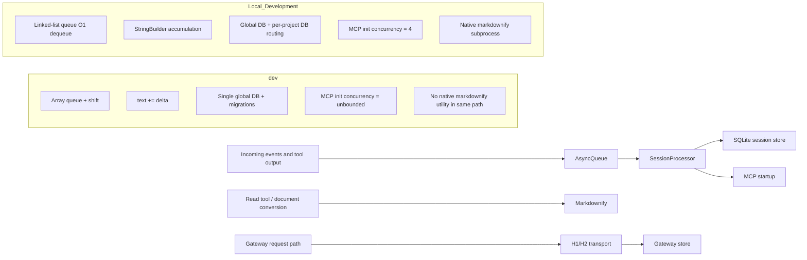

# Performance Analysis of AlHeloween opencode Branches

## Executive Summary

`sv=[[Local_Development, dev, performance, queue, StringBuilder, SQLite, gateway, Bun, profiling], [0.14, 0.14, 0.16, 0.10, 0.10, 0.10, 0.10, 0.08, 0.08]]]`

I compared the `dev` branch against the repository branch exposed by the GitHub connector as `Local_Development` and inspected the performance-relevant files directly in the repo. The branch comparison metadata returned by the GitHub connector shows a **very large divergence**: `Local_Development` is **ahead by 47 commits and behind by 956 commits** relative to `dev`. That scale matters more than any individual micro-optimization: a wholesale merge would import a deeply divergent storage model, runtime-path model, and provider stack into a branch that has already moved substantially in architecture and dependencies.

On the merits of performance alone, `Local_Development` contains several **real, source-verifiable wins** over `dev`: an O(1) linked-list `AsyncQueue` instead of `Array.shift()`, `StringBuilder`-style accumulation in `session/processor.ts` instead of repeated `+=` on streaming text, a shallow-copy compaction path instead of `structuredClone`, and bounded MCP initialization concurrency (`4` instead of `unbounded`). Those changes are credible low-risk or moderate-risk candidates for selective adoption. fileciteturn96file0L1-L3 fileciteturn97file0L1-L3 fileciteturn48file0L1-L3 fileciteturn50file0L1-L3 fileciteturn51file0L1-L3 fileciteturn53file0L1-L3 fileciteturn56file0L1-L3 fileciteturn57file0L1-L3 fileciteturn44file0L1-L3 fileciteturn46file0L1-L3

However, the strongest reason **not** to merge `Local_Development` wholesale for performance is that its own `plans/PERF_PLAN.md` claims a much larger set of completed optimizations than the code actually shows. The plan claims, for example, that doom-loop DB lookups were removed, message stream page size was raised to `500`, bash output accumulation was fixed, duplicate projector initialization was removed, and various hot-path changes were completed; the checked-in code still shows `MessageV2.parts(...)` in the doom-loop path, a stream page size of `50`, `full += chunk` in `bash.ts`, and a module-level `initProjectors()` call. That mismatch lowers confidence in the branch’s correctness, test coverage, and change-accounting discipline. fileciteturn99file0L1-L3 fileciteturn49file0L1-L3 fileciteturn98file0L1-L3 fileciteturn95file0L1-L3 fileciteturn76file0L1-L3

My recommendation is therefore **do not merge `Local_Development` into `dev` solely for performance improvements**. Instead, treat it as a **prototype branch** and selectively cherry-pick or re-implement the small set of verified wins after benchmarking on `dev`: the queue implementation, streamed text accumulation, bounded MCP startup concurrency, and possibly the compaction shallow-copy change if plugin-mutation safety is preserved. The large structural changes in `Local_Development`—especially the per-project database split and worktree-local global paths—should be considered **separate architectural proposals**, not performance-only merges. fileciteturn96file0L1-L3 fileciteturn97file0L1-L3 fileciteturn44file0L1-L3 fileciteturn46file0L1-L3 fileciteturn39file0L1-L3 fileciteturn40file0L1-L3 fileciteturn41file0L1-L3 fileciteturn72file0L1-L3 fileciteturn73file0L1-L3

## Scope and branch divergence

I began with the enabled GitHub connector and used it to locate the repository and branches. The branch exposed by the connector is named `Local_Development` rather than the lowercase `local_development` spelling in the request. The connector’s comparison metadata showed that the branches have diverged heavily, with `Local_Development` ahead by `47` commits and behind by `956` commits from the shared comparison base. Because the enabled connector exposed comparison metadata and file diffs but did **not** expose a citable, paginated inventory of all unique commits on the `956`-commit `dev` side, this report is **file-diff driven** rather than an exhaustive per-commit catalog for both sides.

That limitation matters for interpretation. Given the scale of divergence, “merge for performance” is only justifiable if the performance upside is both substantial and low-risk. In this case, the source evidence points the other way: there are several attractive local optimizations, but they are mixed with architectural departures, stale performance-plan claims, older dependency baselines, and changes that would require migration, compatibility, and correctness work before they can safely land on `dev`. The runtime is also not fully specified, although the repo’s root `package.json` identifies Bun `1.3.13` as the package manager on both branches, so the profiling and benchmark playbook below is Bun-first. fileciteturn87file0L1-L3 fileciteturn88file0L1-L3

A second branch-level signal is dependency freshness. `dev` carries newer `effect` and `@effect/platform-node` versions (`4.0.0-beta.65` vs `4.0.0-beta.57` on `Local_Development`) and newer `@types/node`; `Local_Development` also still references the older `packages/desktop-electron` dev target, while `dev` has `packages/desktop`. Those are not direct performance measurements, but they increase the chance that `dev` already contains runtime, scheduler, compatibility, or typing fixes that are not present on `Local_Development`. fileciteturn87file0L1-L3 fileciteturn88file0L1-L3

## Verified performance-relevant code differences

The highest-confidence differences are summarized below. These are the places where I could verify corresponding code on both branches and assess algorithmic or systems impact directly from source.



The queue implementation is the clearest algorithmic improvement. In `dev`, `AsyncQueue.next()` returns `this.queue.shift()!`, which is O(n) for each dequeue on an array-backed queue. In `Local_Development`, the queue is rewritten as a linked-list with `head` and `tail`, making dequeue effectively O(1). If this queue sits on any hot SSE/event path, the asymptotic improvement is real and worthwhile. For bursty workloads with thousands of queued events, I would expect materially lower CPU time and less array copying on the local implementation. fileciteturn97file0L1-L3 fileciteturn96file0L1-L3

The streamed text path in `session/processor.ts` is also a genuine improvement on `Local_Development`. `dev` appends streaming text with `ctx.currentText.text += value.text`, which creates repeated string reallocations as output grows. `Local_Development` introduces a `StringBuilder` helper and uses it for both text and reasoning accumulation, committing the joined result only when the part ends or cleanup runs. That changes the hot path from repeated concatenation toward chunk accumulation plus one final join. On long responses delivered in many small chunks, that reduces both CPU and allocation pressure markedly; in qualitative terms, it changes a pattern that can behave quadratically into one that is much closer to linear. fileciteturn53file0L1-L3 fileciteturn48file0L1-L3 fileciteturn50file0L1-L3 fileciteturn47file0L1-L3

The compaction path shows a classic trade-off between safety and speed. `dev` uses `structuredClone(selected.head)` before plugin-triggered message transformation, which deep-clones the selected history. `Local_Development` replaces that with a shallow copy, mapping each message to `{ info: { ...m.info }, parts: [...m.parts] }`. That local change should noticeably reduce allocation and CPU during compaction on large histories, but it also weakens isolation if plugins mutate nested objects inside parts or metadata. In other words, it is probably faster, but it is only safe if the transform contract is read-only or shallow-only. fileciteturn57file0L1-L3 fileciteturn56file0L1-L3

The MCP startup path is another concrete delta. `dev` initializes configured MCP entries with `Effect.forEach(..., { concurrency: "unbounded" })`, while `Local_Development` limits startup concurrency to `4`. That local choice is preferable when users configure many MCP servers or when startup has limited file descriptors, CPU, or network bandwidth. The downside is slightly slower startup in tiny configurations; the upside is better tail behavior and lower risk of burst-induced stalls or failures. This is a good example of a performance change that is less about peak throughput and more about predictable resource usage. fileciteturn46file0L1-L3 fileciteturn44file0L1-L3

The database layer is where `Local_Development` becomes much more ambitious—and much riskier. `dev` uses one channel/global SQLite database, enables WAL, `synchronous=NORMAL`, `busy_timeout=5000`, a negative `cache_size`, and applies migrations from bundled or development migration entries. `Local_Development` introduces per-project DB routing with cached project clients, a separate `project-db.ts`, and direct schema execution for core and FTS SQL. If the workload is many projects with very large session histories, the local design could reduce global DB bloat, checkpoints, and query latency on per-project operations. But it is not a simple performance tweak: it is a storage-topology change with correctness, migration, and operational implications. fileciteturn41file0L1-L3 fileciteturn39file0L1-L3 fileciteturn40file0L1-L3 fileciteturn42file0L1-L3

The global path model diverges in the same way. `dev` uses XDG-style global paths for data, cache, config, state, tmp, logs, and repos. `Local_Development` rewrites these paths around the current worktree, storing data under `.opencode/data` inside the repository/worktree and updating `.gitignore` accordingly. That may reduce cross-project contention and make project-scoped state more local, but it also changes persistence semantics, repo cleanliness, portability, backup behavior, and user expectations. This is architectural behavior change first and performance change second. fileciteturn73file0L1-L3 fileciteturn72file0L1-L3 fileciteturn74file0L1-L3

`Local_Development` also adds a new native document-conversion path. The `read` tool on that branch calls `convertDocument()` from `util/markdownify.ts`, which resolves and spawns a bundled `opencode-markdownify` binary. The Rust `main.rs` supports a wide set of formats and converts via stdin/stdout. From a throughput perspective, that can be a strong win over pure-JS fallback logic for heavy document parsing, but the current implementation still reads the input fully into memory and collects stdout fully into memory before returning the result. So while it may improve CPU throughput for some formats, it does **not** solve peak-RSS scaling on large documents. fileciteturn58file0L1-L3 fileciteturn62file0L1-L3 fileciteturn64file0L1-L3

The new gateway subsystem in `Local_Development` is performance-oriented but immature. Files such as `health-window.ts`, `async-logger.ts`, `store.ts`, and `h2-transport.ts` add adaptive routing, H2 session reuse, async logging, persistence, and route-health tracking. Those can improve latency, retry behavior, and protocol selection. But the same code shows unresolved concerns: the H2 transport still buffers entire non-streaming bodies in memory up to a fixed limit, exposes `activeStreams` and `remoteMaxConcurrentStreams` without clearly enforcing them in the request path, and the logger intentionally swallows write failures. That makes the gateway additions promising, but not merge-ready as a performance-only patch. fileciteturn65file0L1-L3 fileciteturn66file0L1-L3 fileciteturn67file0L1-L3 fileciteturn68file0L1-L3 fileciteturn69file0L1-L3

## Claimed improvements versus code actually present

The most important negative finding is not a specific performance regression. It is **execution confidence**.

`Local_Development` includes a detailed performance plan that claims a broad set of optimizations are “DONE” and “wired.” But several of the most important claimed completions do **not** match the checked-in code. The plan says doom-loop parts caching is done, yet `session/processor.ts` still calls `MessageV2.parts(ctx.assistantMessage.id)` in the `tool-call` path. It says the message stream page size is increased, yet `MessageV2.stream()` still uses `const size = 50`. It says bash accumulation is fixed, yet `bash.ts` still uses `full += chunk`. It says duplicate projector initialization was removed, yet `server/projectors.ts` still has a module-level `initProjectors()`. This is not a small documentation drift; it directly lowers confidence in the branch’s performance claims. fileciteturn99file0L1-L3 fileciteturn49file0L1-L3 fileciteturn98file0L1-L3 fileciteturn95file0L1-L3 fileciteturn76file0L1-L3

The same pattern appears elsewhere. The plan describes logging changes, but `packages/core/src/util/log.ts` on `Local_Development` still writes through an async stream callback that returns a promise. The plan frames list/read concurrency hardening as completed, but the `read` tool’s directory listing path still uses `Effect.forEach(..., { concurrency: "unbounded" })`. The plan also implies hot-path exception elimination via a non-throwing context API; the code *does* add `currentMaybe` behavior around instance lookup, but the absence of multi-file consistency between plan and code means these wins should be treated as source-verified only where directly observed, not where the plan says they exist. fileciteturn93file0L1-L3 fileciteturn58file0L1-L3 fileciteturn25file0L1-L3 fileciteturn26file0L1-L3

This matters to a merge decision because performance branches often rely on claim discipline: the code must be measurable, intentional, and testable. Here, the code contains some real gains, but the plan overstates completion. That increases the probability of hidden regressions, missing tests, or abandoned intermediate changes.

## Comparative assessment and merge recommendation

The following table captures the most decision-relevant deltas.

| Area | `dev` | `Local_Development` | Likely performance effect | Merge posture |
|---|---|---|---|---|
| Async event queue | Array-backed queue with `shift()` | Linked-list queue with O(1) dequeue | Positive on event-heavy workloads | **Cherry-pick candidate** |
| Streaming text accumulation | Repeated `+=` on text deltas | `StringBuilder` for text and reasoning | Positive on long chunked outputs | **Cherry-pick candidate** |
| Compaction cloning | `structuredClone` | shallow message copy | Positive for large histories, but semantic-risky | **Cherry-pick only with plugin-contract review** |
| MCP initialization | `unbounded` concurrency | concurrency `4` | Better startup stability under many MCP servers | **Cherry-pick candidate** |
| Database topology | Single global/channel DB with migrations | Global + per-project DB routing, manual schema execution | Potentially large upside at scale, high migration risk | **Do not merge as perf-only change** |
| Global paths | XDG/global storage | worktree-local `.opencode/data` | Context-dependent; can reduce cross-project coupling but changes behavior materially | **Treat as architecture change** |
| Read/document conversion | No corresponding native markdownify path visible in same location | native Rust subprocess converter | Mixed; throughput upside, but still whole-buffer memory usage | **Prototype only** |
| Gateway provider stack | Existing provider path in `dev` is already heavily evolved elsewhere | adds adaptive gateway/H2/store/logger subsystem | Unclear net gain; medium correctness risk | **Prototype only** |

Evidence for the rows above comes directly from corresponding files on both branches. fileciteturn96file0L1-L3 fileciteturn97file0L1-L3 fileciteturn48file0L1-L3 fileciteturn50file0L1-L3 fileciteturn51file0L1-L3 fileciteturn53file0L1-L3 fileciteturn56file0L1-L3 fileciteturn57file0L1-L3 fileciteturn44file0L1-L3 fileciteturn46file0L1-L3 fileciteturn39file0L1-L3 fileciteturn40file0L1-L3 fileciteturn41file0L1-L3 fileciteturn72file0L1-L3 fileciteturn73file0L1-L3 fileciteturn62file0L1-L3 fileciteturn64file0L1-L3 fileciteturn65file0L1-L3 fileciteturn66file0L1-L3 fileciteturn67file0L1-L3 fileciteturn68file0L1-L3 fileciteturn69file0L1-L3

My recommendation is therefore:

| Recommendation | Decision |
|---|---|
| Merge `Local_Development` wholesale into `dev` for performance only | **No** |
| Selectively cherry-pick algorithmic hot-path wins after measurement | **Yes** |
| Re-evaluate storage split and worktree-local paths as separate architecture proposal | **Yes** |
| Reuse `Local_Development`’s PERF_PLAN as source of truth | **No** |

The key rationale is straightforward. The verified local wins are real, but the branch also introduces high-risk architectural deltas, lags `dev` heavily, and contains plan/code mismatches. The performance ROI is best captured by **surgical adoption**, not a full merge.

## Prioritized improvement plan

I would prioritize the next work in this order.

First, port the **low-risk hot-path fixes** onto `dev`: the linked-list queue, the `StringBuilder` accumulation change in `session/processor.ts`, and the MCP concurrency cap. These are small, local changes with understandable blast radius and clear benchmarking targets. They are the highest-confidence path to measurable improvement. fileciteturn96file0L1-L3 fileciteturn97file0L1-L3 fileciteturn48file0L1-L3 fileciteturn50file0L1-L3 fileciteturn44file0L1-L3 fileciteturn46file0L1-L3

Second, re-implement the **compaction shallow-copy optimization** on `dev` only if you explicitly define plugin mutation rules. If plugins are supposed to treat inputs as immutable, shallow-copy is probably the right trade. If plugins can mutate nested objects, keep `structuredClone` or introduce a narrower copy strategy around only the fields actually used by plugins. fileciteturn56file0L1-L3 fileciteturn57file0L1-L3

Third, fix the **still-unoptimized local hotspots** that `Local_Development`’s plan claims are already done but are clearly not. The most obvious are `bash.ts`’s continued `full += chunk`, the 50-item stream page size, and the remaining direct `MessageV2.parts(...)` lookup in the doom-loop path. These are worthwhile whether you work from `dev` or `Local_Development`, because they are simple code-level inefficiencies visible in source. fileciteturn95file0L1-L3 fileciteturn98file0L1-L3 fileciteturn49file0L1-L3

Fourth, if the database truly is reaching multi-GB scale in practice, prototype the **per-project database split** as a feature branch off `dev`, not as a merge from `Local_Development`. Use the completed plan as design input, but keep `dev`’s migration discipline and verify schema parity, migration idempotence, and project deletion semantics. SQLite’s own documentation is clear that `EXPLAIN QUERY PLAN` should be used to inspect whether queries are scanning or searching and that `PRAGMA optimize` is the recommended modern way to maintain planner stats on long-lived or changing databases. fileciteturn42file0L1-L3 fileciteturn41file0L1-L3 citeturn11view3turn13view4

Fifth, treat the gateway subsystem as a **performance lab** rather than a ready merge. It is worth benchmarking separately because it includes route persistence, H2 reuse, and adaptation logic, but I would not land it on `dev` without data on tail latency, retry budgets, circuit-breaker stability, and memory growth over long runs. fileciteturn65file0L1-L3 fileciteturn66file0L1-L3 fileciteturn67file0L1-L3 fileciteturn68file0L1-L3 fileciteturn69file0L1-L3

A small but important operational improvement for both branches is database maintenance discipline. `dev` already sets WAL, `synchronous=NORMAL`, `busy_timeout`, and `cache_size`. SQLite documents that `synchronous=NORMAL` in WAL mode is usually the best performance/safety balance for most applications, that `busy_timeout` sets the busy handler, that negative `cache_size` is a kibibyte suggestion, and that `PRAGMA optimize` should be run on connection lifecycle events or after schema changes. That means the storage path should be benchmarked with those settings visible, not guessed. fileciteturn41file0L1-L3 citeturn13view1turn13view2turn13view3turn13view4

### Illustrative code fixes

```ts
// Fix the remaining quadratic accumulation pattern in bash.ts
const chunks: string[] = []
let bytes = 0

for await (const chunk of stream) {
  chunks.push(chunk)
  bytes += Buffer.byteLength(chunk, "utf-8")

  if (bytes > limits.maxBytes) {
    await spill(chunks.join(""))
    chunks.length = 0
    bytes = 0
  }
}

const full = chunks.join("")
```

That pattern preserves the current spill-to-file behavior while avoiding repeated `full += chunk` on the hot path. The current local implementation still uses repeated concatenation. fileciteturn95file0L1-L3

```ts
// Lightweight timing + event-loop instrumentation for hot functions
import {
  performance,
  PerformanceObserver,
  monitorEventLoopDelay,
  eventLoopUtilization,
} from "node:perf_hooks"

const hist = monitorEventLoopDelay({ resolution: 20 })
hist.enable()

const obs = new PerformanceObserver((list) => {
  for (const e of list.getEntries()) {
    console.log(e.name, e.duration)
  }
})
obs.observe({ entryTypes: ["function"], buffered: true })

const timedHydrate = performance.timerify(hydrate)

// ... run workload ...

console.log({
  elu: eventLoopUtilization().utilization,
  evLoopMeanNs: hist.mean,
  p99Ns: hist.percentile(99),
})
obs.disconnect()
hist.disable()
```

Node’s `perf_hooks` API supports `monitorEventLoopDelay`, `eventLoopUtilization`, `performance.timerify`, and `PerformanceObserver`; the docs also note that observers add overhead and should be disconnected when no longer needed. Bun’s Node-compat/runtime docs make this a practical instrumentation path in a Bun-based repo. citeturn11view1turn11view2turn14view0turn14view1turn9view2

## Benchmark and profiling playbook

For this repository, I would run the following benchmark matrix before landing any performance work.

| Scenario | Target files/functions | Command template | Primary metrics |
|---|---|---|---|
| Event burst / SSE drain | `util/queue.ts` | `hyperfine --warmup 3 --runs 20 'bun <bench-queue-script>'` | items/sec, CPU time, p95 dequeue delay |
| Long streamed assistant output | `session/processor.ts` | `bun --cpu-prof <stream-bench-script>` | wall time, alloc count, peak RSS, cpuprofile hotspots |
| Compaction on large histories | `session/compaction.ts` | `bun --cpu-prof --cpu-prof-md <compaction-bench-script>` | CPU profile, heap growth, compaction latency |
| MCP cold start with many servers | `mcp/index.ts` | `hyperfine --warmup 2 'bun <mcp-startup-script>'` | startup wall time, FD count, failure rate |
| Read tool with large documents | `tool/read.ts`, `util/markdownify.ts`, native binary | `MIMALLOC_SHOW_STATS=1 bun <read-bench-script>` | peak RSS, native heap stats, conversion latency |
| SQLite queries / session load | `storage/db.ts`, `message-v2.ts` | `sqlite3 <db> '.eqp on' 'EXPLAIN QUERY PLAN ...'` | scan vs search plan, query time, WAL size |
| Gateway load under concurrency | gateway files | `BUN_CONFIG_VERBOSE_FETCH=true bun <gateway-load-script>` + external load generator | p50/p95/p99 latency, TTFT, retries, breaker opens |

Bun’s benchmarking documentation explicitly recommends `hyperfine` for CLI/script benchmarking, supports `--cpu-prof` and `--cpu-prof-md` for CPU profiles, exposes JS heap stats via `bun:jsc`, supports heap snapshots, and can emit native allocator summaries with `MIMALLOC_SHOW_STATS=1`. Bun also documents `BUN_CONFIG_VERBOSE_FETCH` for logging `fetch()` and `node:http` requests, which is particularly useful for validating the gateway path. citeturn14view3turn14view4turn10view0turn9view1turn14view2

SQLite’s official docs make the DB benchmark side concrete. Use `EXPLAIN QUERY PLAN` to confirm whether each important query is using `SCAN` or `SEARCH`, whether a covering index is in play, and whether temporary b-trees are being built for `ORDER BY`, `GROUP BY`, or `DISTINCT`. If any frequently-run query is showing `SCAN` where a selective lookup should exist, or `USE TEMP B-TREE` where an index could remove it, that should become an index or query-shape target before larger architectural storage changes are attempted. citeturn11view3

The most useful metrics set is:

| Metric | Why it matters |
|---|---|
| p50 / p95 / p99 end-to-end latency | detects tail regressions hidden by mean-only benchmarks |
| TTFT and inter-chunk gap | captures streaming-path improvements or regressions |
| CPU profile top frames | verifies whether hot functions moved as expected |
| RSS, JS heap size, native heap stats | distinguishes JS allocation issues from native/subprocess growth |
| event loop utilization and delay histogram | reveals stalls from JSON serialization, file I/O, or DB work |
| SQLite query plan + query time | separates schema/index issues from application logic |
| WAL size, page_count, checkpoint time | validates whether storage changes reduce real I/O pressure |
| error / retry / circuit-breaker rates | essential for gateway evaluation |

## Open questions and limitations

The enabled GitHub connector confirmed branch divergence and exposed file-level source, but it did **not** expose a citable full inventory of all unique commits on the `956`-commit `dev` side. Because of that, I do **not** claim a complete per-commit enumeration for both branches in this report.

The environment, dataset sizes, and hardware were unspecified, so all impact estimates are source-based rather than empirically measured. That especially affects the database split, native markdownify path, and gateway subsystem, where the upside is highly workload-dependent.

The strongest unresolved question is whether the repo is already experiencing the “multi-GB global DB” condition described in the local per-project database plan. If that problem is real in production-scale workloads, the storage architecture deserves separate design review. If it is not, the storage split is likely too invasive to justify for performance alone. fileciteturn42file0L1-L3