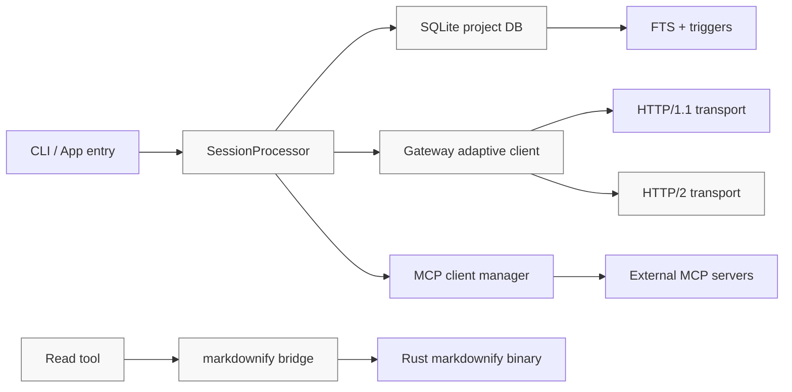

# Performance and Risk Analysis of Local_Development in AlHeloween opencode

`sv=[["opencode","Local_Development","performance","SQLite","Bun","gateway","MCP","compaction","profiling"], "[0.18,0.15,0.14,0.12,0.11,0.11,0.07,0.06,0.06]"]`

## Executive summary

This review found that the `Local_Development` work has **already landed several meaningful performance improvements** relative to `dev`: the async queue no longer relies on `Array.prototype.shift()`, `SessionProcessor` now uses `StringBuilder` objects instead of repeated string concatenation and replaces repeated DB-backed doom-loop checks with a small in-memory ring of recent tool calls, `MCP` initialization and teardown are capped at concurrency `4` instead of `unbounded`, and message streaming paginates at `500` items instead of `50`. Those are all real wins and they directly reduce avoidable CPU and coordination overhead in core execution paths. fileciteturn27file0L1-L3 fileciteturn28file0L1-L3 fileciteturn29file0L1-L3 fileciteturn30file0L1-L3 fileciteturn31file0L1-L3 fileciteturn32file0L1-L3 fileciteturn34file0L1-L3 fileciteturn38file0L1-L3 fileciteturn39file0L1-L3 fileciteturn66file0L1-L3

The most important remaining problems are not “micro-optimizations”; they are **correctness-affecting performance controls**. The highest-priority issues I verified in source are: a broken gateway health window implementation with an off-by-one circular-buffer read and an error-decay path that effectively rehydrates the old counts, an FTS search path that performs an extra SQL query per result row, a route store whose stale-entry eviction never actually evicts route records, an HTTP/2 transport that records remote stream limits but does not enforce them and does not respect downstream backpressure in streaming writes, a permission boundary check that uses lexical paths rather than resolved real paths, and a compaction path that still deep-clones the selected message head via `structuredClone`. Those six items are the fastest route to better latency, lower memory pressure, and lower operational risk. fileciteturn59file0L1-L3 fileciteturn67file0L1-L3 fileciteturn68file0L1-L3 fileciteturn57file0L1-L3 fileciteturn58file0L1-L3 fileciteturn55file0L1-L3 fileciteturn56file0L1-L3 fileciteturn63file0L1-L3 fileciteturn36file0L1-L3

One important limitation: I did **not** execute the branch in a live checkout during this review. Accordingly, the “runtime profiling results” below are **source-grounded hotspot findings and a concrete measurement plan**, not empirical benchmark numbers from a local run.

## Scope and repository layout

Within the reviewed branch, the performance-critical runtime is concentrated in `packages/opencode/src`, while shared path/global-state logic sits in `packages/core/src`, the document-conversion sidecar lives in `packages/native/markdownify`, build packaging is handled in `packages/opencode/script`, and branch-specific design and performance notes are kept under `plans/`. This is a monorepo-style layout with the main execution engine, platform/shared code, native helper, and build tooling clearly separated. fileciteturn44file0L1-L3 fileciteturn49file0L1-L3 fileciteturn69file0L1-L3 fileciteturn71file0L1-L3

The branch also changes core runtime placement semantics. In `Local_Development`, `Global.Path.data`, `cache`, `state`, and `log` are re-rooted under `{worktree}/.opencode/data`, while `config` is tied to the executable directory; in `dev`, those paths came from XDG directories under the user profile. That is a major architecture change because it alters cache placement, DB placement, log placement, and deployment assumptions across local runs, tests, worktrees, and packaging. fileciteturn44file0L1-L3 fileciteturn45file0L1-L3



The architecture above also makes the main performance surfaces obvious: session/event handling, SQLite writes and FTS search, gateway routing/protocol adaptation, MCP fan-out, and document conversion.

## Static analysis and code quality findings

The branch contains several verified improvements compared with `dev`. The strongest ones are summarized here.

| Area | What changed in `Local_Development` | Why it matters |
|---|---|---|
| Async queue | `AsyncQueue` now uses linked-list nodes for values and resolvers; `dev` used `queue.shift()` and `resolvers.shift()`. fileciteturn27file0L1-L3 fileciteturn28file0L1-L3 | Removes repeated front-of-array shifts in a queue-like primitive. That is a clean structural improvement for hot async producer/consumer paths. |
| Session text/reasoning accumulation | `SessionProcessor` now uses `StringBuilder` for text and reasoning accumulation; `dev` appended directly to strings. fileciteturn29file0L1-L3 fileciteturn31file0L1-L3 fileciteturn34file0L1-L3 | Reduces repeated string-copy churn during long streamed outputs and reasoning traces. |
| Doom-loop detection | `Local_Development` tracks only recent tool calls in memory and compares against those; `dev` sliced message parts and compared serialized inputs from the persisted assistant message. fileciteturn30file0L1-L3 fileciteturn32file0L1-L3 | Avoids repeated message-part scans and JSON-stringification-like comparison work on each tool event. |
| MCP concurrency | Branch initialization, teardown, tool enumeration, and connected-client collection use concurrency `4`; `dev` used `unbounded`. fileciteturn38file0L1-L3 fileciteturn39file0L1-L3 | This should materially reduce connection storms, FD pressure, and tail-latency blowups during MCP startup/shutdown. |
| Message stream pagination | `stream()` now pages `500` messages instead of `50`. fileciteturn66file0L1-L3 | Fewer DB round-trips and iterator boundary crossings on long histories. |
| Bash output truncation | The bash tool now spills oversized output to a file instead of continually rebuilding one large string in memory. fileciteturn65file0L1-L3 | Much better behavior for large terminal outputs. |

The more important story is the set of **remaining verified defects and smells**.

| Severity | Finding | Why it matters | Evidence |
|---|---|---|---|
| Critical | `health-window.ts` circular buffers read from `(head - count + 1 + i)` rather than `(head - count + i)`, which is an off-by-one read. The same file’s error-decay branch computes decayed counts and then spreads `window.errorCounts` back on top, effectively undoing decay. | Route adaptation, median delay logic, and health modeling can become misleading or sticky, which undermines gateway policy tuning and failover decisions. | fileciteturn59file0L1-L3 |
| High | `message-v2.ts::search()` runs an FTS query and then performs another `COUNT(*)` query per returned row to compute `messageIndex`. | Classic N+1 query pattern; latency will scale poorly with result count, and the DB becomes the bottleneck for search-heavy flows. | fileciteturn67file0L1-L3 fileciteturn68file0L1-L3 |
| High | `store.ts` defines `MAX_ROUTES`, but `evictStaleEntries()` does not evict from `state.data.routes`; it only clears health windows, access timestamps, circuit breakers, and retry budgets. | Persisted route metadata can grow without the intended cap, increasing memory, JSON persistence cost, and cold-start load time. | fileciteturn57file0L1-L3 fileciteturn58file0L1-L3 |
| High | `h2-transport.ts` records `remoteMaxConcurrentStreams` and defines `activeStreams`, but the request paths do not increment/decrement or use `activeStreams`. `requestStream()` writes to a `TransformStream` without pausing the source or honoring write backpressure. | The client records HTTP/2 server limits but does not meaningfully enforce them at this layer; under slow consumers, buffering can drift upward and stream fairness can degrade. Node’s HTTP/2 API exposes remote settings and stream/session state specifically for this kind of control. | fileciteturn55file0L1-L3 fileciteturn56file0L1-L3 citeturn20view0turn20view1turn20view2 |
| High | `external-directory.ts` checks `Instance.containsPath(full, ins)` on the lexical path, not a resolved real path. | Symlink/junction traversal can bypass the intended boundary check or produce unexpected permission scopes. | fileciteturn63file0L1-L3 |
| Medium | `session/compaction.ts` still executes `const msgs = structuredClone(selected.head)` before transform and model conversion. | This retains a large, avoidable deep-copy cost on long sessions. The branch’s own planning docs aim to remove this, but the code still does the clone. | fileciteturn36file0L1-L3 fileciteturn37file0L1-L3 fileciteturn71file0L1-L3 |
| Medium | `server/projectors.ts` calls `initProjectors()` at module import time. | Import-side initialization is a code smell that can duplicate projector registration in tests, reload loops, or multiple entry paths. | fileciteturn64file0L1-L3 |
| Medium | `read.ts` lists directory entries with `unbounded` concurrency for per-entry metadata resolution and reads whole image/document payloads into memory; `markdownify.ts` and the Rust binary also fully buffer document bytes and outputs. | Large directories and large documents can create avoidable memory and FD pressure. | fileciteturn46file0L1-L3 fileciteturn47file0L1-L3 fileciteturn48file0L1-L3 fileciteturn50file0L1-L3 |

From a security perspective, the strongest verified concerns are the lexical-path permission check in `external-directory.ts`, the fact that document conversion and archive extraction materialize content eagerly in-process or in temp space, and the gateway’s ability to log request bodies when debug/body logging is enabled. The auth headers are redacted by name, but payload bodies can still contain prompts, tool inputs, or user content; the shipped config comments explicitly expose body logging controls, so this should remain disabled by default in production and test harnesses unless there is a compelling incident-response need. fileciteturn63file0L1-L3 fileciteturn48file0L1-L3 fileciteturn50file0L1-L3 fileciteturn51file0L1-L3 fileciteturn52file0L1-L3 fileciteturn73file0L1-L3

## Runtime profiling plan and source-based hotspot results

Because I did not execute the branch, the table below is a **measurement plan plus source-based hotspot expectations**. The tooling choices are grounded in Bun’s official benchmarking and profiling guidance, Node’s `perf_hooks` APIs, and SQLite’s own recommended inspection methods. Bun recommends `hyperfine` for CLI/script timing, `--cpu-prof` / `--cpu-prof-md` for CPU profiles, `--heap-prof` / `--heap-prof-md` for heap snapshots, `heapStats()` / `generateHeapSnapshot()` for JS heap work, and `MIMALLOC_SHOW_STATS=1` for native-heap summaries. Node exposes `eventLoopUtilization()` and `monitorEventLoopDelay()`, and SQLite recommends `EXPLAIN QUERY PLAN` / `.eqp on` to verify index use and warns that temp B-trees and full scans are the signals to watch. citeturn16view0turn16view1turn12view0turn17view0turn18view0turn18view1turn18view2turn18view3

| Workload | Suggested command / tool | What to measure | Source-based expected hotspot |
|---|---|---|---|
| Session streaming | `bun --cpu-prof --cpu-prof-md ./bench/session-stream.ts` plus `perf_hooks.monitorEventLoopDelay()` | CPU, event-loop stalls, DB write rate | `SessionProcessor` event handling, `session.updatePartDelta`, reasoning/text finalize, and cleanup fan-out. fileciteturn29file0L1-L3 fileciteturn30file0L1-L3 fileciteturn31file0L1-L3 citeturn12view0turn16view0 |
| Search on large history | SQLite `.eqp on` / `EXPLAIN QUERY PLAN`, plus `hyperfine` around a bench wrapper | Query count, p50/p95 latency, temp B-trees, scan vs search | FTS query itself is likely fine; the row-by-row `COUNT(*)` index lookup is the avoidable latency multiplier. fileciteturn67file0L1-L3 fileciteturn68file0L1-L3 citeturn17view0 |
| Gateway streaming | `BUN_CONFIG_VERBOSE_FETCH=true bun --cpu-prof-md ./bench/gateway-stream.ts` | TTFT, chunk gap, queueing, memory under slow readers | `adaptive-client` coalescing stream, `requestStream()` backpressure gap, logger I/O, route policy bookkeeping. fileciteturn51file0L1-L3 fileciteturn52file0L1-L3 fileciteturn53file0L1-L3 fileciteturn55file0L1-L3 fileciteturn56file0L1-L3 citeturn14view1turn20view0turn20view1turn20view2 |
| MCP startup at scale | Bench harness with 10–25 mock MCP servers and Bun CPU/heap profiles | Setup latency, peak FDs, teardown time | The branch’s concurrency cap should already help, but bulk client connect/close and server enumeration remain startup-sensitive. fileciteturn38file0L1-L3 |
| Compaction on long sessions | `bun --heap-prof --heap-prof-md ./bench/compaction.ts` | Peak JS heap, native heap, total compaction wall time | `structuredClone(selected.head)` is the clearest avoidable memory spike. fileciteturn36file0L1-L3 citeturn16view0turn16view1 |
| Document conversion | `MIMALLOC_SHOW_STATS=1 bun ./bench/read-doc.ts` with large PDF/7z fixtures | RSS, native heap, conversion time, temp-space use | Full-byte buffering in JS and Rust, plus recursive extraction/processing for 7z. fileciteturn47file0L1-L3 fileciteturn48file0L1-L3 fileciteturn50file0L1-L3 citeturn16view0turn16view1 |

The strongest source-based CPU hotspots are `SessionProcessor`, the gateway client/transport path, and search post-processing. The strongest memory hotspots are compaction deep-cloning, large-file/document reads, HTTP/2 full-body buffering in non-stream requests, and the route store’s failure to evict route records. The strongest I/O hotspots are SQLite write amplification through `part` + FTS triggers, periodic/persistent gateway log flushes, and packaging/build steps that bundle the web UI and multi-target binaries. fileciteturn29file0L1-L3 fileciteturn31file0L1-L3 fileciteturn40file0L1-L3 fileciteturn47file0L1-L3 fileciteturn48file0L1-L3 fileciteturn53file0L1-L3 fileciteturn57file0L1-L3 fileciteturn60file0L1-L3 fileciteturn69file0L1-L3

Concurrency and contention risks are also clear from source. SQLite in this branch uses WAL, `busy_timeout = 5000`, `synchronous = NORMAL`, and a large cache suggestion; that is a sensible throughput-oriented baseline, but SQLite still remains fundamentally constrained by single-writer behavior, and `busy_timeout` only changes how long callers wait. SQLite’s own docs recommend `PRAGMA optimize` for short-lived and long-lived connections, especially after schema/index changes, but I did not find that pragma in the reviewed DB initialization path. fileciteturn40file0L1-L3 fileciteturn41file0L1-L3 citeturn18view0turn18view1turn18view2turn18view3

## Dependencies, build, configuration, and deployment review

The build pipeline is ambitious and comparatively heavy. `packages/opencode/script/build.ts` builds an embedded web UI bundle, explicitly installs platform-wide variants of `@opentui/core` and `@parcel/watcher`, and iterates through a wide matrix of Linux, macOS, and Windows targets, compiling one binary per target. At the same time, the native Rust document-conversion helper is already built with `opt-level = "s"`, LTO, and `strip = true`, which is a positive sign: the branch is already applying reasonable release-size optimizations to the native helper. fileciteturn69file0L1-L3 fileciteturn49file0L1-L3

The main build-system weakness I verified is **reproducibility**, not compiler speed. `packages/script/src/index.ts` computes release versions by fetching the latest published package metadata from the npm registry for non-preview releases. That introduces a network dependency and time-varying external state into version calculation, which is undesirable in CI and makes rebuilds harder to reproduce exactly. This should be replaced with an explicit release version input in CI or a checked-in release manifest. fileciteturn70file0L1-L3

Turborepo’s docs emphasize that tasks run in parallel by default, that outputs must be declared for proper cache restoration, and that remote/shared caching can dramatically reduce repeated work—particularly across worktrees. That matters here because the branch is explicitly worktree-oriented, and the packaging path is expensive enough that remote cache and more fine-grained task decomposition should pay back quickly. The likely highest-value split is: web-UI embed generation, native helper build, cross-target packaging, and smoke tests as separate tasks with explicit outputs and CI-cache boundaries. fileciteturn69file0L1-L3 citeturn21view0turn22view0

On configuration and deployment, the branch is in a transitional state. Source code in `Local_Development` moves runtime data under the worktree and keeps config adjacent to the executable, while the checked-in gateway config comments still reference legacy auth placement under `~/.local/share/opencode/auth.json`, and the branch’s own redesign plan says auth should move to `Global.Path.config`. That mismatch between code, checked-in config commentary, and design plan is an operational risk: docs drift will cause confusing support issues, broken assumptions in tests, and mis-mounted volumes in packaged environments if it is not normalized before rollout. fileciteturn44file0L1-L3 fileciteturn72file0L1-L3 fileciteturn73file0L1-L3

For DB and deployment behavior, current initialization chooses WAL mode, `busy_timeout`, `cache_size = -64000`, and `synchronous = NORMAL`. SQLite documents this as a reasonable performance/safety balance in WAL mode, while also explaining that `NORMAL` sacrifices durability across power loss. That is completely acceptable for many local-developer workloads, but it should be a conscious product decision, not an accidental default. If this branch is ever used in more durable deployment contexts, the durability envelope and backup expectations need to be written down. Adding `PRAGMA optimize` on close or periodically would also align the implementation with SQLite’s current recommendations. fileciteturn40file0L1-L3 citeturn18view0turn18view1turn18view2turn18view3

## Prioritized recommendations and implementation timeline

The table below orders actions by **impact first**, then by effort and merge risk.

| Priority | Recommendation | Expected impact | Effort | Risk |
|---|---|---:|---:|---:|
| Highest | Fix `health-window.ts` off-by-one buffer logic and the broken error-decay merge | High: better gateway adaptation correctness, fewer false protocol/health penalties | Small | Low |
| High | Remove the search-path N+1 query in `message-v2.ts` and validate with `EXPLAIN QUERY PLAN` | High: lower p95/p99 search latency on large histories | Medium | Low |
| High | Make route eviction real in `store.ts`; cap persisted route growth | High: avoids silent memory/persistence bloat | Small | Low |
| High | Enforce real-path checks in `external-directory.ts` | High security value, modest perf impact | Small | Medium |
| High | Add real backpressure and stream-limit enforcement to `h2-transport.ts` / `adaptive-client.ts` | High under load: smoother streaming, lower buffering, better fairness | Medium | Medium |
| Medium | Replace `structuredClone(selected.head)` with a minimal shallow/message-view transform | Medium to high on long sessions and compaction-heavy workloads | Medium | Medium |
| Medium | Bound `ReadTool.list()` symlink-stats concurrency and add size guards for image/document reads | Medium: lower FD and heap spikes | Small | Low |
| Medium | Remove import-side `initProjectors()` and make projector init explicit | Medium correctness/maintainability win | Small | Low |
| Medium | Make release versioning deterministic; remove network dependency from build version resolution | Medium CI/reproducibility win | Small | Low |

The most useful patch-sized fixes are straightforward.

The gateway health-window bug is both real and easy to fix. The source clearly shows the off-by-one replay logic and the decay overwrite. fileciteturn59file0L1-L3

```diff
diff --git a/packages/opencode/src/provider/gateway/health-window.ts b/packages/opencode/src/provider/gateway/health-window.ts
@@
   toArray(): number[] {
     const result = new Array(this.count)
     for (let i = 0; i < this.count; i++) {
-      result[i] = this.buffer[(this.head - this.count + 1 + i + this.capacity) % this.capacity]
+      result[i] = this.buffer[(this.head - this.count + i + this.capacity) % this.capacity]
     }
     return result
   }
@@
   if (currentTime - window.lastErrorDecayAt > ERROR_DECAY_INTERVAL_MS) {
     errorCounts = {
       "429": Math.round(errorCounts["429"] * ERROR_DECAY_FACTOR),
       "5xx": Math.round(errorCounts["5xx"] * ERROR_DECAY_FACTOR),
       connReset: Math.round(errorCounts.connReset * ERROR_DECAY_FACTOR),
       readTimeout: Math.round(errorCounts.readTimeout * ERROR_DECAY_FACTOR),
     }
-    errorCounts = { ...errorCounts, ...window.errorCounts }
     window = { ...window, errorCounts, lastErrorDecayAt: currentTime }
   }
```

The search-path N+1 can be removed entirely by computing message positions in SQL once, instead of issuing a `COUNT(*)` query for each row. The current implementation is visible in source. fileciteturn67file0L1-L3 fileciteturn68file0L1-L3

```diff
diff --git a/packages/opencode/src/session/message-v2.ts b/packages/opencode/src/session/message-v2.ts
@@
-  return rows.map((row) => {
-    const index = db
-      .query(
-        "SELECT COUNT(*) + 1 as idx FROM message WHERE session_id = ? AND time_created < (SELECT time_created FROM message WHERE id = ?)",
-      )
-      .get(row.sessionID, row.messageID) as { idx: number }
-    return {
-      messageID: row.messageID,
-      partID: row.partID,
-      sessionID: row.sessionID,
-      messageIndex: index.idx,
+  const rows = db.query(`
+    WITH message_pos AS (
+      SELECT
+        id,
+        session_id,
+        ROW_NUMBER() OVER (
+          PARTITION BY session_id
+          ORDER BY time_created, id
+        ) AS idx
+      FROM message
+    )
+    SELECT
+      ...
+      mp.idx AS messageIndex
+    FROM ...
+    JOIN message_pos mp ON mp.id = p.message_id
+    ...
+  `).all(...)
+
+  return rows.map((row) => ({
+      messageID: row.messageID,
+      partID: row.partID,
+      sessionID: row.sessionID,
+      messageIndex: row.messageIndex,
       partType: row.part_type,
       text: row.text,
       snippet: highlightSnippet(row.text, input.query),
       rank: row.rank,
-    }
-  })
+  }))
```

The directory-boundary hardening should resolve the target before permission comparison so symlink/junction paths cannot confuse lexical checks. The current implementation does not do this. fileciteturn63file0L1-L3

```diff
diff --git a/packages/opencode/src/tool/external-directory.ts b/packages/opencode/src/tool/external-directory.ts
@@
 export const assertExternalDirectoryEffect = Effect.fn("Tool.assertExternalDirectory")(function* (
   ctx: Tool.Context,
   target?: string,
   options?: Options,
 ) {
@@
-  const full = process.platform === "win32" ? AppFileSystem.normalizePath(target) : target
-  if (Instance.containsPath(full, ins)) return
+  const full = process.platform === "win32" ? AppFileSystem.normalizePath(target) : target
+  const real = yield* AppFileSystem.realpath(full).pipe(Effect.catch(() => Effect.succeed(full)))
+  if (Instance.containsPath(real, ins)) return
@@
-      filepath: full,
-      parentDir: dir,
+      filepath: real,
+      parentDir: path.dirname(real),
     },
   })
 })
```

A practical top-five implementation timeline looks like this:

| Window | Fix | Deliverable |
|---|---|---|
| Days 1–2 | `health-window` correctness fixes | Unit tests for buffer replay, median, and decayed error counts |
| Days 3–4 | Search-path rewrite | Single-query search, EQP snapshots, latency comparison report |
| Day 5 | `external-directory` hardening | Realpath-based permission tests across symlinks/junctions |
| Days 6–8 | Gateway store + H2 backpressure work | Bounded route store, stream-limit accounting, slow-consumer test |
| Days 9–10 | Compaction/document memory work | Replace deep clone, add file-size guards, heap-profile before/after |

## Validation plan and benchmarks

The validation work should focus on **proof of improvement**, not just “tests still pass.” Bun’s profiling features, Node’s event-loop metrics, and SQLite’s query-plan inspection are enough to build a rigorous acceptance suite. citeturn16view0turn16view1turn12view0turn17view0turn18view0

| Hypothesis | Test or benchmark | Pass criterion |
|---|---|---|
| Gateway routing metrics are now correct | Unit-test `CircularBuffer.toArray()`, `DelayBuffer.median()`, and `recordError()` decay behavior | Exact expected sequence replay and decayed counts under deterministic fixtures |
| Search no longer has N+1 behavior | Seed 50k–200k messages/parts; compare old vs new search latency; inspect `EXPLAIN QUERY PLAN` | Single SQL query path, no per-row follow-up queries, lower p95 latency |
| H2 streaming respects slow consumers | Simulate slow downstream reader; profile heap and active stream counts | Memory stays bounded; no uncontrolled buffered-growth trend |
| Compaction peak heap is lower | Long-history compaction bench with `--heap-prof-md` before/after | Lower peak heap and lower total compaction time |
| Read/document conversion is safer under large inputs | Large PDF, image, and 7z fixtures; native heap and RSS tracking | Guardrails trigger correctly; no pathological RSS growth |
| Boundary checks resist symlink traversal | Integration tests with in-tree symlink to out-of-tree target on Unix and Windows junction equivalent | Permission prompt still triggers for real external targets |
| Route metadata stays bounded | Repeatedly add >10k synthetic routes and persist | Persisted store and in-memory route count remain at capped bounds |
| Import-side initialization is eliminated | Test harness importing projector module multiple times | No duplicate registrations or duplicate event handling |

A minimal benchmark harness set should mirror the real hotspots already visible in code: `bench/session-stream.ts`, `bench/search.ts`, `bench/gateway-stream.ts`, `bench/compaction.ts`, and `bench/read-doc.ts`. These should emit CPU profile artifacts, heap artifacts, event-loop utilization statistics, and—where relevant—SQLite query plans. Bun explicitly supports `.cpuprofile` and heap snapshot generation, while Node’s performance APIs cover event-loop utilization and delay. citeturn16view0turn16view1turn12view0

## Open questions and limitations

A few things remain intentionally incomplete in this report. I did not execute the branch, so I cannot provide observed benchmark numbers or confirm which saved in-branch perf plans are stale versus current. I also did not complete a package-registry-wide “latest version” audit for every JS and Rust dependency; the dependency review here therefore focuses on **high-confidence build/runtime implications visible in source** rather than a full upgrade matrix.

The biggest unresolved product question is architectural, not micro-technical: `Local_Development` is moving pathing and storage semantics away from `dev`’s XDG assumptions and toward worktree-local data. That is a perfectly defensible direction, but before merging, the code, checked-in configs, tests, and operational docs need to agree on where auth, DBs, cache, logs, and plugin metadata actually live. Right now they do not fully agree. fileciteturn44file0L1-L3 fileciteturn45file0L1-L3 fileciteturn72file0L1-L3 fileciteturn73file0L1-L3