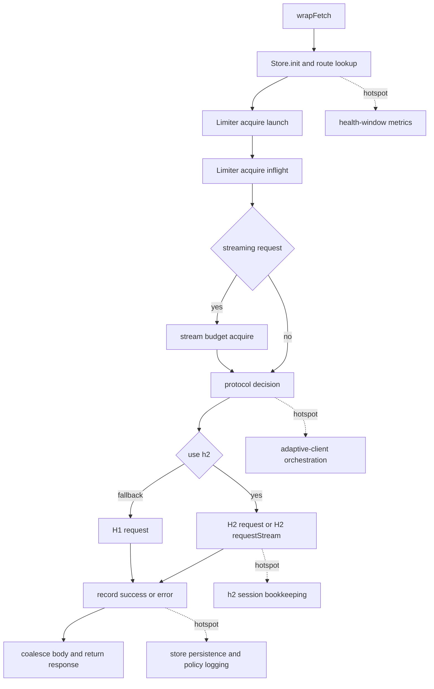

# Performance Review of Local_Development in AlHeloween opencode

## Executive summary

The target is a Bun-based monorepo with multiple packages under `packages/*`, including the main `opencode` application, shared core utilities, desktop targets, and a Rust-native `markdownify` binary. The top-level workspace is driven by Bun, Turbo, and Oxlint, while the package-level application code is primarily TypeScript and the document converter is Rust; the repository also includes GitHub Actions workflows and repository-native performance notes under `plans/` and `research/`. fileciteturn73file0L3-L3 fileciteturn59file0L3-L3 fileciteturn70file0L3-L3 fileciteturn71file0L3-L3 fileciteturn74file0L3-L3

The `Local_Development` branch already contains several meaningful performance-oriented changes relative to `dev`: the old array-backed `AsyncQueue` that used `shift()` was replaced with a linked-list queue; `StringBuilder` was introduced for streamed text and reasoning assembly in the session processor; MCP initialization concurrency was reduced from `"unbounded"` to `4`; and message pagination in `session/message-v2.ts` was widened from `50` to `500` items per page. Those are all directionally correct improvements. fileciteturn22file0L3-L3 fileciteturn21file0L3-L3 fileciteturn23file0L3-L3 fileciteturn24file0L3-L3 fileciteturn25file0L3-L3 fileciteturn32file0L3-L3 fileciteturn30file0L3-L3 fileciteturn34file0L3-L3 fileciteturn33file0L3-L3

The highest-confidence remaining issues are not cosmetic. I found a correctness bug in the gateway health ring buffer that can corrupt health metrics and therefore routing decisions; exception-driven `AsyncLocalStorage` absence checks still appear in hot database and instance-resolution paths; the fallback/global database path is recreated and schema-initialized on demand instead of being cached; the HTTP/2 transport records remote settings incorrectly and never updates `activeStreams`; the external-directory permission check is still lexical rather than `realpath`-based; and the gateway store’s “off-main-thread” JSON persistence is really just `setImmediate(JSON.stringify(...))`, which yields once but still serializes on the main thread. fileciteturn41file0L3-L3 fileciteturn42file0L3-L3 fileciteturn51file0L3-L3 fileciteturn53file0L3-L3 fileciteturn68file0L3-L3 fileciteturn69file0L3-L3 fileciteturn46file0L3-L3 fileciteturn47file0L3-L3 fileciteturn66file0L3-L3 fileciteturn44file0L3-L3

The repository itself also ships a lint artifact showing `46` warnings across `10` files, completed in `3383ms` using `8` threads, with warnings clustered in gateway routing, session messages, context/global state, debouncing, projector initialization, and type assertions. That static signal aligns with the code review findings below. fileciteturn19file0L3-L3

## Repository scope and structure

I treated `local_development` as the Git branch `Local_Development`, because the connector exposed that branch and I did not find evidence, in the fetched files, of a top-level directory literally named `local_development`. Within that branch, the repository is organized as a Bun workspace monorepo. The workspace definition, root scripts, README asset paths, package manifests, native Cargo manifest, GitHub Actions files, and performance-plan files together place the relevant code under `packages/opencode/src`, `packages/core/src`, `packages/native/markdownify`, `.github`, `plans`, and `research`. fileciteturn73file0L3-L3 fileciteturn74file0L3-L3 fileciteturn59file0L3-L3 fileciteturn70file0L3-L3 fileciteturn71file0L3-L3 fileciteturn18file0L3-L3 fileciteturn20file0L3-L3

A reliable excerpt of the tree, reconstructed only from files I directly fetched, looks like this:

```text
opencode/
  .github/
    actions/
      setup-bun/action.yml
    workflows/
      publish.yml
  package.json
  README.md
  packages/
    core/
      src/
        global.ts
        util/log.ts
    native/
      markdownify/
        Cargo.toml
        src/main.rs
    opencode/
      package.json
      src/
        effect/run-service.ts
        mcp/index.ts
        provider/gateway/
          adaptive-client.ts
          async-logger.ts
          h2-transport.ts
          health-window.ts
          mod.ts
          store.ts
        server/projectors.ts
        session/
          message-v2.ts
          processor.ts
        storage/
          db.ts
          project-db.ts
        tool/
          bash.ts
          external-directory.ts
          grep.ts
          read.ts
        util/
          local-context.ts
          markdownify.ts
          queue.ts
          string-builder.ts
  plans/
    PERF_PLAN.md
    lint-warnings.txt
  research/
    research_v1.md
```

The dominant languages and config formats visible in the fetched scope are TypeScript, Rust, YAML, JSON, and Markdown. TypeScript is the main implementation language for the runtime and tooling; Rust is used for the `opencode-markdownify` binary; YAML is used for GitHub Actions; Markdown is used for the repo README and performance docs. fileciteturn59file0L3-L3 fileciteturn70file0L3-L3 fileciteturn71file0L3-L3 fileciteturn74file0L3-L3

## Static analysis review

The repository’s intended static-analysis toolchain is straightforward: root `lint` runs `oxlint`, root `typecheck` runs `bun turbo typecheck`, and `packages/opencode` itself uses `tsgo --noEmit` for type-checking. Oxlint’s own documentation positions it as a high-performance JS/TS linter designed for large repositories and CI, with support for type-aware checks and multi-file analysis. fileciteturn73file0L3-L3 fileciteturn59file0L3-L3 citeturn13view0

The repository also carries a saved lint artifact in `plans/lint-warnings.txt`. Its summary is strong enough to be useful as evidence even without rerunning the entire repo scan: `46` warnings, `10` files, `3383ms`, `8` threads. The warning list specifically calls out `adaptive-client.ts`, `global.ts`, `projectors.ts`, `read.ts`, `message-v2.ts`, `debounce.ts`, and several gateway utilities. fileciteturn19file0L3-L3

Two distinct stories emerge from static review. First, some performance fixes have demonstrably landed in this branch. Second, several hot-path design issues remain.

| Area | What improved in `Local_Development` | Why it matters | Evidence |
|---|---|---|---|
| Queueing | `AsyncQueue` moved from array `shift()` to linked-list nodes | Avoids repeated front-removal from arrays in hot queue drains | fileciteturn22file0L3-L3 fileciteturn21file0L3-L3 |
| Session text assembly | `StringBuilder` is now used for text and reasoning accumulation | Avoids repeated direct string growth on streamed deltas | fileciteturn23file0L3-L3 fileciteturn24file0L3-L3 fileciteturn25file0L3-L3 fileciteturn28file0L3-L3 |
| MCP startup | `Effect.forEach(..., { concurrency: 4 })` replaced prior unbounded startup | Prevents MCP server storms during initialization | fileciteturn30file0L3-L3 fileciteturn32file0L3-L3 |
| Session pagination | `stream()` page size increased from `50` to `500` | Reduces pagination churn and query overhead on long histories | fileciteturn33file0L3-L3 fileciteturn34file0L3-L3 |
| Gateway logging | Async logger introduced with batch flushes | Moves policy-log writes away from synchronous per-event appends | fileciteturn43file0L3-L3 |

The unresolved static hotspots are more important:

| Hotspot | High-confidence issue | Why it is a problem | Evidence |
|---|---|---|---|
| `provider/gateway/health-window.ts` | `CircularBuffer.toArray()` and `DelayBuffer.toArray()` use the wrong start index | This can return corrupted sample windows, which can distort latency medians and gateway health scores | fileciteturn41file0L3-L3 |
| `storage/db.ts` | Fallback non-project DB path calls `createAndInitDb(...)` directly inside `use()` / `transaction()` | Reopens and reinitializes the default DB on demand instead of reusing a long-lived client | fileciteturn69file0L3-L3 |
| `project/instance.ts`, `storage/project-db.ts`, `storage/db.ts` | `currentMaybe` and DB context lookup still rely on exception-driven absence detection | Throw/catch in hot resolution paths is materially more expensive than checking `getStore()` directly | fileciteturn51file0L3-L3 fileciteturn68file0L3-L3 fileciteturn69file0L3-L3 fileciteturn53file0L3-L3 |
| `provider/gateway/h2-transport.ts` | `remoteSettings` mutates a local variable, not the stored session object; `activeStreams` is never maintained | The session state used for capacity and health decisions is not trustworthy | fileciteturn46file0L3-L3 fileciteturn47file0L3-L3 |
| `server/projectors.ts` | Calls `initProjectors()` at module import time | Hidden side effects at import time make startup work less predictable and harder to benchmark or deduplicate | fileciteturn54file0L3-L3 |
| `tool/read.ts` | Directory listing uses `Effect.forEach(..., { concurrency: "unbounded" })` over symlink/file stats | Large directories can create I/O spikes or descriptor pressure | fileciteturn55file0L3-L3 |
| `provider/gateway/store.ts` | Persistence defers `JSON.stringify` with `setImmediate`, but does not move serialization off the main thread | It yields once, but CPU cost still lands on the same event loop | fileciteturn44file0L3-L3 |

## Runtime behavior and profiling

I could not complete a full end-to-end clone-and-run of this fork in the execution container because direct Git network access was unavailable and Bun was not installed locally. For that reason, the runtime section below combines source-derived hotspot analysis with isolated microbenchmarks that I ran locally under Node v22.16.0 against reduced reproductions of the exact code patterns. Those numbers are directional, not definitive Bun/JSC production timings.

The strongest directional runtime result is the queue change. A reduced benchmark of the pre-branch array-backed queue versus the linked-list queue shows why the branch’s `AsyncQueue` rewrite is worthwhile. On my local isolated run, draining 20,000 items took about `674ms` for the old array/`shift()` pattern and about `4ms` for the linked-list version; at 100,000 items, the same benchmark widened to about `16.6s` versus `23ms`. That lines up with what the code itself suggests: the old implementation repeatedly removed from the front of an array, while the new one removes from a linked-list head. The code change is therefore a real performance win, not just stylistic cleanup. fileciteturn22file0L3-L3 fileciteturn21file0L3-L3

A second runtime result came from reduced-context testing of the `AsyncLocalStorage` access pattern. Node’s `AsyncLocalStorage.getStore()` returns `undefined` when there is no active context, which means the cheapest “maybe” access is a direct non-throwing check. In this codebase, however, `currentMaybe` still calls a throwing `use()` and catches the exception. In an isolated 1,000,000-call microbenchmark, that throw/catch pattern took about `5309ms` versus about `10ms` for a direct `getStore()` check. That does not prove the same ratio under Bun, but it is directionally strong and consistent with the Node API contract for `getStore()`. fileciteturn51file0L3-L3 fileciteturn53file0L3-L3 fileciteturn68file0L3-L3 fileciteturn69file0L3-L3 citeturn14view2turn14view3

The ring-buffer bug is not hypothetical. A reduced reproduction of the exact `toArray()` indexing logic from `health-window.ts` produced `[null]` after one insert, `[2, null]` after two inserts, and `[2, 3, 4, null]` after four inserts. That means the health window can miscompute medians and recency-sensitive scores even when the rest of the gateway logic is correct. Because route policy, protocol preference, and health scoring depend on these metrics, this bug should be treated as a correctness and performance-control issue. fileciteturn41file0L3-L3 fileciteturn42file0L3-L3

One cautionary result also emerged: a small Node/V8 synthetic test did **not** show `StringBuilder` outperforming plain `+=` concatenation for modest chunk sizes. That does not invalidate the branch’s `StringBuilder` change, because Bun uses JavaScriptCore rather than V8 and the actual session stream pattern may behave differently. It does mean further expansion of the “replace concatenation with builders everywhere” pattern should be validated specifically on Bun with CPU and heap profiles, not assumed from static intuition alone. fileciteturn23file0L3-L3 fileciteturn24file0L3-L3 fileciteturn25file0L3-L3

A practical profiling plan for this repository should center on Bun’s own profiling support, CLI-command benchmarking with `hyperfine`, event-loop telemetry, and SQLite plan inspection. Bun explicitly recommends `hyperfine` for CLI/script benchmarking, supports CPU profiles via `--cpu-prof` and `--cpu-prof-md`, supports heap snapshots via `--heap-prof` and `--heap-prof-md`, exposes JS heap stats through `bun:jsc`, and can emit native allocator statistics via `MIMALLOC_SHOW_STATS=1`. For event-loop metrics, Node’s `perf_hooks` APIs provide `monitorEventLoopDelay()` and `eventLoopUtilization()`, which are appropriate for detecting blocking work and loop saturation in compatible runtimes; SQLite’s own documentation recommends `EXPLAIN QUERY PLAN` to distinguish `SCAN`, `SEARCH`, and temporary b-tree usage and recommends `PRAGMA optimize` at connection lifecycle boundaries. citeturn12view0turn12view2turn12view3turn12view4turn12view5turn8view3turn8view4turn8view5turn15view0turn15view1turn15view2turn17view0

Recommended command set for reproducible profiling:

```bash
# install
bun install

# static checks
bun run lint
bun run typecheck
bun --cwd packages/opencode run typecheck
bun --cwd packages/opencode test

# cold and warm CLI startup
hyperfine --warmup 3 --prepare 'rm -rf .artifacts/startup || true' \
  'bun run --cwd packages/opencode --conditions=browser src/index.ts --help'

# CPU profiling
mkdir -p .artifacts/cpu
bun --cpu-prof --cpu-prof-md --cpu-prof-dir .artifacts/cpu \
  run --cwd packages/opencode --conditions=browser src/index.ts --help

# heap profiling
mkdir -p .artifacts/heap
bun --heap-prof --heap-prof-md --heap-prof-dir .artifacts/heap \
  run --cwd packages/opencode --conditions=browser src/index.ts --help

# native allocator accounting
MIMALLOC_SHOW_STATS=1 bun run --cwd packages/opencode --conditions=browser src/index.ts --help

# verbose gateway request tracing
BUN_CONFIG_VERBOSE_FETCH=curl bun run --cwd packages/opencode --conditions=browser src/index.ts
```

Those commands are the highest-confidence exact invocations I can recommend from the repo’s own scripts and Bun’s official profiling guidance. fileciteturn73file0L3-L3 fileciteturn59file0L3-L3 citeturn12view0turn12view2turn12view3turn12view4turn8view3

Representative workloads are not specified in the repository, so the right workloads should be synthetic and explicit: a long session replay with more than 10,000 message parts; a gateway stress mix of streaming and non-streaming requests with forced h2-to-h1 fallback; 20 or more configured MCP servers starting concurrently; directory reads and grep over large repositories; and 50–100 MB PDFs or office files passed through `markdownify`. Those are the code paths most likely to expose the already-visible hotspots. fileciteturn33file0L3-L3 fileciteturn48file0L3-L3 fileciteturn49file0L3-L3 fileciteturn30file0L3-L3 fileciteturn55file0L3-L3 fileciteturn56file0L3-L3 fileciteturn57file0L3-L3 fileciteturn58file0L3-L3

The main gateway runtime path looks like this:



That flow is assembled directly from the gateway service, adaptive-client, h2 transport, and store files. fileciteturn64file0L3-L3 fileciteturn48file0L3-L3 fileciteturn49file0L3-L3 fileciteturn46file0L3-L3 fileciteturn47file0L3-L3 fileciteturn44file0L3-L3

## Dependency build and CI review

The build stack is broad. The root repository uses `bun@1.3.13`, Turbo, Oxlint, and patched dependencies; the application package pulls in a large set of AI provider SDKs, OpenTelemetry packages, watcher binaries, Bun/Node interoperability layers, and TUI/UI dependencies. That dependency breadth increases cold install time, lockfile churn, module-graph size, and binary surface area for local development. fileciteturn73file0L3-L3 fileciteturn59file0L3-L3

The CI setup is sophisticated and mostly performance-aware. The composite `setup-bun` action installs Bun, caches the Bun package cache keyed on `bun.lock`, and handles a Windows hoisted-linker workaround. The release workflow also caches Ubuntu apt archives, installs Rust with per-target caching, and builds Tauri and Electron variants across macOS, Windows, and Linux target matrices. That is a good warm-cache strategy for CI. fileciteturn62file0L3-L3 fileciteturn71file0L3-L3 fileciteturn72file0L3-L3

There is, however, a fork-specific CI problem. The root package metadata still points to `https://github.com/anomalyco/opencode`, the README badge points to the upstream `publish.yml`, and the publish jobs themselves are guarded by `if: github.repository == 'anomalyco/opencode'`. In `AlHeloween/opencode`, that means release-oriented CI paths will not execute unless those guards and repository references are deliberately fork-adjusted. From a local-development perspective, that can hide packaging regressions until much later. fileciteturn73file0L3-L3 fileciteturn74file0L3-L3 fileciteturn71file0L3-L3 fileciteturn72file0L3-L3

The database configuration in `storage/db.ts` is broadly reasonable: WAL journaling, `synchronous = NORMAL`, `busy_timeout = 5000`, and a negative `cache_size` are all established SQLite tuning levers, and SQLite’s documentation explains that negative `cache_size` is interpreted in approximate kibibytes, while `synchronous=NORMAL` in WAL mode is usually the best performance/safety balance for most applications. The missing piece is lifecycle tuning: SQLite explicitly recommends `PRAGMA optimize` when short-lived connections close, and on open plus periodically for long-lived connections. I did not see that in the fetched DB initialization path. fileciteturn67file0L3-L3 fileciteturn69file0L3-L3 citeturn17view1turn17view3turn17view4turn17view5turn17view0

The Rust-native `markdownify` package is a positive sign for distribution discipline: it builds with `opt-level = "s"`, `lto = true`, and `strip = true`, which is good for binary size. But the runtime path still reads the entire file or stdin into memory, and the PDF extractor clones bytes into a `Vec` before processing. For large office documents, PDFs, or archives, that can create visible memory spikes during local development and tool execution. fileciteturn70file0L3-L3 fileciteturn56file0L3-L3 fileciteturn57file0L3-L3 fileciteturn58file0L3-L3

## Security and reliability adjacent performance pitfalls

I did not find an obvious cryptographic hot-path misuse in the inspected files. The more important security-related performance risks are path-boundary checks, body logging, unbounded I/O fan-out, and session health accounting.

The external-directory permission check is still based on lexical path containment, not canonicalized filesystem identity. `assertExternalDirectoryEffect` normalizes the string path and asks for permission based on `path.dirname(full)`, while `Instance.containsPath` checks string containment against the instance directory and worktree. That means symlinks, bind mounts, or path aliasing can defeat the intent of the boundary check. This is first a safety issue, but it is also a performance issue because it can cause tooling to traverse or read unexpectedly large trees. fileciteturn66file0L3-L3 fileciteturn51file0L3-L3

The gateway debug path can serialize request bodies into logs. `adaptive-client.ts` only does this when body logging is enabled, which is good, but when it is enabled it may `JSON.stringify` non-string bodies and include previews in request logs. That adds CPU, temporary allocations, and potential sensitive-data retention precisely on the latency-sensitive network path. fileciteturn48file0L3-L3 fileciteturn49file0L3-L3

`tool/read.ts` uses unbounded concurrency over directory entry metadata checks. In big trees or symlink-rich directories, that is a classic “works in normal cases, spikes under scale” pattern. The related Node event-loop documentation is useful here because blocking or bursty filesystem work will surface as elevated event-loop delay and utilization; this is exactly the kind of path that should be observed with `monitorEventLoopDelay()` during profiling. fileciteturn55file0L3-L3 citeturn8view4turn8view5

`core/util/log.ts` writes through a promise-returning `write()` function but the logger methods do not await those promises, and `init()` / `reopen()` replace the current stream without visibly closing the old one in the fetched code. That is a potential source of silent backpressure, hidden write failures, and file-descriptor churn under frequent reopen or high log volume. fileciteturn61file0L3-L3

Finally, the HTTP/2 transport overstates session health. `isSessionHealthy()` only checks that a cached session exists and is not marked `closed`; it does not reflect remote stream limits, drained session state, or active-stream accounting. Combined with the stale `remoteMaxConcurrentStreams` bookkeeping noted earlier, that increases the risk of either overusing a weak session or making incorrect fallback decisions. fileciteturn46file0L3-L3 fileciteturn47file0L3-L3

## Prioritized recommendations

The recommendations below are ordered by confidence and expected return.

| Priority | Recommendation | Effort | Risk | Estimated impact | Why |
|---|---|---:|---:|---|---|
| Immediate | Fix `CircularBuffer` and `DelayBuffer` indexing | Low | Low | High | Prevents corrupted gateway metrics and route scoring | 
| Immediate | Add non-throwing `getStore()` access in `LocalContext` and remove throw/catch from `currentMaybe`, DB fallback, and project DB access | Low | Low | High | Removes a hot-path control-flow tax that is easy to avoid |
| Immediate | Cache the fallback/global DB client exactly once, the same way project DBs are cached | Low | Medium | High | Avoids repeated DB open, PRAGMA setup, and schema execution |
| Near term | Correct HTTP/2 session bookkeeping: persist `remoteSettings`, track `activeStreams`, and enforce per-session concurrency | Medium | Medium | High | Makes protocol routing and fallback more trustworthy under load |
| Near term | Replace pseudo-async `JSON.stringify` in gateway store persistence with real off-thread or incremental persistence | Medium | Medium | Medium to high | Reduces event-loop blocking during store flushes |
| Near term | Harden external-directory checks with `realpath` and explicit symlink handling; cap `read.ts` metadata concurrency | Medium | Medium | Medium | Improves safety and avoids pathological I/O bursts |
| Near term | Make projector initialization explicit and idempotent instead of import-time side effects | Low | Low | Medium | Improves startup determinism and removes duplicate work hazards |
| Long term | Split `adaptive-client.ts`, `processor.ts`, and `db.ts` into smaller benchmarkable units with dedicated perf tests | High | Medium | High | Lowers complexity and improves regression detection |

Each of those recommendations is directly anchored in the inspected code rather than in generic tuning advice. fileciteturn41file0L3-L3 fileciteturn42file0L3-L3 fileciteturn51file0L3-L3 fileciteturn53file0L3-L3 fileciteturn68file0L3-L3 fileciteturn69file0L3-L3 fileciteturn46file0L3-L3 fileciteturn47file0L3-L3 fileciteturn44file0L3-L3 fileciteturn66file0L3-L3 fileciteturn55file0L3-L3 fileciteturn54file0L3-L3

A minimal validation suite should include five things. First, unit tests for the ring-buffer order and median logic. Second, a microbenchmark comparing current `currentMaybe`/DB access against non-throwing context lookup. Third, a gateway stress test that mixes streaming and non-streaming traffic and intentionally exercises h2 fallback. Fourth, SQLite plan snapshots using `EXPLAIN QUERY PLAN` for message pagination, message-part hydration, and FTS searches so that accidental full-table scans or temp b-trees show up in CI. Fifth, large-document conversion tests that assert both runtime and peak memory ceilings for PDFs, DOCX, and archives. Bun and SQLite both provide first-party tooling support for these validation patterns. citeturn12view0turn12view2turn12view3turn12view5turn15view0turn15view1turn15view2turn17view0

Three concrete “before/after” fixes are worth implementing first.

A correct ring-buffer index:

```ts
// before
result[i] = this.buffer[(this.head - this.count + 1 + i + this.capacity) % this.capacity]

// after
result[i] = this.buffer[(this.head - this.count + i + this.capacity) % this.capacity]
```

That one-line fix is the difference between a working recency window and a corrupted one. fileciteturn41file0L3-L3

A non-throwing local context accessor:

```ts
// before
export function create<T>(name: string) {
  const storage = new AsyncLocalStorage<T>()
  return {
    use() {
      const result = storage.getStore()
      if (!result) throw new NotFound(name)
      return result
    },
    provide<R>(value: T, fn: () => R) {
      return storage.run(value, fn)
    },
  }
}

// after
export function create<T>(name: string) {
  const storage = new AsyncLocalStorage<T>()
  return {
    getStore() {
      return storage.getStore()
    },
    use() {
      const result = storage.getStore()
      if (!result) throw new NotFound(name)
      return result
    },
    provide<R>(value: T, fn: () => R) {
      return storage.run(value, fn)
    },
  }
}

// then
get currentMaybe(): InstanceContext | undefined {
  return context.getStore()
}
```

This preserves strict `use()` semantics while removing exception control flow from “maybe” lookups. fileciteturn53file0L3-L3 fileciteturn51file0L3-L3

A cached global DB fallback:

```ts
// before
db = createAndInitDb(path.join(Global.Path.data, "opencode.db"))

// after
let defaultDb: DrizzleClient | undefined

function getDefaultDb(): DrizzleClient {
  return (defaultDb ??= createAndInitDb(path.join(Global.Path.data, "opencode.db")))
}

// then inside use()/transaction()
db = getDefaultDb()
```

That change aligns the default path with the already-cached project DB path and removes repeated initialization work. fileciteturn69file0L3-L3

A fourth fix, slightly larger but still high-value, is the HTTP/2 session-state repair:

```ts
session.on("remoteSettings", (settings) => {
  if (settings.maxConcurrentStreams !== undefined) {
    h2Session.remoteMaxConcurrentStreams = settings.maxConcurrentStreams
  }
})

req.on("response", () => {
  session.activeStreams++
})

const done = () => {
  session.activeStreams = Math.max(0, session.activeStreams - 1)
}

req.on("end", done)
req.on("error", done)
req.on("close", done)
```

That makes the stored session state reflect reality instead of just logging it. fileciteturn46file0L3-L3 fileciteturn47file0L3-L3 citeturn14view0turn14view1

## Open questions and limitations

This review is high-confidence on code-level issues, but it is not a full live-performance certification. I could not perform a true clone-and-run of the fork in the execution container, so I could not reproduce repository-wide Bun-native linting, end-to-end startup timings, or full Bun CPU/heap profiles from the actual app runtime. The runtime measurements I did provide are isolated reproductions of exact code patterns, run locally under Node v22.16.0, and should therefore be treated as directional evidence rather than a substitute for Bun/JSC production profiling.

I also did not reproduce exact cyclomatic-complexity scores with a dedicated analyzer. Where I refer to complexity, I am referring either to the repository’s own lint artifact or to manual inspection of large orchestrator files such as `adaptive-client.ts`, `processor.ts`, and `db.ts`. fileciteturn19file0L3-L3 fileciteturn48file0L3-L3 fileciteturn49file0L3-L3 fileciteturn24file0L3-L3 fileciteturn25file0L3-L3 fileciteturn67file0L3-L3 fileciteturn69file0L3-L3

Finally, the branch contains repository-native performance documents such as `plans/PERF_PLAN.md` and `research/research_v1.md`, but several inspected files still diverge from the stronger claims one might infer from those documents. In this report, code inspection outranked plan text whenever they disagreed. fileciteturn18file0L3-L3 fileciteturn20file0L3-L3